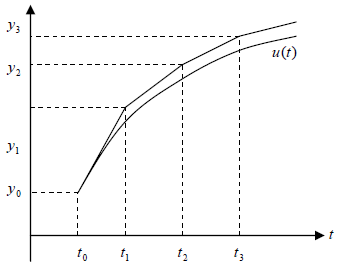



<!-- MarkdownTOC -->

- [10. Чисельні методи розв'язання задачі Коші для звичайних диференційних рівнянь](#10-чисельні-методи-розвязання-задачі-коші-для-звичайних-диференційних-рівнянь)
	- [10.1. Наближені аналітичні методи](#101-наближені-аналітичні-методи)
	- [10.2. Методи типу Ейлера](#102-методи-типу-ейлера)
	- [10.3. Методи типу Рунге-Кутта](#103-методи-типу-рунге-кутта)
	- [10.4. Методи з контролем точності на кроці](#104-методи-з-контролем-точності-на-кроці)
	- [10.5. Багатокрокові методи розв'язання задачі Коші. Методи Адамса](#105-багатокрокові-методи-розвязання-задачі-коші-методи-адамса)
	- [10.6. Метод невизначених коефіцієнтів побудови багатокрокових методів для розв'язання задачі Коші](#106-метод-невизначених-коефіцієнтів-побудови-багатокрокових-методів-для-розвязання-задачі-коші)
	- [10.7. Питання реалізації багатокрокових методів](#107-питання-реалізації-багатокрокових-методів)
	- [10.8. Стійкість методів розв'язання задачі Коші: TBC](#108-стійкість-методів-розвязання-задачі-коші-tbc)

<!-- /MarkdownTOC -->

## 10. Чисельні методи розв'язання задачі Коші для звичайних диференційних рівнянь

Постановка задачі: нехай потрібно знайти розв'язок диференційного рівняння з початковими умовами

\begin{equation}
	\label{eq:10.1}
	\frac{\diff u}{\diff t} = f(t, u), \quad t > t_0, \quad u(t_0) = u_0,
\end{equation}

де $$u = (u_1, \ldots. u_m)^\intercal$$, $$f = (f_1, \ldots, f_m)^\intercal$$, $$u_k = u_k(t)$$, $$f_k(t; u_1, \ldots, u_m)$$.

Якщо довільна функція $$f_k$$ неперервна по кожній своїй змінній та по $$u_j$$ вони Ліпшиць-неперервні, тобто

\begin{equation}
	| f_k(t; \ldots, u_j, \ldots) - f_k(t; \ldots, v_j, \ldots) | \le L_j | u_j - v_j |, \quad \forall j, k,
\end{equation}

то розв'язок задачі \eqref{eq:10.1} існує і єдиний.

Нехай задано рівняння $$m$$-ого порядку та початкові умови:

\begin{equation}
	\label{eq:10.2}
	\left\\{
		\begin{aligned}
			& v^{(m)}(t) = F \left(t; v, v', \ldots v^{(m - 1)} \right), \newline
			& t = t_0: v = v_1, v' = v_2, \ldots, v^{(m - 1)} = v_m.
		\end{aligned}
	\right.
\end{equation}

Введемо компоненти вектора $$\vec u$$: $$u_k(t) = v^{(k - 1)}(t)$$. Тоді задача [$$(2)$$](#eq:10.2) записується у вигляді системи \eqref{eq:10.1}:

\begin{equation}
	\left\\{
		\begin{aligned}
			\frac{\diff u_1}{\diff t} &= u_2, \quad u_1(t_0) = v_1, \newline
			\ldots & \ldots, \newline
			\frac{\diff u_{m - 1}}{\diff t} &= u_m, \quad u_{m - 1}(t_0) = v_{m - 1}, \newline
			\frac{\diff u_m}{\diff t} &= F(t; u_1, \ldots, u_m), \quad u_m(t_0) = v_m.
		\end{aligned}
	\right.
\end{equation}

Тому далі, в основному, розглядаються методи розв'язання задачі \eqref{eq:10.1} .

### 10.1. Наближені аналітичні методи

Література:

- БЖК, стор.&nbsp;358&ndash;360;

- ЛМС, стор.&nbsp;254&ndash;255.

1. Метод послідовних наближень (_метод Пікара_):

	Потрібно розв'язати диференційне рівняння з відповідними початковими умовами:

	\begin{equation}
		\label{eq:10.1.1}
		\frac{\diff u}{\diff t} = f(x, u), \quad u(t_0) = u_0.
	\end{equation}

	Проінтегруємо \eqref{eq:10.1.1}

	\begin{equation}
	 	\label{eq:10.1.2}
	 	u(t) = u(t_0) + \Int_{t_0}^{t} f(\xi, u(\xi)) \diff \xi.
	\end{equation}

	Задаємо $$u^{(0)}(t)$$ і запишемо ітераційний процес

	\begin{equation}
		\label{eq:10.1.3}
		u^{(k + 1)}(t) = u_0 + \Int_{t_0}^{t} f \left( \xi, u^{(k)}(\xi) \right) \diff \xi, \quad k = 0, 1, \ldots
	\end{equation}
	
	Існує $$T = T(u_0, L)$$ ($$L = \Max_j L_j$$ &mdash; стала Ліпшиця) така, що

	\begin{equation}
		u^{(n)}(t) \xrightarrow[n \to \infty]{} u(t), \quad t \in [t_0, T].
	\end{equation}
	
	Тому $$u(t) \approx u^{(n)}(t)$$.

	**Недолік** методу: необхідно проведення аналітичного інтегрування.

2. _Метод рядів Тейлора_:

	Нехай розв'язок задачі \eqref{eq:10.1.1} можна представити у вигляді ряду

	\begin{equation}
		u(t) = \Sum_{k = 0}^{\infty} \frac{u^{(k)}(t)}{k!} \cdot (t - t_0)^k.
	\end{equation}
	
	Будемо шукати наближення у вигляді скінченої суми:

	\begin{equation}
		\label{eq:10.1.4}
		u(t) \approx u^{N}(t) = \Sum_{k = 0}^{N} \frac{u^{(k)}(t_0)}{k!} \cdot (t - t_0)^k, \quad t \in [t_0, t_1].
	\end{equation}
		
	Для визначення $$u^{(k)}(t_0)$$ диференціюємо рівняння \eqref{eq:10.1.1} по $$t$$:

	\begin{equation}
		u^{(0)}(t_0) = u_0, \quad u^{(1)}(t_0) = f(t_0, u_0),
	\end{equation}

	\begin{equation}
		u^{(2)}(t_0) = f_{t,0} + f_{u,0} f_0, \quad u^{(3)}(t_0) = f_{tt,0} + 2 f_{tu,0} f_0 + f_{uu,0} f_0^2,
	\end{equation}

	і так далі.

	Якщо $$\tau = t_1 - t_0$$ малий параметр, то:

	\begin{equation}
		\left| u(t) = u^N(t) \right| = O(\tau^{N + 1}).
	\end{equation}
	
	**Недоліки** методу:

	- зростання кількості доданків при обчисленні $$u^{(n)}(t_0)$$;

	- необхідно аналітичного диференціювання.

### 10.2. Методи типу Ейлера

Література:

- СГ, стор.&nbsp;214&ndash;218.

Розглянемо задачу Коші:

\begin{equation}
	\label{eq:10.2.1}
	\frac{\diff u}{\diff t} = f(t, u), \quad u(t_0) = u_0.
\end{equation}

Використаємо перше наближення за допомогою рядів Тейлора на проміжку $$t_0 \le t \le t_1$$:

\begin{equation}
	u(t) \approx u^1(t) = u(t_0) + (t - t_0) f(t_0, u_0).
\end{equation}

Обчислимо наближене значення в точці $$t_1$$:

\begin{equation}
	u(t_1) = u_1 \approx u^1(t_1) = u_0 + \tau f(t_0, u_0)
\end{equation}

де $$\tau = t_1 - t_0$$ &mdash; деякий крок. Якщо позначити $$y_1 = u(t_1)$$, $$y_0 = u(t_0)$$, то маємо формулу

\begin{equation}
	y_1 = y_0 + \tau f(t_0, y_0).
\end{equation}

Застосовуючи такий підхід для tn ≤ t ≤ tn+1, отримаємо рекурентну формулу

\begin{equation}
	\label{eq:10.2.2}
	y_{n + 1} = y_1 + \tau f(t_n, y_n),
\end{equation}

для $$n = 0, 1, \ldots$$ з початковими умовами $$y_0 = u_0$$.

Це формула методу Ейлера. Крок інтегрування може змінюватися:

\begin{equation}
	\tau = \tau_n = t_{n + 1} - t_n.
\end{equation}

Геометрична інтерпретація методу Ейлера представлена на рис:

Його друга назва &mdash; метод ламаних.

Цей метод відноситься до однокрокових, тобто розв'язок на наступному кроці обчислюється тільки по одному значенню на попередньому кроці.

Загальна формула однокрокових методів:

\begin{equation}
	\label{eq:10.2.3}
	y_{n + 1} = y_n + \tilde \Phi(t_n, y_n, f).
\end{equation}

Для методу Ейлера $$\tilde \Phi = \tau f(t_n, y_n)$$.

> **Означення**: Величина $$R(\tau) = y(t_{n + 1}) - u(t_{n + 1})$$, де $$y_{n + 1}$$ обчислюється за формулою \eqref{eq:10.2.3}, причому $$y_n = u(t_n)$$ називається _похибка методу \eqref{eq:10.2.3} на одному кроці_.

Загальна похибка на $$(n + 1)$$-му кроці складається з похибок на всіх попередніх кроках.

> **Означення**: Величина $$z_{n + 1} = y_{n + 1} - u(t_{n + 1})$$, де $$y_{n + 1}$$ і всі попередні $$y_k$$, $$k = 1, 2, \ldots$$ також наближені, називається _похибкою методу_ \eqref{eq:10.2.3}.

Якщо виразити $$y_{n + 1} = u(t_{n + 1}) + z_{n + 1}$$ і підставити в \eqref{eq:10.2.3} , то

\begin{equation}
	u(t_{n + 1}) + z_{n + 1} = u(t_n) + z_n + \tau \tilde \Phi(t_n, u_n + z_n).
\end{equation}

Тоді можна записати рівняння для $$z_n$$:

\begin{equation}
	z_{n + 1} = z_n + \tau \left(- \frac{u_{n + 1} - u_n}{\tau} + \tilde\Phi(t_n, u_n)\right) + \tau \left(\tilde \Phi(t_n, u_n + z_n) - \tilde \Phi(t_n, u_n)\right).
\end{equation}

> **Означення**: Величина $$\psi_n = - \frac{u_{n + 1} - u_n}{\tau} + \tilde \Phi(t_n, u_n)$$ називається _похибкою апроксимації методу_ \eqref{eq:10.2.3} .

Для методу Ейлера

\begin{equation}
	\begin{aligned}
		\psi_n &= - \frac{u_{n + 1} - u_n}{\tau} + f(t_n, u_n) = \newline
		&= - \frac{1}{\tau} \left(u_n + \tau \cdot \frac{\diff u}{\diff t}(t_n) + O(\tau^2) - u_n\right) + f(t_n, u_n) = \newline
		&= - \frac{\diff u}{\diff t}(t_n) + f(t_n, u_n) + O(\tau) = \newline
		&= O(\tau) \xrightarrow[\tau \to 0]{} 0.
	\end{aligned}
\end{equation}

Похибка апроксимації це нев'язка, коли замість $$y$$ в різницеве рівняння \eqref{eq:10.2.3} підставляємо точний розв'язок задачі Коші $$u$$.

> **Означення**: Метод \eqref{eq:10.2.3} має _похибку на одному кроці степеня $$m$$_, якщо $$\vert R_n(\tau) \vert = O(\tau^{m + 1})$$.

> **Означення**: Кажуть, що чисельний метод має _похибку апроксимації степеня $$p$$_, якщо $$\vert \psi_n \vert = O(\tau^p)$$.

Для методу Ейлера похибка на одному кроці

\begin{equation}
	\begin{aligned}
		R_n(\tau) &= y_{n + 1} - u(t_{n + 1}) = \newline
		&= u(t_n) + \tau f(t_n, u(t_n)) - u(t_n + \tau) = \newline
		&= u(t_n) + \tau f(t_n, u(t_n)) - u(t_n) - \tau y'(t_n) + O(\tau^2) = \newline
		&= O(\tau^2).
	\end{aligned}
\end{equation}

Отже $$m = 1$$. Маємо зв'язок похибок: $$\psi(\tau) = R(\tau) / \tau$$ і тому $$p = 1$$.

> **Означення**: Кажуть, що метод \eqref{eq:10.2.3} має степінь точності $$m$$, якщо
>
> \begin{equation}
> \forall n: x_n = y_n - u(t_n) = O(\tau^m).
> \end{equation}

> **Теорема**: Нехай $$f(y, u) \in C^{(1)} (\overline D_T)$$, та $$\vert f_u (t, u) \vert \le L$$, де $$\overline D_T = \{ t_0 < t \le T, \vert u(t) \vert \le K \}$$. Тоді метод Ейлера \eqref{eq:10.2.3} має степінь точності $$m = 1$$ і для нього має місце оцінка 
>
> \begin{equation}
> | z_n | \le M \cdot \Max_j |\psi_j| = O(\tau),
> \end{equation}
>
> де $$M = M(T, L)$$.

_Доведення_: Для $$z$$ маємо задачу

\begin{equation}
	z_{n + 1} = z_n + \tau \psi_n + \tau (f(t_n, u_n + z_n) - f(t_n, u_n)).
\end{equation}

Оцінимо $$z_{n + 1}$$:

\begin{equation}
	\begin{aligned}
		|z_{n+1}| &\le |z_n| + \tau |\psi_n| + \tau L |z_n| + \tau |\psi_n| \le \ldots \newline
		&\le (1 + \tau L)^n |z_0| + \Sum_{j = 0}^{n} \tau (1 + \tau L)^{n - j} |\psi_j| \le \newline
		&\le (1 + \tau L)^n \Max_j |\psi_j| \cdot \Sum_{j = 0}^{n} \tau \le \newline
		&\le T e^{L \tau} \Max_j |\psi_j| \le \newline
		&\le M \Max_j |\psi_j| = O(\tau),
	\end{aligned}
\end{equation}

адже 

\begin{equation}
	(1 + \tau L)^n = (1 + \tau L)^{n \tau / \tau} = (1 + \tau L)^{t_n / \tau} \le (1 + \tau L)^{T / \tau} \le e^{L T}.
\end{equation}

Позначимо $$T e^{LT} = M$$ і отримуємо бажану оцінку. $$\square$$

Таким чином порядок точності методу Ейлера $$m = 1$$.

Метод Ейлера можна вивести із таких міркувань. Інтегруємо \eqref{eq:10.2.1} по $$t$$: $$t_n < t < t_{n + 1]}$$:

\begin{equation}
	\label{eq:10.2.4}
	u(t_{n + 1}) = u(t_n) + \Int_{t_n}^{t_{n+1}} f(t, u(t)) \diff t.
\end{equation}

Застосуємо формулу лівих прямокутників для інтегралу:

\begin{equation}
	\Int_{t_n}^{t_{n+1}} f(t, u(t)) \diff t \approx \tau f(t_n, u(t_n))
\end{equation}

і підставимо в \eqref{eq:10.2.4}. Отримаємо формулу для явного методу Ейлера:

\begin{equation}
	y_{n + 1} = y_n + \tau f(t_n, u(t_n))
\end{equation}

Застосуємо формулу правих прямокутників для інтегрування

\begin{equation}
	\Int_{t_n}^{t_{n+1}} f(t, u(t)) \diff t \approx \tau f(t_{n + 1}, u(t_{n + 1}))
\end{equation}

і підставимо в \eqref{eq:10.2.4}. Отримаємо формулу для неявного методу Ейлера:

\begin{equation}
	\label{eq:10.2.5}
	y_{n + 1} = y_n + \tau f(t_{n + 1}, y_{n + 1}).
\end{equation}

Ці формули $$1$$-го степеня точності по кроку $$\tau$$. Заміняючи інтеграл за квадратурною формулою трапеції:

\begin{equation}
	\Int_{t_n}^{t_{n+1}} f(t, u(t)) \diff t \approx \frac{\tau}{2} (f(t_n, u(t_n)) + f(t_{n + 1}, u(t_{n + 1})))
\end{equation}

ми отримаємо формулу _методу трапеції_ інтегрування задачі Коші:

\begin{equation}
	\label{eq:10.2.6}
	y_{n + 1} = y_n + \frac{\tau}{2} (f(t_n, u(t_n)) + f(t_{n + 1}, u(t_{n + 1}))).
\end{equation}

Це неявний метод.

Обчислимо похибку апроксимації цього методу:

\begin{equation}
	\begin{aligned}
		\psi_n &= - \frac{u_{n + 1} - u_n}{\tau} + \frac{1}{2} (f(t_n, u_n) + f(t_{n + 1}, u_{n + 1})) = \newline
		&= - \frac{1}{\tau} \left( u_{n + 1/2} + \frac{\tau}{2} \cdot \dot u_{n + 1 /2} + \frac{1}{2} \left(\frac{\tau}{2}\right)^2 \ddot u_{n + 1/2} + O(\tau^3) - \right. \newline
		& \quad \left. - u_{n + 1/2} + \frac{\tau}{2} \cdot \dot u_{n + 1/2} - \frac{1}{2} \left(\frac{\tau}{2}\right)^2 \ddot u_{n + 1/2} + O(\tau^3) \right) + \newline
		& \quad + \frac{1}{2} \left( f_{n+1/2} + \frac{\tau}{2} \cdot \dot f_{n + 1/2} + O(\tau^2) + f_{n + 1/2} - \frac{\tau}{2} \cdot \dot f_{n + 1/2} + O(\tau^2) \right) = \newline
		&= - \dot u_{n + 1/2} + O(\tau^2) + f_{n+1/2} = O(\tau^2).
	\end{aligned}
\end{equation}

Таким чином метод трапецій має другий порядок апроксимації.

> **Задача 36**: Показати, що похибка на одному кроці методу трапецій є величина порядку $$O(\tau^3)$$.

Таким чином ми отримали більш точний метод. Недолік методу трапецій &mdash; неявність (треба розв'язувати нелінійне рівняння). Для розв'язання проблеми неявності застосуємо метод предиктор-корректор (предиктор &mdash; попередник, коректор &mdash; уточнювач).

Обчислимо попередньо за явним методом Ейлера

\begin{equation}
	\label{eq:10.2.7}
	\bar y_{n + 1} = y_n + \tau f(t_n, u_n).
\end{equation}

Уточнимо за методом трапецій

\begin{equation}
	\label{eq:10.2.8}
	y_{n + 1} = y_n + \frac{\tau}{2} (f(t_n, y_n) + f(t_{n + 1}, \bar y_{n + 1})).
\end{equation}

Формули \eqref{eq:10.2.7} та \eqref{eq:10.2.8} утворюють _метод Ейлера-Коші_.

Оцінимо похибку на одному кроці

\begin{equation}
	R(\tau) = y_1 + u(t_0 + \tau) = u_0 + \frac{\tau}{2} (f(t_0, y_0) + f(t_0 + \tau, u_0 + \tau f(t_0, u_0))) - u(t_0 + \tau).
\end{equation}

Звідси $$R(0) = 0$$. Далі

\begin{equation}
	\begin{aligned}
		R'(\tau) &= \frac{1}{2} (f(t_0, y_0) + f(t_0 + \tau, y_0 + \tau f_0)) - \newline
		& \quad - \frac{\diff u}{\diff t}(t_0 + \tau) + \frac{\tau}{2} \cdot f_t(t_0 + \tau, u_0 + \tau f(t_0, u_0)) + \newline
		& \quad + \frac{\tau}{2} \cdot f_{tt}(t_0 + \tau, u_0 + \tau f_0(t_0, u_0)) \cdot f(t_0, u_0),
	\end{aligned}
\end{equation}

тому $$R'(0) = \frac{f_0 + f_0}{2} - \frac{\diff u}{\diff t}(t_0) = 0$$.

Наступна похідна

\begin{equation}
	R''(\tau) = f_t(t_0 + \tau, u_0 + \tau f_0) + f_{tt}(t_0 + \tau, u_0 + \tau f_0) \cdot f_0 + \tau (\ldots) - u''(t_0),
\end{equation}

тому $$R''(0) = f_{t,0} + f_{u,0} \cdot f_0 - \frac{\diff^2 u}{d\diff t^2}(t_0) = 0$$,

оскільки $$\frac{\diff^2 u}{\diff t^2} = \frac{\diff}{\diff t} f(t, u) = f_t(\ldots) + f_{tt}(\ldots) \cdot f_0$$.

І, нарешті, $$R'''(0) = \frac{3}{2} \left( f_{tt,0} + 2 f_{tu, 0} + f_{uu} \cdot f_0^2 \right) - u'''(t_0) \ne 0$$. Таким чином похибка на одному кроці має порядок $$p = 2$$.

Ще один метод цього типу:

\begin{equation}
	\label{eq:10.2.9}
	y_{n + 1/2} = y_n + \frac{\tau}{2} \cdot f(t_n, y_n),
\end{equation}

\begin{equation}
	\label{eq:10.2.10}
	y_{n + 1} = y_n + \tau f \left( t_{n + 1/2}, y_{n + 1/2} \right).
\end{equation}

Це модифікований метод Ейлера. На етапі коректор \eqref{eq:10.2.10} використовуємо формулу середніх прямокутників, а предиктор &mdash; це метод Ейлера на інтервалі $$(t_n, t_{n + 1/2})$$.

> **Задача 37**: Показати, що для модифікованого методу Ейлера $$R(\tau) = O(\tau^3)$$, тобто $$m = 2$$.

### 10.3. Методи типу Рунге-Кутта

Література:

- СГ, стор.&nbsp;218&ndash;221;

- ЛМС, стор.&nbsp;256&ndash;261.

Методи типу Ейлера мають низьку точність ($$m = 1, 2$$). Рунге запропонував метод третього, а Кутта розвинув його ідею та отримав методи четвертого порядку точності.

Розглянемо задачу Коші

\begin{equation}
	\label{eq:10.3.1}
	\frac{\diff u}{\diff t} = f(t, u), \quad u(t_0) = u_0.
\end{equation}

Явний $$m$$-етапний (стадійний) метод Рунге-Кутта полягає в наступному.

Нехай розв'язок $$y_n = y(t_n)$$ вже відомий. Задаються числові коефіцієнти $$\alpha_i$$, $$\beta_{i, j}$$, $$i = \overline{2,m}$$, $$j = \overline{1,i-1}$$ та $$p_i$$, $$i = \overline{1,m}$$ і послідовно обчислюються за формулами:

\begin{align}
	k_1 &= \tau f(t_n, y_n), \newline
	k_2 &= \tau f(t_n + \alpha_2 \tau, y_n + \beta_{2,1} \tau k_1), \newline
	k_3 &= \tau f(tn + \alpha_3 \tau, y_n + \beta_{3,1} \tau k_1 + \beta_{3,2} \tau k_2), \newline
	\ldots & \ldots \newline
	k_m &= \tau f \left( t_n + \alpha_m \tau, y_m + \Sum_{j = 1}^{m - 1} \beta_{m, j} \tau k_j \right).
\end{align}

Потім з формули

\begin{equation}
	\label{eq:10.3.2}
	y_{n + 1} = y_n = \Sum_{i = 1}^{m} p_i k_i
\end{equation}

знаходимо нове значення $$y_{n + 1} = y(t_{n + 1}) \approx u(t_{n + 1})$$.

Коефіцієнти $$\alpha_i$$, $$\beta_{i,j}$$, $$p_i$$ вибираємо з міркувань точності. Наприклад, для того, щоб рівняння \eqref{eq:10.3.2} апроксимувало рівняння \eqref{eq:10.3.1}, необхідно, щоб

\begin{equation}
	\Sum_{i = 1}^{m} p_i = 1.
\end{equation}

Інформація про $$m$$-стадійний метод записується в _таблиці Батчера_:

$$\alpha_1 = 0$$ |                  |            |                    | 
$$\alpha_2$$     | $$\beta_{2, 1}$$ |            |                    |
$$\vdots$$       | $$\vdots$$       | $$\ddots$$ |                    |
$$\alpha_m$$     | $$\beta_{m, 1}$$ | $$\ldots$$ | $$\beta_{m, m-1}$$ |
                 | $$p_1$$          | $$\ldots$$ | $$p_{m - 1}$$      | $$p_m$$

Похибка на одному кроці:

\begin{equation}
	\begin{aligned}
		R(\tau) &= y_1 - u(t_0 + \tau) = \newline
		&= u_0 + \Sum_{i = 1}^{m} p_i k_i(\tau) - u(t_0 + \tau) = \newline
		&= R(0) + R'(0) + \ldots + \frac{\tau^p}{p!} \cdot R^{(p)}(0) + O(\tau^{p + 1}).
	\end{aligned}
\end{equation}

Для того, щоб $$R(\tau) = O(\tau^{p + 1})$$, тобто метод мав $$p$$-й степінь точності необхідно і достатньо, щоб $$R(0) = R'(0) = \ldots = R^{(p)}(0) = 0$$. Загального розв'язку цієї нелінійної системи немає, тому розглянемо частинні випадки.

1. Методи першого порядку $$m = 1$$. Невідоме $$p_1$$:

	\begin{align}
		k_1(\tau) &= \tau f(t_0, y_0), \newline
		R(\tau) &= u_0 + p_1 k_1(\tau) - u(t_0 + \tau), \newline
		R(0) &= u_0 - u(t_0) = 0, \newline
		R'(\tau) &=  p_1 k'(\tau) - \dot u(t_0 + \tau) = \newline
		&= p_1 f(t_0, y_0) - \dot u(t_0 + \tau), \newline
		R'(0) &= (p_1 - 1) f_0 = 0
	\end{align}

	Звідси $$p_1 = 1$$.

	Ясно, що $$R''(0) \ne 0$$. Тому $$R(\tau)= O(\tau^2)$$. Отримуємо _явний метод Ейлера_

	\begin{equation}
		y_{n + 1} = y_n + \tau f(t_n, y_n).
	\end{equation}
		
2. Методи другого порядку $$m = 2$$. Тут отримуємо сімейство методів. 

	Невідомі $$p_1$$, $$p_2$$, $$\alpha_2$$, $$\beta_{2,1}$$. Вони вибираються з умови: $$R(\tau) = O(\tau^3)$$, $$p = 2$$. Маємо

	\begin{equation}
		p_1 + p_2 = 1, \quad 2 \alpha_2 p_2 = 1, \quad 2 \beta_{2, 1} p_2 = 1,
	\end{equation}
		
	і один параметр залишається вільним. Далі один параметр $$p_1$$ фіксуємо і отримуємо конкретний метод:
	
	1. $$p_1 = 0$$, $$p_2 = 1$$, $$\alpha_2 = \beta_{2,1} = 1/2$$ &mdash; _модифікований метод Ейлера_:

	   \begin{equation}
	   y_{n + 1} = y_n + \tau f \left( t_{n + 1/2}, y_n + \frac{\tau f_n}{2} \right)
	   \end{equation}

	2. $$p_1 = 1/2$$, $$p_2 = 1/2$$, $$\alpha_2 = \beta_{2,1} = 1$$ &mdash; _метод Ейлера-Коші_:

	   \begin{equation}
	   y_{n + 1} = y_n + \frac{\tau}{2} \left(f(t_n, y_n) + f(t_{n + 1}, y_n + \tau f_n)\right).
	   \end{equation}
	
	3. $$p_1 = 1/3$$, $$p_2 = 2/3$$, $$\alpha_2 = \beta_{2,1} = 3/4$$ &mdash; ще один метод другого порядку точності:

	   \begin{equation}
	   y_{n + 1} = y_n + \frac{\tau}{3} \left( f(t_n, y_n) + 2 f \left( t_{n + 3/4}, y_n + \frac{3 f_n}{4} \right)\right).
	   \end{equation}
	
3. Методи третього порядку $$m = 3$$. $$R(\tau) = O(\tau^4)$$. Тому $$p = 3$$. Запишемо результат вибору параметрів у вигляді таблиці Батчера (один з частинних випадків):

	$$0$$   |         |         |
	$$1/3$$ | $$1/3$$ |         |
	$$2/3$$ | $$0$$   | $$2/3$$ |
	        | $$1/4$$ | $$0$$   | $$3/4$$

	> **Задача 38**: Довести. що метод, якому відповідає ця таблиця Батчера, має третій степінь точності.

4. Методи четвертого порядку $$m = 4$$, $$R(\tau) = O(\tau^5)$$, $$p = 4$$. Найбільш поширені методи:

	$$0$$   |         |         |         |
	$$1/2$$ | $$1/2$$ |         |         |
	$$1/2$$ | $$0$$   | $$1/2$$ |         |
	$$1$$   | $$1/2$$ | $$0$$   | $$1$$   |
	        | $$1/6$$ | $$1/3$$ | $$1/3$$ | $$1/6$$

	і

	$$0$$   |         |         |         |
	$$1/4$$ | $$1/4$$ |         |         |
	$$1/2$$ | $$0$$   | $$1/2$$ |         |
	$$1$$   | $$1$$   | $$-2$$  | $$2$$   |
	        | $$1/6$$ | $$0$$   | $$2/3$$ | $$1/6$$

Розглянемо як пов'язаний порядок методу $$p$$ і кількість стадій $$m$$:

$$m$$ | $$1$$ | $$2$$ | $$3$$ | $$4$$ | $$5$$ | $$6$$
$$p$$ | $$1$$ | $$2$$ | $$3$$ | $$4$$ | $$4$$ | $$5$$

Ясно чому методи Рунге-Кутта при $$m > 4$$ рідко застосовуються: збільшення кількості стадій (а значить збільшення об'єму обчислювальної роботи) не дає виграшу в точності.

> **Теорема**: Нехай $$m$$-стадійний метод Рунге-Кутта має $$p$$-й степінь точності на кроці, а $$f(t,u)$$ задовольняє умову Ліпшиця. Тоді метод має $$p$$-й степінь точності і для похибки методів Рунге-Кутта має місце така оцінка:
> 
> \begin{equation}
> |z_n| = |y_n - u(t_n) | \le T \cdot e^{\alpha_0 T} \cdot \Max_j |\psi_j| = O(\tau^p),
> \end{equation}
>
> де $$\psi_j = R_j(\tau) / \tau$$ &mdash; похибка апроксимації метода, $$\alpha_0 = p L m (1 + B L \tau_0)^{m - 1}$$, $$L$$ &mdash; стала Ліпшиця, $$B = \Max_{i,j} \vert f_{ij} \vert$$, $$T = \Max_n \vert t_n \vert$$.

### 10.4. Методи з контролем точності на кроці

Література:

- БЖК, стор.&nbsp;365&ndash;367.

Часто в ході розрахунків необхідно змінювати крок інтегрування, контролюючи величину похибки методу на кроці. При практичній оцінці цієї величини можна. наприклад, поступати так.

Перший підхід використовує принцип Рунге. Головний член похибки на одному кроці $$(t_n, t_{n+1})$$ інтегрування має вигляд 

\begin{equation}
	\frac{\varphi^{(p + 1)}(0) \tau^{p + 1}}{(p + 1)!}.
\end{equation}

В результаті двох кроків інтегрування однокроковим методом, наприклад, методом Рунге-Кутта $$p$$-го степеня точності, буде отримано наближення $$y^\tau(t + 2 \tau)$$ до значення $$u(t_n + 2 \tau)$$ таке, що

\begin{equation}
	y^\tau (t_n + 2 \tau) - u(t_n + 2\tau) \approx 2 \frac{\varphi^{(p + 1)}(0) \tau^{ p + 1}}{(p + 1)!} = 2 \overset{\circ} R(\tau).
\end{equation}

Якщо тепер застосувати метод Рунге-Кутта $$p$$-го степеня з одним кроком довжини $$2 \tau$$ на інтервалі $$(t_n, t_{n + 2})$$, то отримаємо наближене значення $$y^{2\tau}(t_n + 2 \tau)$$, для якого

\begin{equation}
	y^{2 \tau}(t_n + 2 \tau) - u(t_n + 2 \tau) \approx \frac{\varphi^{(p + 1)}(0) (2 \tau)^{p + 1}}{(p + 1)!} = \overset{\circ} R(2 \tau) = 2^{p + 1} \overset{\circ} R(\tau).
\end{equation}

З цих співвідношень випливає представлення головного члена похибки на кроці

\begin{equation}
	y^\tau (t_n + 2 \tau) - y(t_n + 2 \tau) \approx 2 \overset{\circ} R(\tau) = \frac{y_{n + 1}^{2 \tau} - y_{n + 1}^\tau}{2^p - 1}.
\end{equation}

При необхідності можна уточнити отримане наближене значення, додавши до нього величину головного члена похибки, тобто покласти

\begin{equation}
	u(t_n + 2 \tau) \approx y^\tau + \frac{y^\tau - y^{2 \tau}}{2^p - 1}.
\end{equation}

Позначимо

\begin{equation}
	g(\tau) =  \frac{y_{n + 1}^{2 \tau} - y_{n + 1}^\tau}{2^p - 1}
\end{equation}

Якщо $$\vert g(\tau) \vert \le \varepsilon$$, де $$\varepsilon$$ &mdash; деяка задана мала величина (похибка на одному кроці), то $$\tau$$ &mdash; успішний крок і $$y_{n + 1}^\tau \approx u(t_n, + 2 \tau)$$. Якщо $$\vert g(\tau) \vert > \varepsilon$$, то зменшуємо крок $$t := \tau / 2$$. Треба ще передбачити умову збільшення кроку. Задаємо деяке $$\delta \ll \varepsilon$$ і якщо $$\vert g(\tau) \vert \le \delta$$, то $$y_{n + 1}^\tau \approx u(t_n + 2 \tau)$$ і далі беремо $$\tau := 2 \tau$$. Параметр $$\delta$$ вибирають, наприклад, так: $$\delta = \alpha \cdot \varepsilon / 2^p$$, $$0 < \alpha < 1$$, де $$p$$ &mdash; порядок точності методу.

Інший підхід вибору кроку інтегрування заключається в використанні методів різного степеня точності. Отже, якщо в нас є два методи степеня точності на кроці $$p$$ та $$p + 1$$:

\begin{align}
	y_{n + 1}^{(1)} - u(t_n) &= O(\tau^{p + 1}), \newline
	y_{n + 1}^{(2)} - u(t_n) &= O(\tau^{p + 2}),
\end{align}

то головний член похибки першого методу

\begin{equation}
	g(\tau) = y_{n + 1}^{(1)} - y_{n + 1}^{(2)} = O(\tau^{p + 1}).
\end{equation}

Далі з головним членом похибки $$g(\tau)$$ методу степені $$p$$ оперуємо так як і в першому підході.

Бажано мати можливість здійснювати крок інтегрування і оцінювати похибку при меншій кількості обчислення значень правих частин. Виграш досягається, якщо використовують методи, які називаються _вкладеними_. Таблиця Батчера для них має вигляд:

$$\alpha_2$$ | $$\beta_{2, 1}$$ |            |                      |
$$\vdots$$   | $$\vdots$$       | $$\ddots$$ |                      |
$$\alpha_m$$ | $$\beta_{m, 1}$$ | $$\ldots$$ | $$\beta_{m, m - 1}$$ |
             | $$p_1$$          | $$\ldots$$ | $$p_{m - 1}$$        | $$p_m$$
             | $$\bar p_1$$     | $$\ldots$$ | $$\bar p_{m - 1}$$   | $$\bar p_m$$

Метод з параметрами $$p_1, \ldots, p_{m - 1}, p_m$$ має порядок точності $$p$$, а з параметрами $$\bar p_1, \ldots, \bar p_{m - 1}, \bar p_m$$ &mdash; $$p + 1$$. Коефіцієнти $$\alpha_i$$, $$\beta_{i, j}$$ у обох методів однакові.

Найпростіший приклад вкладених методів для $$m = 2$$ має таблицю Батчера:

$$0$$ |       |
$$1$$ | $$1$$ |
      | $$1$$ | $$0$$
      | $$0$$ | $$1$$

Перший метод, якому відповідають коефіцієнти $$p_1 = 1$$, $$p_2 = 0$$, це метод Ейлера, $$p = 1$$. Другий &mdash; $$p_1 = 0$$, $$p_2 = 1$$ &mdash; метод Ейлера-Коші, $$p = 2$$.

Іншим прикладом може служити сукупність формул шестістадійного $$m = 6$$ методу Рунге-Кутта-Фельберга

\begin{align}
	k_1 &= \tau f(t_n, y_n), \newline
	k_2 &= \tau f \left( t_n + \frac{\tau}{2}, y_n + \frac{k_1}{2} \right), \newline
	k_3 &= \tau f \left( t_n + \frac{\tau}{2}, y_n + \frac{k_1 + k_2}{4} \right), \newline
	k_4 &= \tau f \left( t_n + \tau, y_n - k_2 + 2 k_3 \right), \newline
	k_5 &= \tau f \left( t_n + \frac{\tau}{3}, y_n + \frac{7 k_1 + 10 k_2 + k_4}{27} \right), \newline
	k_6 &= \tau f \left( t_n + \frac{\tau}{5}, y_n + \frac{28 k_1 - 125 k_2 + 546 k_3 + 54 k_4 - 378 k_5}{625} \right),
\end{align}

тоді

\begin{equation}
	\Delta y_n = \frac{k_1 + 4 k_3 + k_4}{6}
\end{equation}

з головним членом похибки

\begin{equation}
	y_n(t_n + \tau) - u(t_n + \tau) = g(\tau) + O(\tau^5),
\end{equation}

з

\begin{equation}
	g(\tau) = - \frac{42 k_1 + 224 k_3 + 21 k_4 - 162 k_5 - 125 k_6}{366}.
\end{equation}

Методи Рунге-Кутта-Фельберга мають четвертий та п'ятий степінь точності. Порівняємо кількість обчислень правих частин в методах Рунге-Кутта та Рунге-Кутта-Фельберга ($$p = 4$$ для обох). Згідно схеми кроків по змінній $$t$$ та по стадіях $$i = \overline{1,4}$$ для методу Рунге-Кутта необхідно обчислити для оцінки похибки $$11$$ значень функції, а для методу Рунге-Кутта-Фельберга &mdash; $$6$$ значень функції.

- Основний **недолік** методів Рунге-Кутта: щоб отримати досить високий степінь точності потрібно багато раз обчислювати значення функції. 

- **Достойністю** методів Рунге-Кутта є можливість зміни кроку інтегрування $$\tau =\ tau_n$$ і за рахунок цього задовольняти умову точності на кроці.

### 10.5. Багатокрокові методи розв'язання задачі Коші. Методи Адамса

Література:

- СГ, стор.&nbsp;230&ndash;231;

- БЖК, стор.&nbsp;372&ndash;375.

Недолік методів Рунге-Кутта: велика кількість обчислень значень функцій на одному кроці (особливо, чутливо це для систем). Висока точність в цих методах досягається за рахунок обчислень для $$m$$ стадій коефіцієнтів $$k_i(\tau) = \tau f(\xi_i, \eta_i)$$ в проміжних точках між $$t_n$$ та $$t_{n + \tau}$$. А чи не можна для цього використати попередні значення $$f(t_n, y_n), f(t_{n - 1}, y_{n - 1}), \ldots, f(t_{n - m}, y_{n - m})$$?

Для розв'язання задачі Коші

\begin{equation}
	\label{eq:10.5.1}
	\frac{\diff u}{\diff t} = f(t, u), \quad t > 0, \quad u(0) = u_0
\end{equation}

введемо сітку

\begin{equation}
	\omega_\tau = \{t_n = n \tau, n = 0, 1, \ldots \}
\end{equation}

з постійним кроком $$\tau > 0$$. Позначимо через $$y_n = y(t_n)$$, $$f_n = f(t_n)$$, y функції, визначені на сітці $$\omega \tau$$.

> **Означення**: _Лінійним $$m$$-кроковим різницевим методом_ називається рівняння:
>
> \begin{equation}
> \label{eq:10.5.2}
> \frac{a_0 y_n + a_1 y_{n - 1} + \ldots + a_m y_{n - m}}{\tau} = b_0 f_n + b_1 f_{n - 1} + \ldots + b_m f_{n - m},
> \end{equation}
>
> для $$n = m, m + 1, \ldots$$, де $$a_k, b_k$$ &mdash; числові коефіцієнти, які не залежать від $$n$$, причому $$a_0 \ne 0$$. 

Рівняння \eqref{eq:10.5.2} слід розглядати як рекурентне співвідношення, яке виражає нове значення $$y_n = y(t_n)$$ через знайдені раніше значення $$y_{n - 1}, y_{n - 2}, \ldots, y_{n - m}$$.

Розрахунок починається з $$n = m$$, тобто з рівняння

\begin{equation}
	\frac{a_0 y_m + a_1 y_{m - 1} + \ldots + a_m y_0}{\tau} = b_0 f_m + b_1 f_{m - 1} + \ldots + b_m f_0,
\end{equation}

Як бачимо з рівняння, для початку розрахунків необхідно задати $$m$$ початкових значень. Значення $$y_0$$ визначається початковою умовою задачі \eqref{eq:10.5.1}, а саме покладають $$y_0 = u_0$$. Величини $$y_1, \ldots, y_{m - 1}$$ можна обчислити, наприклад, за методом Рунге-Кутта, або за методом рядів Тейлора. В подальшому будемо вважати, що початкові значення $$y_0, y_1, \ldots, y_{m - 1}$$ задані.

З рівняння \eqref{eq:10.5.2} видно, що на відміну від методу Рунге-Кутта багатокрокові різницеві методи допускають обчислення правих частин тільки в точках основної сітки $$\omega_t$$.

> **Означення**: Метод \eqref{eq:10.5.2} називається _явним_, якщо $$b_0 = 0$$, і відповідно, шукане значення $$y_n$$ виражається явно через $$y_{n - 1}, \ldots, y_{n - m}$$. Якщо $$b_0 \ne 0$$, то метод \eqref{eq:10.5.2} називається неявним.

В неявному методі для пошуку $$y_n$$ потрібно розв'язувати нелінійне рівняння:

\begin{equation}
	\frac{a_0}{\tau} \cdot y_n - b_0 f(t_n, y_n) = F(y_{n - 1}, y_{n - 2}, \ldots, y_{n - m}),
\end{equation}

де

\begin{equation}
	F(y_{n - 1}, y_{n - 2}, \ldots y_{n - m}) = \Sum_{k = 1}^{m} \left( b_k f_{n - k} - \frac{a_0}{\tau} \cdot y_{n - k}\right)
\end{equation}

Як правило це рівняння розв'язують методом Ньютона, обираючи, наприклад, початкове наближення $$y_n^{(0)}$$ рівним $$y_{n - 1}$$.

Коефіцієнти рівняння \eqref{eq:10.5.2} визначені з точністю до множника. Для уникнення цієї неоднозначності, будемо вважати, що виконується умова:

\begin{equation}
	\label{eq:10.5.3}
	\Sum_{k = 0}^{m} b_k = 1,
\end{equation}

яка означає, що права частина різницевого рівняння \eqref{eq:10.5.2} апроксимує праву частину диференціального рівняння \eqref{eq:10.5.1}.

В практичному використанні найбільш поширені методи Адамса, які являють собою частинний випадок багатокрокових методів \eqref{eq:10.5.2}, коли похідна $$u'(t)$$ апроксимується тільки по двох точках, $$t_n$$ і $$t_{n - 1}$$, тобто

\begin{equation}
	a_0 = - a_1 = 1, \quad a_k = 0, \quad k = \overline{2,m}.
\end{equation}

Таким чином, _методи Адамса_ мають вигляд:

\begin{equation}
	\frac{y_n - y_{n - 1}}{\tau} = \Sum_{k = 0}^{m} b_k f_{n - k}.
\end{equation}

> **Означення**: У випадку, коли $$b_0 = 0$$, методи Адамса називають _явними_, $$A$$ при $$b_0 \ne 0$$, методи Адамса називають _неявними_.

Розглянемо детальніше процедуру побудови методів Адамса. Інтегруємо рівняння \eqref{eq:10.5.1} по $$t \in [t_{n - 1}, t_n]$$:

\begin{equation}
	\label{eq:10.5.4}
	\frac{u(t_{n - 1}) - u(t_n)}{\tau} = \frac{1}{\tau} \Int_{t_{n - 1}}^{t_n} f(t, u(t)) \diff t.
\end{equation}

Замінимо $$f(t, u(t)) $$на інтерполяційний поліном. Виберемо вузлами інтерполювання точки $$t_n, t_{n - 1}, \ldots, t_{n - m}$$. Використаємо багаточлен степеня $$m$$ за формулою Ньютона по рівновіддалених вузлах, тобто

\begin{equation}
	\begin{aligned}
		f(t, u(t)) &\approx L_m(t) = \newline
		&= f_n + s \Delta f_{n - 1} + \ldots + \frac{s (s + 1) \ldots (s + m - 1)}{m!} \Delta^m f_{n - m}.
	\end{aligned}
\end{equation}

де $$s = \frac{t - t_n}{\tau}$$, крок $$\tau$$ сталий. В результаті підстановки в \eqref{eq:10.5.4} $$f(t, u(t)) \approx L_m(t)$$ отримуємо метод

\begin{equation}
	\frac{y_n - y_{n - 1}}{\tau} = f_n + \beta_1 \Delta f_{n - 1} + \ldots + \beta_m \Delta^m f_{n - m},
\end{equation}

де

\begin{equation}
	\label{eq:10.5.5}
	\beta_k = \Int_{-1}^{0} \frac{s (s + 1) \ldots (s + k - 1)}{k!}\diff s, 
\end{equation}

для $$k = \overline{1, m}$$, де $$\Delta f_{n - 1} = f_n - f_{n - 1}$$, $$\Delta^2 f_{n - 2} = f_n - 2 f_{n - 1} + f_{n - 2}$$.

Похибка методу на одному кроці

\begin{equation}
	R(\tau) = \Int_{t_{n - 1}}^{t_n}  r_m(t) \diff t = O(\tau^{m + 2}),
\end{equation}

де $$r_m(t) = f(t) - L_m(r)$$, звідки степінь точності на одному кроці $$p = m + 1$$.

Формула \eqref{eq:10.5.5} називається _формулою Адамса-Мултона_ (неявний метод Адамса, інтерполяційний метод Адамса).

Виберемо вузли інтерполювання точки $$t_{n - 1}, \ldots, t_{n - m}$$. Отримаємо багаточлен степеня $$m - 1$$:

\begin{equation}
	\begin{aligned}
		f(t, u(t)) &\approx L_{m - 1}(t) = \newline
		&= f_{n - 1} + v \Delta f_{n - 2} + \ldots + \frac{v (v + 1) \ldots (v + m - 2)}{(m - 1)!} \Delta^{m - 1} f_{n - m},
	\end{aligned}
\end{equation}

де $$v = \frac{t - t_{n - 1}}{\tau}$$. Підставляючи в \eqref{eq:10.5.5}, маємо метод

\begin{equation}
	\label{eq:10.5.6}
	\frac{y_n - y_{n - 1}}{\tau} = f_{n - 1} + \gamma_1 \Delta f_{n - 2} + \ldots + \gamma_{m - 1} \Delta^{m - 1} f_{n - m},
\end{equation}

де 

\begin{equation}
	\gamma_k = \Int_{0}^{1} \frac{v (v + 1) \ldots (v + k - 1)}{k!}\diff v,
\end{equation}

для $$k = \overline{1, m - 1}$$.

Формула \eqref{eq:10.5.6} називається _формулою Адамса-Башфорта_ (явний метод Адамса, екстраполяційний метод Адамса). Похибка цього методу на одному кроці $$R(\tau) = O(\tau^{m + 1})$$. Степінь точності на одному кроці $$p = m$$.

> **Задача 39**: Побудувати явний та неявний двокрокові методи Адамса. Який степінь точності вони мають?

### 10.6. Метод невизначених коефіцієнтів побудови багатокрокових методів для розв'язання задачі Коші

- БЖК, стор.&nbsp;375&ndash;379;

- СГ, стор.&nbsp;230&ndash;231.

Розглянемо задачу Коші

\begin{equation}
	\label{eq:10.6.1}
	\frac{\diff u}{\diff t} = f(t, u), \quad t > 0, \quad u(0) = u_0
\end{equation}

і багатокроковий метод

\begin{equation}
	\label{eq:10.6.2}
	\Sum_{k = 0}^{m} \frac{a_k}{\tau} \cdot y_{n - k} = \Sum_{k = 0}^{m} b_k f_{n - k}
\end{equation}

Підберемо коефіцієнти $$a_k$$, $$b_k$$ так, щоб досягти найвищої точності методу \eqref{eq:10.6.2}.

Введемо похибку апроксимації $$\psi(\tau)$$ для формули \eqref{eq:10.6.2}. Похибкою апроксимації на розв'язку або нев'язкою різницевого методу \eqref{eq:10.6.2} називається функція

\begin{equation}
	\label{eq:10.6.3}
	\psi(\tau) = - \Sum_{k = 0}^{m} \frac{a_k}{\tau}\cdot u_{n-k} + \Sum_{k = 0}^{m} b_k f(t_{n - k}, u_{n - k}),
\end{equation}

де $$u_{n - k} = u(t_n - k \tau)$$. Її отримують підстановкою точного розв'язку $$u(t)$$ задачі \eqref{eq:10.6.1} в різницеве рівняння \eqref{eq:10.6.2}. Розглянемо питання про порядок похибки апроксимації при $$\tau \to 0$$ в залежності від вибору коефіцієнтів $$a_k, b_k$$, $$k = \overline{0, m}$$.

Розкладемо функції $$u_{n - k} = u(t_n - k \tau)$$ в точці $$t = t_n$$ по формулі Тейлора:

\begin{equation}
	\label{eq:10.6.4}
	u(t_n - \tau k) = \Sum_{j = 0}^{p} u^{(j)}(t_n) \cdot \frac{(- k \tau)^j}{j!} + O(\tau^{p + 1}).
\end{equation}

Тут $$u^{(j)}$$ &mdash; $$j$$-та похідна. Далі

\begin{equation}
	\label{eq:10.6.5}
	\begin{aligned}
		f(t_n - k \tau, u(t_n - k \tau)) &= \frac{\diff u}{\diff t} (t_n - k \tau) = \newline
		&= \Sum_{j = 0}^{p - 1} u^{(j + 1)}(t_n) \cdot \frac{(- k \tau)^j}{j!} + O(\tau^p),
	\end{aligned}
\end{equation}

для $$k = \overline{1, m}$$. Підставляючи ці вирази в формулу \eqref{eq:10.6.3}, отримаємо:

\begin{equation}
	\begin{aligned}
		\psi(\tau) &= - \Sum_{k = 0}^{m} \frac{a_k}{\tau} \left( \Sum_{j = 0}^{p} \frac{(- k \tau)^j u^{(j)}(t_n)}{j!} \right) + \newline
		& \quad + \Sum_{k = 0}^{m} b_k \left( \Sum_{j = 0}^{p - 1} \frac{(-k \tau)^j u^{(j + 1)}(t_n)}{j!} \right) + O(\tau^p) = \newline
		&= - \Sum_{j = 0}^{p} \Sum_{k = 0}^{m} \left( \frac{a_k}{\tau} \cdot \frac{(- k \tau)^j u^{(j)}(t_n)}{j!} \right) + \newline
		& \quad + \Sum_{j = 0}^{p - 1} \Sum_{k = 0}^{m} \left( b_k \cdot \frac{(-k \tau)^j u^{(j + 1)}(t_n)}{j!} \right) + O(\tau^p).
	\end{aligned}
\end{equation}

Після перетворень, приходимо до розкладу:

\begin{equation}
	\psi(\tau) = - \left( \Sum_{k = 0}^{m} \frac{a_k}{\tau} \right) u(t_n) + \Sum_{j = 1}^{p} \left( \Sum_{k= 0}^{m} (-k \tau)^{j - 1} \left( a_k \cdot \frac{k}{j} + b_k \right) \right) \frac{u^{(j)}(t_n)}{(j - 1)!} + O(\tau^p).
\end{equation}

Звідки видно, що похибка апроксимації має порядок $$p$$, якщо виконуються умови:

\begin{equation}
	\label{eq:10.6.6}
	E_0 = \Sum_{k = 0}^{m} a_k = 0, \quad E_l = \Sum_{k = 0}^{m} \frac{k^{l - 1}}{l!} \cdot (k a_k + l b_k) = 0, \quad l = \overline{1, p}.
\end{equation}

Разом з умовою нормування 

\begin{equation}
	\Sum_{k = 0}^{m} b_k = 1,
\end{equation}

рівняння \eqref{eq:10.6.6} утворюють систему з $$p + 2$$ лінійних алгебраїчних рівнянь відносно $$2 (m + 1)$$ невідомих $$a_0, a_1, \ldots a_m$$, $$b_0, b_1, \ldots, b_m$$.

Умови нормування запишуться у вигляді:

\begin{equation}
	Lim_{\tau \to 0} \Sum_{k = 0}^{m} \frac{a_k}{\tau} \cdot u_{n - k} = \frac{\diff u}{\diff t}(t_n),
\end{equation}

і

\begin{equation}
	Lim_{\tau \to 0} \Sum_{k = 0}^{m} b_k f(t_{n - k}, u_{n - k}) = f(t_n, u_n).
\end{equation}

Зурахуванням \eqref{eq:10.6.4}, [$$(105)$$](#eq:10.6.5) маємо

\begin{equation}
	\Sum_{k = 0}^{m} b_k = 1, \quad \Sum_{k = 0}^{m} k a_k = 1.
\end{equation}

З рівняння \eqref{eq:10.6.6} при $$l = 0$$ отримуємо

\begin{equation}
	\Sum_{k = 0}^{m} k a_k - \Sum_{k = 0}^{m} b_k = 0.
\end{equation}

Тому умови нормування додатково до \eqref{eq:10.6.6} дають тільки рівняння

\begin{equation}
	\Sum_{k = 0}^{m} b_k = 1
\end{equation}

Для того, щоб система [$$(105)$$](#eq:10.6.5) не була перевизначеною, необхідно вимагати, щоб $$p \le 2 m$$. Ця вимога означає, що порядок апроксимації лінійних $$m$$-крокових різницевих методів не може перевищувати $$2 m$$ (неявні методи). Найвищий порядок апроксимації явних методів &mdash; $$2 m - 1$$.

Для методів Адамса умови $$p$$-го порядку апроксимації мають вигляд:

\begin{equation}
	\Sum_{k = 1}^{m} k^{l - 1} b_k = 1, \quad l = \overline{2,p}, \quad n_0 = 1 - \Sum_{j = 1}^{m} b_k
\end{equation}

Звідки бачимо, що найвищий порядок апроксимації неявного $$m$$-крокового методу Адамса дорівнює $$m + 1$$, а найвищий порядок апроксимації явного методу Адамса ($$b_0 = 0$$) дорівнює $$m$$.

> **Задача 40**: Побудувати явний та неявний двокрокові методи найвищого степеня точності.

### 10.7. Питання реалізації багатокрокових методів

1. Перша проблема, яка виникає при застосування багатокрокових методів це вибір додаткових початкових умов. Треба знайти $$(m - 1)$$ додаткове початкове значення $$y_1, \ldots, y_{m - 1}$$. Шляхи вирішення проблеми такі.
	
	1. Можна використовувати методи Рунге-Кутта для пошуку цих початкових значень. Але треба, щоб ці методи мали або точність апроксимації $$p$$, або точність похибки на кроці $$p$$. Недолік такого способу: сама процедура обчислення за методами Рунге-Кутта займає великий об'єм, та й багатокрокові методи об'ємні.

	2. Можна використовувати метод рядів Тейлора. Знову ж таки потрібно узгоджувати точність $$p$$. Функцію розкладають в ряд:

	   \begin{equation}
	   \overset{(p - 1)} u(t) = \Sum_{k = 0}^{p - 1} \frac{u^{(k)}(t_0)}{k!} \cdot (t - t_0)^k,
	   \end{equation}
		
	   де індекс $$(p - 1)$$ над $$u$$ вказує кількість членів ряду. Похибка

	   \begin{equation}
	   u - \overset{(p - 1)} u = O(\tau^p).
	   \end{equation}
	
2. Друга проблема: реалізація неявних методів

	\begin{equation}
		y_n = \tau \cdot \frac{b_0}{a_0} \cdot f(t_n, y_n) + \Phi(y_{n - 1}, \ldots, y_{n - m}) = \varphi(y_n).
	\end{equation}
	
	1. Можна використовувати для знаходження розв'язку нелінійного рівняння метод простої ітерації:

	   \begin{equation}
	   y_n^{(k + 1)} = \varphi \left( y_n^{(k)} \right)
	   \end{equation}
	
	   де індекс $$k$$ означає $$k$$-ту ітерацію. Умова збіжності методу простої ітерації $$\varphi'(u) \le q < 1$$. Тоді маємо:

	   \begin{equation}
	   |\varphi'(u)| = \left|\tau \cdot \frac{b_0}{a_0} \cdot f_u'(t,u)\right| \le q < 1,
	   \end{equation}
	   
	   звідки

	   \begin{equation}
	   \tau < \frac{a_0}{b_0 \cdot L},
	   \end{equation}
	   
	   де $$\vert f_u'(t, u) \vert \le L$$, $$L$$ &mdash; максимум похідної чи стала Ліпшиця. Тобто для збіжності методу необхідно, щоб крок $$\tau$$ був досить малим.

	2. Можна використовувати метод Ньютона. Як відомо, умови збіжності методу Ньютона залежать від вдалого вибору початкових умов. Хороше початкове наближення таке: або $$y_n^{(0)} = y_{n - 1}$$, або $$y_n^{(0)}$$ обчислюється за явною $$m$$-кроковою формулою.

	   В результаті умови збіжності методу Ньютона менш жорсткі, ніж у методу простої ітерації.

	3. можна використовувати метод предиктор-коректор. Запишемо формули неявного методу ($$С$$ &mdash; коректор, $$Р$$ &mdash; предиктор):
	   
	   $$C$$: $$y_n = \tau \cdot \frac{b_0}{a_0} \cdot f(t_n, y_n) + \Phi(y_{n - 1}, \ldots, y_{n - m})$$ &mdash; неявний $$m$$-кроковий метод, $$p = 2m$$.

	   $$P$$: $$y_n = \bar \Phi(y_{n - 1}, \ldots, f_{n - 1}, \ldots)$$ &mdash; явний $$m$$-кроковий метод, $$p = 2m - 1$$.

	   Далі виконується така процедура:

	   $$P$$: $$\bar y_n = \bar \Phi(y_{n - 1}, \ldots, f_{n - 1}, \ldots)$$;

	   $$E$$: $$\bar f_n = f(t_n, y_n)$$;

	   $$C$$: $$y_n = \tau \cdot \frac{b_0}{a_0} \cdot f(t_n, \bar y_n) + \Phi(y_{n - 1}, \ldots)$$;

	   $$E$$: $$f_n = f(t_n, y_n)$$,

	   де $$Е$$ &mdash; підрахування правої частини рівняння (Equation). Схема $$PECE$$ &mdash; це метод _предиктор-коректор_.

	   Іноді, щоб підвищити точність, використовують схему $$РЕ(СЕ)^j$$. Ця схема аналогічна методу простої ітерації, де $$j$$ &mdash; це максимальна кількість ітерацій.

### 10.8. Стійкість методів розв'язання задачі Коші: TBC

[Назад до лекцій](README.md)

[Назад на головну](../README.md)
