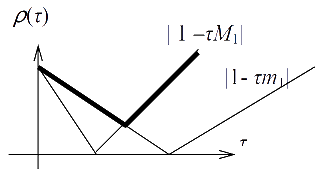
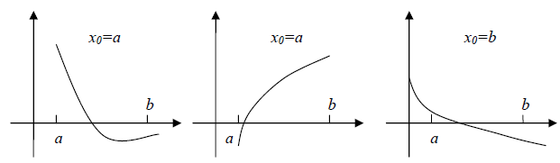



<!-- MarkdownTOC -->

- [2. Методи розв'язання нелінійних рівнянь](#2-методи-розвязання-нелінійних-рівнянь)
	- [2.1. Метод ділення навпіл](#21-метод-ділення-навпіл)
	- [2.2. Метод простої ітерації](#22-метод-простої-ітерації)
	- [2.3. Метод релаксації](#23-метод-релаксації)
	- [2.4. Метод Ньютона \(метод дотичних\)](#24-метод-ньютона-метод-дотичних)
	- [2.5. Збіжність методу Ньютона](#25-збіжність-методу-ньютона)

<!-- /MarkdownTOC -->

## 2. Методи розв'язання нелінійних рівнянь

_Постановка задачі_. Нехай маємо рівняння $$f(x) = 0$$, $$\bar x$$ &mdash; його розв'язок, тобто $$f(\bar x) = 0$$.

Задача розв'язання цього рівняння розпадається на етапи:

- Існування та кількість коренів.

- Відділення коренів, тобто розбиття числової вісі на інтервали, де знаходиться один корінь.

- Обчислення кореня із заданою точністю $$\varepsilon$$.

Для розв'язання перших двох задач використовуються методи математичного аналізу та алгебри, а також графічний метод. Далі розглядаються методи розв'язання третього етапу.

### 2.1. Метод ділення навпіл

Література:

- Самарский, Гулин, стор.&nbsp;191: [djvu](../books/samarskyi-gulin-1989.djvu), [pdf](../books/samarskyi-gulin-1989/191.pdf);

- Волков, стор.&nbsp;189&ndash;190: [djvu](../books/volkov-1987.djvu), [pdf](../books/volkov-1987/189-190.pdf).

Припустимо на $$[a, b]$$ знаходиться лише один корінь рівняння

\begin{equation}
	\label{eq:2.1.1}
	f(x) = 0
\end{equation}

для $$f(x) \in C[a, b]$$, який необхідно визначити. Нехай $$f(a) \cdot f(b) < 0$$.

Припустимо, що $$f(a) > 0$$, $$f(b) < 0$$. Покладемо $$x_1 = \frac{a + b}{2}$$ і підрахуємо $$f(x_1)$$. Якщо $$f(x_1) < 0$$, тоді шуканий корінь $$\bar x$$ знаходиться на інтервалі $$(a, x_1)$$. Якщо ж $$f(x_1) > 0$$, то $$\bar x \in (x_1, b)$$. Далі з двох інтервалів $$(a, x_1)$$ і $$(x_1, b)$$ вибираємо той, на границях якого функція $$f(x)$$ має різні знаки, знаходимо точку $$x_2$$ &mdash; середину вибраного інтервалу, підраховуємо $$f(x_2)$$ і повторюємо вказаний процес.

В результаті отримаємо послідовність інтервалів, що містять шуканий корінь $$\bar x$$, причому довжина кожного послідуючого інтервалу вдвічі менше попереднього.

Цей процес продовжується до тих пір, поки довжина отриманого інтервалу $$(a_n, b_n)$$ не стане меншою за $$b_n - a_n < 2 \varepsilon$$. Тоді $$x_{n + 1}$$, як середина інтервалу $$(a_n, b_n)$$, пов'язане з $$\bar x$$ нерівністю

\begin{equation}
	\label{eq:2.1.2}
	\vert x_{n + 1} - \bar x \vert < \varepsilon.
\end{equation}

Ця умова для деякого $$n$$ буде виконуватись за теоремою Больцано-Коші. Оскільки

\begin{equation}
	\vert b_{k + 1} - a_{k + 1} = \frac{\vert b_k - a_k \vert}{2},
\end{equation}

то

\begin{equation}
	\vert x_{n + 1} - \bar x \vert \le \frac{b - a}{2^{n + 1}} < \varepsilon.
\end{equation}

Звідси отримаємо нерівність для обчислення кількості ітерацій $$n$$ для виконання умови \eqref{eq:2.1.2}:

\begin{equation}
	n = n(\varepsilon) \ge \left[ \log \left( \frac{b - a}{\varepsilon} \right) \right] + 1.
\end{equation}

Степінь збіжності &mdash; лінійна, тобто геометричної прогресії з знаменником $$q = 1/2$$.

- **Переваги методу:** простота, надійність. 

- **Недоліки методу:** низька швидкість збіжності; метод не узагальнюється на системи.

### 2.2. Метод простої ітерації

Література:

- Самарский, Гулин, стор.&nbsp;191&ndash;193: [djvu](../books/samarskyi-gulin-1989.djvu), [pdf](../books/samarskyi-gulin-1989/191-193.pdf);

- Волков, стор.&nbsp;172&ndash;184: [djvu](../books/volkov-1987.djvu), [pdf](../books/volkov-1987/172-184.pdf).

Спочатку рівняння

\begin{equation}
	\label{eq:2.2.1}
	f(x) = 0
\end{equation}

замінюється еквівалентним

\begin{equation}
	\label{eq:2.2.2}
	x = \varphi(x).
\end{equation}

Ітераційний процес має вигляд

\begin{equation}
	\label{eq:2.2.3}
	x_{n + 1} = \varphi(x_n), \quad n = 0, 1, \ldots
\end{equation}

Початкове наближення $$x_0$$ задається.

Для збіжності велике значення має вибір функції $$\varphi(x)$$. Перший спосіб заміни рівняння полягає в відділенні змінної з якогось члена рівняння. Більш продуктивним є перехід від рівняння \eqref{eq:2.2.1} до \eqref{eq:2.2.2} з функцією $$\varphi(x) = x + \tau(x) \cdot f(x)$$, де $$\tau(x)$$ &mdash; знакостала функція на тому відрізку, де шукаємо корінь.

> **Означення**: Кажуть, що ітераційний метод збігається, якщо $$\Lim_{k \to \infty} x_k = \bar x$$.

Далі $$U_r = \left\{x : \vert x - a \vert \le r\right\}$$ відрізок довжини $$2 r$$ з серединою в точці $$a$$.

З'ясуємо умови, при яких збігається метод простої ітерації.

> **Теорема 1**: Якщо
> 
> \begin{equation}
> \Max_{x \in [a, b] = U_r} \vert \varphi'(x) \vert \le q < 1
> \end{equation}
>
> то метод простої ітерації збігається і має місце оцінка
> 
> \begin{equation}
> \label{eq:2.2.4}
> \vert x_n - \bar x \vert \le \frac{q_n}{1 - q} \cdot \vert x_0 - x_1 \vert \le \frac{q^n}{1 - q} \cdot (b - a).
> \end{equation}

_Доведення:_ Нехай $$x_{k + 1}, x_k \in U_r$$. Тоді

\begin{equation}
	\begin{aligned}
		\vert x_k - x_{k - 1} \vert &= \vert \varphi(x_k) - \varphi(x_{k - 1}) \vert = \newline
		&= \vert \varphi'(\xi_k) \cdot (x_k - x_{k - 1}) \vert \le \newline
		&\le \vert \varphi'(\xi_k) \vert \cdot \vert x_k - x_{k - 1} \vert \le \newline
		&\le q \cdot \vert x_k - x_{k - 1} \vert = \ldots \newline
		&= q^k \cdot \vert x_1 - x_0 \vert,
	\end{aligned}
\end{equation}

де $$\xi_k = x_k + \theta_k \cdot (x_{k + 1} - x_k)$$, а у свою чергу $$0 < \theta_k < 1$$. Далі

\begin{align}
	\vert x_{k + p} - x_k \vert &= \vert x_{k + p} - x_{k + p - 1} + \ldots + x_{k + 1} - x_k \vert = \nonumber \newline
	&= \vert x_{k + p} - x_{k + p - 1} \vert + \ldots + \vert x_{k + 1} - x_k \vert \le \nonumber \newline
	&\le \left( q^{k + p - 1} + q^{k + p - 2} + \ldots + q^k \right) \cdot \vert x_1 - x_0 \vert = \nonumber \newline
	&= \frac{q^k - q^{k + p - 1}}{1 - q} \cdot \vert x_1 - x_0 \vert \xrightarrow[k \to \infty]{} 0. \label{eq:2.2.5}
\end{align}

Бачимо що $$\{x_k\}$$ &mdash; фундаментальна послідовність. Значить вона збіжна. При $$p \to \infty$$ в \eqref{eq:2.2.5} отримуємо \eqref{eq:2.2.4}. $$\square$$

Визначимо кількість ітерацій для досягнення точності $$\varepsilon$$. З оцінки в [теоремі $$1$$](#теорема-2-2-1) отримаємо

\begin{equation}
	\vert x_n - \bar x \vert \le \frac{q^n}{1 - q} \cdot (b - a) < \varepsilon,
\end{equation}

звідки безпосередньо маємо

\begin{equation}
	n(\varepsilon) = n \ge \left[ \frac{\ln \left( \frac{\varepsilon (1 - q)}{b - a} \right)}{\ln q} \right] + 1.
\end{equation}

Практично ітераційний процес зупиняємо при: $$\vert x_n - x_{n - 1} \vert < \varepsilon$$. Але ця умова не завжди гарантує, що $$\vert x_n - \bar x \vert < \varepsilon$$.

> **Зауваження**: Умова збіжності методу може бути замінена на умову Ліпшиця
>
> \begin{equation}
> \vert \varphi(x) - \varphi(y) \vert \le q \cdot \vert x - y \vert, \quad 0 < q < 1.
> \end{equation}

- **Переваги методу:** простота; при $$q < 1/2$$ &mdash; швидше збігається ніж метод ділення навпіл; метод узагальнюється на системи. 

- **Недоліки методу:** при $$q > 1/2$$ збігається повільніше ніж метод ділення навпіл; виникають труднощі при зведенні $$f(x) = 0$$ до $$x = \varphi(x)$$.

### 2.3. Метод релаксації

Література:

- Самарский, Гулин, стор.&nbsp;192&ndash;193: [djvu](../books/samarskyi-gulin-1989.djvu), [pdf](../books/samarskyi-gulin-1989/192-193.pdf).

Якщо в методі простої ітерації для рівняння $$x = x + \tau \cdot f(x) \equiv \varphi(x)$$ вибрати $$\tau(x) = \tau = \text{const}$$, то ітераційний процес приймає вигляд 

\begin{equation}
	\label{eq:2.3.1}
	x_{n + 1} = x_n + \tau \cdot f(x_n),
\end{equation}

де $$k = 0, 1, 2, 3 \ldots$$, а $$x_0$$ &mdash; задано. Метод можна записати у вигляді

\begin{equation}
	\frac{x_{k + 1} - x_k}{\tau} = f(x_k), \quad k = 0, 1, \ldots
\end{equation}

Оскільки $$\varphi'(x) = 1 + \tau \cdot f'(x)$$, то метод збігається при умові

\begin{equation}
	\vert \varphi'(x) \vert = \vert 1 + \tau \cdot f'(x) \vert \le q < 1.
\end{equation}

Нехай $$f'(x) < 0$$, тоді \eqref{eq:2.2.3} запишеться у вигляді: $$-q \le 1 + \tau \cdot f'(x) \le q < 1$$. Звідси 

\begin{equation}
	f'(x) \le 1 + q < 2 k \tau,
\end{equation}

і

\begin{equation}
	0 < \tau < \frac{2}{\vert f'(x)\vert}.
\end{equation}

Поставимо задачу знаходження $$\tau$$, для якого $$q = q(\tau) \to \min$$. Для того,
щоб вибрати оптимальний параметр $$\tau$$, розглянемо рівняння для похибки $$z_k = x_k - \bar x$$.

Підставивши $$x_k = x + z_k$$ в \eqref{eq:2.3.1}, отримаємо 

\begin{equation}
	z_{k + 1} = z_k + \tau \cdot f(x + z_k).
\end{equation}

В припущені $$f(x) \in C^1([a,b])$$ з теореми про середнє маємо

\begin{equation}
	\begin{aligned}
		f (\bar x + z_k) &= f(\bar x) + z_k \cdot f'(\bar x + \theta \cdot z_k) = \newline
		&= z_k \cdot  f'(\bar x + \theta \cdot z_k) = z_k \cdot f'(\xi_k),
	\end{aligned}
\end{equation}

тобто

\begin{equation}
	z_{k + 1} = z_k + \tau \cdot f'(\xi_k) \cdot z_k.
\end{equation}

Звідси

\begin{equation}
	\vert z_{k + 1} \vert \le \vert 1 + \tau \cdot f'(\xi_k) \vert \cdot \vert z_k \vert \le \Max_U \vert 1 + \tau \cdot f'(\xi_k) \vert \cdot \vert z_k \vert.
\end{equation}

А тому

\begin{equation}
	\vert z_{k + 1} \vert \le \max \left\\{ \vert 1 - \tau M_1 \vert, \vert 1 - \tau m_1 \vert \right\\} \cdot \vert z_k \vert,
\end{equation}

де

\begin{equation}
	m_1 = \Min_{[a, b]} \vert f'(x) \vert, \quad M_1 = \Max_{[a, b]} \vert f'(x) \vert
\end{equation}

Таким чином, задача вибору оптимального параметра зводиться до знаходження $$\tau$$, для якого функція 

\begin{equation}
	q(\tau) = \max \left\\{ \vert 1 - \tau M_1 \vert, \vert 1 - \tau m_1 \vert \right\\}
\end{equation}

приймає мінімальне значення: $$q(\tau) \to \min$$.

З графіка видно, що точка мінімуму визначається умовою $$\vert 1 - \tau M_1 \vert = \vert 1 - \tau m_1 \vert$$. Тому 

\begin{equation}
	1 - \tau_0 m_1 = \tau_0 M_1 - 1 \implies \tau_0 = \frac{2}{M_1 - m_1} < \frac{2}{\vert f'(x) \vert}.
\end{equation}

При цьому значенні $$\tau$$ маємо

\begin{equation}
	q(\tau_0) = \rho_0 = \frac{M_1 - m_1}{M_1 + m_1}.
\end{equation}

Тоді для похибки вірна оцінка

\begin{equation}
	\vert x_n - \bar x \vert \le \frac{\rho_0^n}{1 - \rho_0} \cdot (b - a) < \varepsilon.
\end{equation}

Кількість ітерацій

\begin{equation}
	n = n(\varepsilon) \ge \left[ \frac{\frac{\ln (\varepsilon (1 - \rho_0))}{b - a}}{\ln \rho_0} \right] + 1.
\end{equation}

> **Задача 1**: Дати геометричну інтерпретацію методу простої ітерації для випадків:
> 
> \begin{equation}
> 0 < \varphi'(x) < 1; \quad -1 < \varphi'(x) < 0; \quad \varphi'(x) < -1; \quad \varphi'(x) > 1.
> \end{equation}

> **Задача 2**: Знайти оптимальне $$\tau = \tau_0$$ для методу релаксації при $$f'(x) > 0$$.

### 2.4. Метод Ньютона (метод дотичних)

Література:

- Самарский, Гулин, стор.&nbsp;193&ndash;194: [djvu](../books/samarskyi-gulin-1989.djvu), [pdf](../books/samarskyi-gulin-1989/193-194.pdf).

- Березин, Жидков, том.&nbsp;ІІ, стор.&nbsp;135&ndash;140: [djvu](../books/berezin-zhidkov-ii-1959.djvu), [pdf](../books/berezin-zhidkov-ii-1959/135-140.pdf).

Припустимо, що рівняння $$f(x) = 0$$ має простий дійсний корінь $$\bar x$$, тобто $$f(\bar x) = 0$$, $$f'(x) \ne 0$$. Нехай виконуються умови: $$f(x) \in C^1([a,b])$$, $$f(a) \cdot f (b) < 0$$. Тоді 

\begin{equation}
	0 = f(\bar x) = f(x_k + \bar x - x_k) = f(x_k) + f'(\xi_k) \cdot (x - x_k),
\end{equation}

де $$\xi_k = x_k + \theta_k \cdot (\bar x - x_k)$$, $$0 < \theta_k < 1$$, $$\xi_k \approx x_k$$. Тому наступне наближення виберемо з рівняння

\begin{equation}
	f(x_k) + f'(x_k) \cdot (x_{k + 1} - x_k) = 0.
\end{equation}

Звідси маємо ітераційний процес

\begin{equation}
	x_{k + 1} = x_k - \frac{f(x_k)}{f'(x_k)},
\end{equation}

де $$k = 0, 1, 2, \ldots$$; $$x_0$$ &mdash; задане.

Метод Ньютона ще називають методом лінеаризації або методом дотичних.

> **Задача 3**: Дати геометричну інтерпретацію методу Ньютона.

Метод Ньютона можна інтерпретувати як метод простої ітерації з

\begin{equation}
	\varphi(x) = x - \frac{f(x)}{f'(x)},
\end{equation}

тобто

\begin{equation}
	\tau(x) = - \frac{1}{f'(x)}.
\end{equation}

Тому

\begin{equation}
	\varphi'(x) = 1 - \frac{f'(x) \cdot f'(x) - f(x) \cdot f''(x)}{(f'(x))^2} = \frac{f(x) \cdot f''(x)}{(f'(x))^2}.
\end{equation}

Якщо $$\bar x$$ &mdash; корінь $$f(x)$$, то $$\varphi'(x) = 1$$. знайдеться окіл кореня, \end{equation}

\begin{equation}
	\vert \varphi'(x) \vert = \left\vert \frac{f(x) \cdot f''(x)}{(f'(x))^2} \right\vert < 1.
\end{equation}

Це означає, що збіжність методу Ньютона залежить від вибору $$x_0$$.

**Недолік** методу Ньютона: необхідність обчислювати на кожній ітерації не тільки значення функції, а й похідної.

Модифікований метод Ньютона позбавлений цього недоліку і має вигляд:

\begin{equation}
	x_{k + 1} = x_k - \frac{f(x_k)}{f'(x_0)}, \quad k = 0, 1, 2, \ldots
\end{equation}

Цей метод має лише лінійну збіжність: $$\vert x_{k + 1} - x = O(\vert x_k - \bar x \vert)$$.

> **Задача 4**: Дати геометричну інтерпретацію модифікованого методу Ньютона.

В методі Ньютона, для якого $$f'(x_k)$$ замінюється на

\begin{equation}
	\frac{f(x_k) - f(x_{k - 1})}{x_k - x_{k - 1}}
\end{equation}

дає метод січних:

\begin{equation}
	x_{k + 1} = x_k - \frac{x_k - x_{k - 1}}{f(x_k) - f(x_{k - 1})} \cdot f(x_k),
\end{equation}

де $$k = 1, 2, \ldots$$, $$x_0, x_1$$ &mdash; задані.

> **Задача 5**: Дати геометричну інтерпретацію методу січних.

### 2.5. Збіжність методу Ньютона

Література:

- Самарский, Гулин, стор.&nbsp;199&ndash;202: [djvu](../books/samarskyi-gulin-1989.djvu), [pdf](../books/samarskyi-gulin-1989/199-202.pdf).

> **Теорема 1**: Нехай $$f(x) \in C^2([a,b])$$; $$\bar x$$ простий дійсний корінь рівняння 
>
> \begin{equation}
> \label{eq:2.5.1}
> f(x) = 0.
> \end{equation}
>
> і $$f'(x) \ne 0$$ при $$x \in U_r = \left\{ x : \vert x - \bar x \vert < r \right\}$$. Якщо
> 
> \begin{equation}
> \label{eq:2.5.2}
> q = \frac{M_2 \cdot \vert x_0 - \bar x \vert}{2 m_1} < 1,
> \end{equation}
>
> де $$m_1 = \Min_{U_r} \vert f'(x) \vert$$, $$M_2 = \Max_{U_r} \vert f''(x) \vert$$, то для $$x_0 \in U_r$$ метод Ньютона
>
> \begin{equation}
> \label{eq:2.5.3}
> x_{k + 1} = x_k - \frac{f(x_k)}{f'(x_k)}
> \end{equation}
>
> збігається і має місце оцінка
>
> \begin{equation}
> \label{eq:2.5.4}
> \vert x_n - \bar x \vert \le q^{2^n - 1} \cdot \vert x_0 - \bar x \vert.
> \end{equation}

З \eqref{eq:2.5.3} маємо 

\begin{align}
	x_{k + 1} - \bar x &= x_k - \frac{f(x_k)}{f'(x_k)} - \bar x = \nonumber \newline 
	&= \frac{(x_k - \bar x) \cdot f'(x_k) - f(x_k)}{f'(x_k)} = \frac{F(x_k)}{f'(x_k)},
	\label{eq:2.5.5}
\end{align}

де $$F(x) = (x - \bar x) f'(x) - f(x)$$, така, що

- $$F(\bar x) = 0$$;

- $$F'(x) = (x - \bar x) \cdot f''(x)$$.

Тоді

\begin{equation}
	F(x_k) = F(\bar x) + \Int_x^{x_k} F'(t) \diff t = \Int_x^{x_k} (t - \bar x) \cdot f''(t) \diff t.
\end{equation}

Так як $$(t - \bar x)$$ не міняє знак на відрізку інтегрування, то скористаємося теоремою про середнє значення:

\begin{equation}
	\label{eq:2.5.6}
	F(x_k) = f''(\xi_k) \Int_x^{x_k} (t - \bar x) \diff t = \frac{(x_k - x)^2}{2} \cdot f''(\xi_k),
\end{equation}

де $$\xi_k = \bar x + \theta_k \cdot (x_k - \bar x)$$, де $$0 < \theta_k < 1$$. З \eqref{eq:2.5.5}, \eqref{eq:2.5.6} маємо

\begin{equation}
	\label{eq:2.5.7}
	x_{k + 1} - \bar x = \frac{(x_k - \bar x)^2}{2 f'(x_k)} \cdot f''(\xi_k).
\end{equation}

Доведемо оцінку \eqref{eq:2.5.3} за індукцією. Так як $$x_0 \in U_r$$, то

\begin{equation}
	\vert \xi_0 - \bar x \vert = \vert \theta_0 \cdot (x_0 - \bar x) \vert < \vert \theta_0 \vert \cdot \vert x_0 - \bar x \vert < r
\end{equation}

звідси випливає $$\xi_0 \in U_r$$.

Тоді $$f''(\xi_0) \le M_2$$, тому

\begin{equation}
	\begin{aligned}
		\vert x_1 - \bar x \vert &\le \frac{(x_0 - \bar x)^2 \cdot M_2}{2 m_1} = \\
		&= \frac{M_2 \cdot \vert x_0 - \bar x \vert}{2 m_1} \cdot \vert x_0 - \bar x \vert = \\
		&= q \cdot \vert x_0 - \bar x \vert < r,
	\end{aligned}
\end{equation}

тобто $$x_1 \in U_r$$.

Ми довели твердження \eqref{eq:2.5.4} при $$n = 1$$. Нехай воно справджується при $$n = k$$

\begin{equation}
	\begin{aligned}
		\vert x_k - \bar x \vert &\le q^{2^k - 1} \cdot \vert x_0 - \bar x \vert < r, \newline
		\vert \xi_k - \bar x \vert &= \vert \theta_k \cdot (x_k - \bar x) \vert < r.
	\end{aligned}
\end{equation}

Тоді $$x_k, \xi_k \in U_r$$.

Доведемо \eqref{eq:2.5.4} для $$n = k + 1$$. З \eqref{eq:2.5.7} маємо

\begin{align}
	\vert x_{k + 1} - \bar x \vert &\le \frac{\vert x_k - \bar x \vert^2 \cdot M_2}{2 m_1} \le \nonumber \newline
	&\le \left( q^{2^k - 1} \right)^2 \cdot \frac{\vert x_0 - \bar x \vert^2 \cdot M_2}{2 m_1} = \nonumber \newline 
	&= q^{2^{k + 1} - 2} \cdot \frac{\vert x_0 - \bar x \vert \cdot M_2}{2 m_1} \cdot \vert x_0 - \bar x \vert = \nonumber \newline
	&= q^{2^{k + 1} - 1} \cdot \vert x_0 - \bar x \vert. \nonumber
\end{align}

Таким чином \eqref{eq:2.5.4} справджується для $$n = k + 1$$. Значить \eqref{eq:2.5.4} виконується і для довільного $$n$$. Таким чином $$x_n \xrightarrow[n \to \infty]{} x$$. $$\square$$

З \eqref{eq:2.5.4} маємо оцінку кількості ітерацій для досягнення точності $$\varepsilon$$

\begin{equation}
	n \ge \left[ \log_2 \left( 1 + \frac{\ln \left( \frac{\varepsilon}{b - a} \right)}{\ln q} \right) \right] + 1.
\end{equation}

Кажуть, що ітераційний метод має _степінь збіжності_ $$m$$, якщо

\begin{equation}
	\vert x_{k + 1} - \bar x \vert = O \left( \vert x_k - \bar x \vert^m \right).
\end{equation}

Для методу Ньютона 

\begin{equation}
	\vert x_{k + 1} - \bar x \vert = \frac{\vert x_k - \bar x \vert^2 \vert \cdot f''(\xi_k) \vert}{2 \vert f'(x_k) \vert}.
\end{equation}

Звідси випливає, що

\begin{equation}
	\vert x_{k + 1} - \bar x \vert = O\left( \vert x_k - \bar x \vert^2 \right).
\end{equation}

Значить степінь збіжності методу Ньютона $$m = 2$$. Для методу простої ітерації і ділення навпіл $$m = 1$$.

> **Теорема 2**: Нехай $$f(x) \in C^2([a,b])$$ та $$x$$ простий корінь рівняння $$f(x) = 0$$ ($$f'(x) \ne 0$$). Якщо $$f'(x) \cdot f''(x) > 0$$ ($$f'(x) \cdot f''(x) < 0$$) то для методу Ньютона при $$x_0 = b$$ послідовність наближень $$\{x_k\}$$ монотонно спадає (монотонно зростає при $$x_0 = a$$).

> **Задача 6**: Довести [теорему $$2$$](#теорема-2-5-2) при
>
> - $$f'(x) \cdot f''(x) > 0$$;
>
> - $$f'(x) \cdot f''(x) < 0$$.

> **Задача 7**: Знайти степінь збіжності методу січних [Калиткин&nbsp;Н.Н., Численные методы, с.&nbsp;145&ndash;146]

Якщо $$f(a) \cdot f''(a) > 0$$ та $$f''(x)$$ не міняє знак, то потрібно вибирати $$x_0 = a$$; при цьому $$\{x_k\} \uparrow \bar x$$.

Якщо $$f(b) \cdot f''(b) > 0$$, то $$x_0 = b$$; маємо $$\{x_k\} \downarrow \bar x$$. Пояснення на рисунку&nbsp;2:

> **Зауваження 1**: Якщо $$\bar x$$ &mdash; $$p$$-кратний корінь тобто 
>
> \begin{equation}
> f^{(m)}(\bar x) = 0, \quad m = 0, 1, \ldots, p - 1; \quad f^{(p)} (x) \ne 0,
> \end{equation}
>
> то в методі Ньютона необхідна наступна модифікація
>
> \begin{equation}
> x_{k + 1} - x_k - p \cdot \frac{f(x_k)}{f'(x_k)}
> \end{equation}
>
> і
>
> \begin{equation}
> q = \frac{M_{p + 1} \cdot \vert x_0 - \bar x \vert}{m_p \cdot p \cdot (p + 1)} < 1.
> \end{equation}

> **Зауваження 2**: Метод Ньютона можна застосовувати і для обчислення комплексного кореня
>
> \begin{equation}
> z_{k + 1} = z_k - \frac{f(z_k)}{f'(z_k)}
> \end{equation}
>
> В теоремі про збіжність
>
> \begin{equation}
> q = \frac{\vert x_0 - \bar x \vert M_2}{2 m_1},
> \end{equation}
>
> де
>
> \begin{equation}
> m_1 = \Min_{U_r} \vert f'(z) \vert, \quad M_2 = \Max_{U_r} f''(z) \vert.
> \end{equation}
>
> Тут $$\vert z \vert$$ &mdash; модуль комплексного числа.

**Переваги** методу Ньютона:

- висока швидкість збіжності;

- узагальнюється на системи рівнянь; 

- узагальнюється на комплексні корені.

**Недоліки** методу Ньютона: 

- на кожній ітерації обчислюється не тільки $$f(x_k)$$, а і похідна $$f'(x_k)$$; 

- збіжність залежить від початкового наближення $$x_0$$, оскільки від нього залежить умова збіжності

	\begin{equation}
		q = \frac{M_2 \vert x_0 - \bar x \vert}{2 m_1} < 1;
	\end{equation}

- потрібно, щоб $$f(x) \in C^2([a,b])$$.

[Назад до лекцій](README.md)

[Назад на головну](../README.md)
