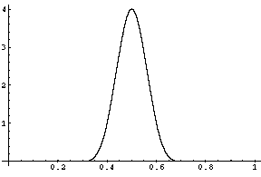
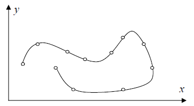
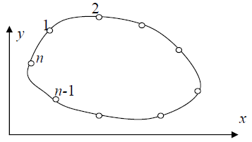



<!-- MarkdownTOC -->

- [6. Інтерполювання функцій](#6-інтерполювання-функцій)
    - [6.7. Інтерполювання з кратними вузлами](#67-інтерполювання-з-кратними-вузлами)
    - [6.8. Збіжність процесу інтерполювання](#68-збіжність-процесу-інтерполювання)
    - [6.9. Кусково-лінійна інтерполяція](#69-кусково-лінійна-інтерполяція)
    - [6.10. Кусково-кубічна ермітова інтерполяція](#610-кусково-кубічна-ермітова-інтерполяція)
    - [6.11. Кубічні інтерполяційні сплайни](#611-кубічні-інтерполяційні-сплайни)
    - [6.12. Параметричні сплайни](#612-параметричні-сплайни)
    - [6.13. Застосування інтерполювання: TBC](#613-застосування-інтерполювання-tbc)
    - [6.14. Тригонометрична інтерполяція: TBC](#614-тригонометрична-інтерполяція-tbc)
    - [6.15. Двовимірна інтерполяція: TBC](#615-двовимірна-інтерполяція-tbc)

<!-- /MarkdownTOC -->

## 6. Інтерполювання функцій

### 6.7. Інтерполювання з кратними вузлами

Література:

- БЖК, стор.&nbsp;47&ndash;50;

- ЛМС, стор.&nbsp;34.

Нехай $$f(x)$$ задана таблицею значень $$f^{(j)}(x_i)$$, $$i = \overline{0, n}$$, $$j = \overline{0, k_i - 1}$$, $$k_i$$ &mdash; кратності відповідних вузлів. Побудуємо $$H_m^{(i)}(x_j) = f^{(i)}(x_j)$$ &mdash; інтерполяційний багаточлен Ерміта по кратним вузлах, де

\begin{equation}
    m = \Sum_{i = 1}^n k_i - 1.
\end{equation}

Якщо $$k_i = 1$$, то $$H_m(x) = L_n(x)$$.

Для побудови $$H_m(x)$$ в загальному випадку для кожної точки $$x_i$$ введемо $$k_i$$ точок $$x_{i, j}^\varepsilon = x_i + j \varepsilon$$, $$i = \overline{0, n}$$, $$j = \overline{0, k_i - 1}$$. З умови $$\forall i$$: $$x_{i, k_i - 1}^\varepsilon = x_i + \varepsilon (k - 1) < x_{i + 1}$$ можна вибрати $$\varepsilon$$.

Нехай $$f(x) \in C^{(m)}([a,b])$$. Запишемо інтерполяційну формулу Ньютона:

\begin{equation}
    \begin{aligned}
        L_m^\varepsilon &= f \left( x_{0, 0}^\varepsilon \right) + f \left(x_{0, 0}^\varepsilon; x_{0, 1}^\varepsilon \right) \left(x - x_{0, 0}^\varepsilon \right) + \ldots \newline
        & \quad + f \left( x_{0, 0}^\varepsilon; \ldots; x_{n, k_n - 1}^\varepsilon \right) \left( x - x_{0, 0}^\varepsilon \right) \ldots \left( x - x_{n, k_n - 1}^\varepsilon \right).
    \end{aligned}
\end{equation}
    
При $$\varepsilon \to 0$$ маємо $$x_{i,j}^\varepsilon \to x_i$$. Крім того

\begin{equation}
    f \left( x_{i,0}^\varepsilon; \ldots; x_{i, k_i - 1}^\varepsilon \right) = f (x_i; \ldots; x_i) = \frac{f^{(k_i)}(x_i)}{k_i!}.
\end{equation}

Тому $$L_m^\varepsilon(x) \to H_m(x)$$ та

\begin{equation}
    R_m(x) = f(x) - H_m(x) = \frac{f^{(m + 1)}(\xi)}{(m + 1)!} \cdot \Omega_m(x),
\end{equation}

де $$\Omega_m(x) = (x - x_0)^{k_0} \ldots (x - x_n)^{k_n}$$.

### 6.8. Збіжність процесу інтерполювання

Література:

- ЛМС, стор.&nbsp;42&ndash;46; 

- СГ, стор.&nbsp;134&ndash;136.

Виникає питання, чи буде прямувати до нуля похибка інтерполювання $$f(x) - L_n(x)$$, якщо число вузлів $$n$$ збільшувати? 

Введемо норму

\begin{equation}
    \|f(x) - L_n\|\void_{C([a,b])} = \Max_{x \in [a,b]} | f(x) - L_n(x) |.
\end{equation}

Тоді для довільної $$f(x) \in C^{(n + 1)}([a,b])$$ справджується оцінка

\begin{equation}
    \label{eq:6.8.1}
    \| f(x) - L_n(x)\|\void_{C([a,b])} \le \frac{M_{n + 1}}{(n + 1)!} \|\omega_n(x)\|\void_{C([a,b])},
\end{equation}

де $$M_{n + 1} = \Max_{x \in [a,b]} \left\vert f^{(n + 1)}(x) \right\vert$$, $$\omega_n(x) = \Prod_{i = 0}^n (x - x_i)$$. 

А яка оцінка буде для довільної неперервної функції?

> **Означення**: Кажуть, що інтерполяційний процес для функції $$f(x)$$ _збігається_ в точці $$x \in [a,b]$$, якщо
>
> \begin{equation}
> \forall \\{x_i\\}^n_{i = 1}: h = \Max_{i = \overline{1,n}} \to 0: \Lim_{n\to\infty} L_n(x) = f(x), 
> \end{equation}
>
> де, як завжди, $$h_i = x_i - x_{i-1}$$.

> **Означення**: Якщо $$\|f(x) - L_n(x)\|\void_{C([a,b])} \xrightarrow[n\to\infty]{}0$$, то інтерполяційний процес збігається рівномірно.

Розглянемо приклади поведінки інтерполяційних багаточленів при $$n \to \infty$$ для деяких функцій. 

> **Приклад 1**: Послідовність інтерполяційних багаточленів (сітка рівномірна), побудованих для неперервної функції $$f(x) = \vert x \vert$$, $$-1 \le x \le 1$$ (функція неперервна, але негладка), не збігається на $$x \in [-1,1]$$, крім точок $$x = -1,0,1$$.
>
> На рисунку дано графіки самої функції (штрихова лінія) та інтерполяційного багаточлена (суцільна лінія) на рівномірній сітці $$x_i = -1 + i h$$, $$h = 2 / n$$, $$i = \overline{0,n}$$ для $$n = 10$$:
> 
> 

> **Приклад 2**: Функція Рунге $$f(x) = \frac{1}{1 + 40x^2}$$, $$-1 \le x \le 1$$ (функція аналітична!). Для рівномірної сітки $$x_i = -1 + i h$$, $$h = 2 / n$$, $$i = \overline{0,n}$$ маємо графіки: суцільна лінія &mdash; інтерполяційного багаточлена; пунктирна &mdash; самої функції для $$n = 10$$:
>
> 

Пояснити чому рівномірна сітка дає великі похибки інтерполювання біля кінців інтервалу інтерполювання допомагає наступний рисунок. На цьому рисунку суцільною лінією представлено графік функції $$\omega_n = \Prod_{i = 0}^n (x - x_i)$$ ($$n = 8$$) для рівномірної сітки. Як бачимо максимальні за модулем значення цієї функції припадають на кінці інтервалу.

Для порівняння на цьому ж рисунку (штрихова лінія) побудовано графік $$\omega_n = \Prod_{i = 0}^n (x - x_i)$$, що відповідає чебишовським вузлам, які мінімізують похибку інтерполювання. Тепер відхилення $$\omega_n(x)$$ розподілено рівномірно по всьому проміжку інтерполювання.

> **Теорема** (_Фабера_): $$\forall \{x_i\}^n_{i = 0}$$ існує $$f(x) \in C([a,b])$$, для якої інтерполяційний процес не збігається рівномірно.

> **Теорема** (_Марцинкевича_): $$\forall f(x) \in C([a,b])$$ існуюють $$\{x_i\}^n_{i = 0}$$ такі, що послідовність $$\{L_n(x)\}$$ збігається рівномірно до $$f(x)$$.

> **Теорема**: Стала Лебега
>
> \begin{equation}
> \|P_n\| = \Max_j \Sum_{j = 0}^n \left\vert \varphi_j^{(n)}(x) \right\vert,
> \end{equation}
>
> де 
> 
> \begin{equation}
> \varphi_j^{(n)}(x) = \frac{\omega_n(x)}{(x-x_j) \cdot \omega_n'(x_i)}.
> \end{equation}

> **Теорема**: Для $$f(x) \in C([a,b])$$:
>
> \begin{equation}
> \|f(x)-L_n(x)\|\void_{C([a,b])} \le (1 + \|P_n\|) \cdot E_n(f),
> \end{equation}
>
> де
>
> \begin{equation}
> E_n(f) = \Inf_{Q_n(x)} \|f(x) - Q_n(x)\|\void_{C([a,b])}
> \end{equation}
>
> &mdash; відхилення багаточлена $$n$$-го степеня найкращого рівномірного наближення від $$f(x)$$.

> **Теорема**: Нехай $$P_n^E$$ &mdash; оператор інтерполяції на рівномірній сітці, $$P_n^T$$ &mdash; оператор інтерполяції на чебишовській сітці. Тоді на $$[-1,1]$$ маємо наближені оцінки:
>
> \begin{equation}
> \|P_n^E\|\approx C_1 \cdot 2^n, \quad \|P_n^T\| \approx C_2 \cdot \ln(n).
> \end{equation}

Останні оцінки поясняють розбіжність процесу інтерполювання при великих $$n$$.

### 6.9. Кусково-лінійна інтерполяція

Інтерполяція багаточленом Лагранжа або Ньютона на відрізку $$[a,b]$$ з використанням великої кількості вузлів інтерполяції часто приводить до поганого наближення через розбіжність процесу інтерполювання. Для того щоб уникнути великої похибки, весь відрізок $$[a,b]$$ розбивають на частинні відрізки $$[x_{i-1}, x_i]$$ і на кожному з частинних відрізків замінюють функцію $$f(x)$$ багаточленом невисокого степеню. В цьому і полягає кусково-поліноміальна інтерполяція.

Розглянемо найпростішу таку інтерполяцію &mdash; лінійну. Нехай задана $$f(x)$$ значеннями $$f(x_i)$$, $$i = \overline{0, n}$$. Побудуємо функцію $$\Phi_1(x)$$ &mdash; лінійну на $$x \in [x_{i - 1}, x_i]$$, що інтерполює ці значення:

\begin{equation}
    \label{eq:6.9.2}
    \begin{aligned}
        \Phi_1(x) &= L_1^i(x) = \newline
        &= f(x_{i - 1}) \cdot \frac{x - x_{i - 1}}{x_i - x_{i - 1}} + f(x_i) \cdot \frac{x_i - x}{x_i - x_{i - 1}},
    \end{aligned}
\end{equation}

де $$x \in [x_{i - 1}, x_i]$$.

Представимо її у вигляді

\begin{equation}
    \label{eq:6.9.3}
    \Phi_1(x) = \Sum_{i = 0}^n f(x_i) \cdot \varphi_i(x).
\end{equation}

З умов інтерполювання маємо 

\begin{equation}
    \Phi_1(x_j) = \Sum_{i = 0}^n f(x_i) \cdot \varphi_i(x_j) = f(x_j).
\end{equation}

Звідси 

\begin{equation}
    \varphi_i(x_j) = \delta_{i,j} = \begin{cases} 
        1, & i = j \newline
        0, & i \ne j
    \end{cases}.
\end{equation}

Значить

\begin{equation}
    \varphi_i(x) = \begin{cases} 
        0, & a \le x \le x_{i-1} \newline
        \frac{x-x_{i-1}}{x_i-x_{i-1}}, & x_{i-1} \le x \le x_i \newline
        \frac{x_{i+1}-x}{x_{i+1}-x_i}, & x_i \le x \le x_{i+1} \newline
        0, & x_{i+1} \le x \le b
    \end{cases}
\end{equation}

> **Теорема**: Для довільної $$f(x) \in C^{(2)}([a,b])$$ справедлива оцінка
>
> \begin{equation}
> \label{eq:6.9.4}
> \|f(x)-\Phi_1(x)\|\void_{C([a,b])} \le \frac{M_2}{8} \cdot |h|^2,
> \end{equation}
> 
> де $$\Phi_1(x)$$ &mdash; кусково-лінійна функція, побудована по значеннях $$f(x_i)$$, $$i = \overline{0, n}$$, $$\vert h \vert = \Max_i h_i$$, $$h_i = x_i - x_{i-1}$$.

_Доведення_: Маємо для $$x \in [x_{i-1}, x_i]$$:
    
\begin{equation}
    \begin{aligned}
        z(x) &= f(x) - \Phi_1(x) = \newline
        &= f(x) - L_1^i(x) = \newline
        &= \frac{f^{\prime\prime}(\xi_i)}{2!} \cdot (x-x_{i-1}) \cdot(x-x_i).
    \end{aligned}
\end{equation}

Звідси 
    
\begin{equation}
    \label{eq:6.9.5}
    \begin{aligned}
        |f(x) - \Phi_1(x)| & \le \frac{M_2^i}{2} \cdot |(x - x_{i-1}) (x - x_i)| \le \newline
        & \le \frac{M_2^i \cdot h_i^2}{8},
    \end{aligned}
\end{equation}

де

\begin{equation}
    M_2^i = \Max_{x \in [x_{i - 1}, x_i]} | f^{\prime\prim  (x) |.
\end{equation}

Остання оцінка отримана з нерівності

\begin{equation}
    \Max_{[x_{i-1},x_i]} |(x-x_{i-1}) \cdot (x - x_i)| = \frac{h_i^2}{4}.
\end{equation}

Тоді

\begin{equation}
    \label{eq:6.9.6}
    \Max_{i = \overline{1,n}} \Max_{x \in [x_{i-1},x_i]} |z(x)| \le \frac{h^2 M_2}{8},
\end{equation}

де $$M_2 = \Max_{x\in[a,b]} \vert f^{\prime\prime}(x) \vert$$, $$h_i = \Max_i h_i$$, що доводить \eqref{eq:6.9.4}. $$\square$$

> **Задача 16**: Довести оцінку $$\vert f'(x) - \Phi_1'(x) \vert \le \vert h \vert \cdot M_2$$.

Отже маємо збіжність процесу інтерполювання за допомогою кусково-лінійної функції

\begin{equation}
    \left\| f(x) - \Phi_1^{(n)}(x) \right\|\void_{C([a,b])} \xrightarrow[h \to 0, n \to \infty]{} 0,
\end{equation}

тобто

\begin{equation}
    \left\\{\Phi_1^{(n)}(x)\right\\} \implies f(x).
\end{equation}

Розглянемо деякі простори:

1. $$H_0 = L_2([a,b])$$ &mdash; гільбертів простір, в якому скалярний добуток визначається так:

    \begin{equation}
        \langle u, v \rangle = \Int_a^b (u(x) \cdot v(x)) \diff x
    \end{equation}

    а норма $$\|u\|\void_0 = \sqrt{\langle u,u \rangle}$$.

2. $$H_k = W_2^k([a,b])$$. Тепер скалярний добуток

    \begin{equation}
        \langle u, v \rangle_k = \Sum_{m = 0}^k \Int_a^b \left( u^{(m)}(x) \cdot v^{(m)}(x) \right) \diff x,
    \end{equation}

    а норма $$\|u\|\void_k = \sqrt{\|u^{(0)}\|^2 + \ldots + \|u^{(k)}\|^2}$$.

> **Теорема**: Нехай $$f(x) \in H_2 = W_2^2([a,b])$$. Тоді
>
> \begin{equation}
> \left\|f^{(k)} - \Phi_1^{(k)} \right\|\void_0 \le \vert h \vert^{2-k} \cdot \|f\|\void_2,
> \end{equation}
>
> де $$k=1,2$$. 

Зауважимо, що кусково-лінійна інтерполяція негладка, тому на практиці застосовують квадратичні, а найчастіше &mdash; кубічні поліноми на кожному проміжку.

### 6.10. Кусково-кубічна ермітова інтерполяція

Нехай деяка функція $$f(x)$$ задана в точках $$x_i$$ своїми значеннями та значеннями похідної: $$y_i = f(x_i)$$, $$y_i' = f'(x_i)$$, $$i = \overline{0, n}$$. Позначимо через $$\Phi_3(x)$$ функцію, яка буде інтерполювати задану. Тоді 

\begin{equation}
    \label{eq:6.10.1}
    \Phi_3(x) = H_3^i(x), \quad x \in [x_{i-1},x_i].
\end{equation}

Неважко написати явний вигляд цього багаточлена $$H_3^i(x)$$ на проміжку:

$$x_i$$ | $$y_i$$ | | | 
| | $$y_i'$$ | | 
$$x_i$$ | $$y_i$$ | | $$\frac{y_{i-1,i}-y_i'}{h_i}$$ | 
| | $$y_{i-1,i}$$ | | $$\frac{y_i' - 2 y_{i-1,i}+y_{i-1}'}{h_i^2}$$ 
$$x_{i-1}$$ | $$y_{i-1}$$ | | $$\frac{y_{i-1}'-y_{i-1,i}}{h_i}$$ | 
| | $$y_{i-1}'$$ | | 
$$x_{i-1}$$ | $$y_{i-1}$$ | | | 

\begin{equation}
    \begin{aligned}
        H_3^i(x) &= y_i + y_i'(x-x_i) + \frac{y_{i-1,i}-y_i'}{h_i} \cdot (x-x_i)^2 + \newline
        & \quad + \frac{y_i' - 2 y_{i-1,i}+y_{i-1}'}{h_i^2} \cdot (x-x_i)^2 \cdot (x-x_{i-1})
    \end{aligned}
\end{equation}    

Можна представити кусково-кубічну функцію і в такому вигляд:

\begin{equation}
    \label{eq:6.10.2}
    \Phi_3(x) = \Sum_{i = 0}^n (y_i \cdot \varphi_i^0 (x) + y_i' \cdot \varphi_i^1(x)).
\end{equation}

Умови інтерполювання: $$\Phi_3(x_i) = y_i$$, $$\Phi_3'(x_i) = y_i'$$, $$i = \overline{0,n}$$. Якщо ці умови підставити в \уйref{eq:6.10.2}, то отримаємо умови на базисні функції:

\begin{align}
    \varphi_i^0(x_j) &= \delta_{i,j}, \newline
    \left(\varphi_i^0\right)^\prime(x_j) &= 0, \newline
    \varphi_i^1(x_j) &= 0, \newline
    \left(\varphi_i^1\right)^\prime(x_j) &= \delta_{i,j}.
\end{align}

для $$i,j=\overline{0,n}$$.

Ці функції кусково-кубічні, тобто $$\varphi_i^k(x) \in \pi_3$$, $$x \in [x_{i - 1}, x_{i + 1}]$$, $$k = 0, 1$$ ($$\pi_3$$ &mdash; множина багаточленів третього степеня), на всіх інших проміжка вони нульові. Нехай $$h_i \equiv h$$, і позначимо $$s = \frac{x - x_i}{h}$$, $$x \in [x_{i - 1}, x_i] \implies s \in [-1,0]$$.

1. введемо $$\overline \varphi_1^0(s) = \varphi_i^0(x)$$, $$x \in [x_{i - 1}, x_{i + 1}]$$, $$x \in [0,1]$$. Побудуємо цю функцію. Вона задовольняє умовам:
    
    \begin{align}
        \overline \varphi_1^0(0) &= 1, \newline
        \overline \varphi_1^0(1) &= 0, \newline
        \left(\overline \varphi_1^0\right)^\prime(0) &= 0, \newline
        \left(\overline \varphi_1^0\right)^\prime(1) &= 0.
    \end{align}

    Її явний вигляд отримаємо за допомогою таблиці розділених різниць:
    
    $$0$$ | $$1$$ | | |
    | | $$0$$ | |
    $$0$$ | $$1$$ | | $$-1$$ |
    | | $$-1$$ | | $$2$$
    $$1$$ | $$0$$ | | $$1$$ |
    | | $$0$$ | |
    $$1$$ | $$0$$ | | |

    \begin{equation}
        \begin{aligned}
            H_3(s) &= 1 + 0 \cdot s - 1 \cdot s^2 + 2 s^2(s-1) = \newline
            &= 2s^3 - 3s^2 + 1 \equiv \overline \varphi_1^0(s).
        \end{aligned}
    \end{equation}

    Аналогічно
    
2. $$\overline \varphi_2^0(s) = -2s^3 - 3s^2 + 1$$, $$\varphi_i^0(x) = \overline \varphi_2^0(s)$$, $$x \in [x_{i - 1}, x_i]$$, $$s \in [-1,0]$$;

3. $$\overline \varphi_1^1(s) = s(s-1)^2$$, $$\varphi_i^0(x) = h \overline \varphi_1^1(s)$$, $$x \in [x_i, x_{i+1}]$$, $$s \in [0,1]$$;

4. $$\overline \varphi_2^1(s) = s(s+1)^2$$, $$\varphi_i^0(x) = h \overline \varphi_2^1(s)$$, $$x \in [x_{i-1}, x_i]$$, $$s\in[-1,0]$$.

А тепер будуємо явний вигляд функцій $$\varphi_i^k(x)$$ для довільного проміжку $$x\in[x_{i-1},x_{i+1}]$$:

\begin{equation}
    \varphi_i^0(x) = \begin{cases} 
        0, & a \le x \le x_{i-1}, \newline
        -2s^3 - 3s^2 + 1, & x_{i-1} \le x \le x_i, \newline
        2s^3 - 3s^2 + 1, & x_i \le x \le x_{i+1}, \newline
        0, & x_{i+1} \le x \le b, 
    \end{cases}
\end{equation}

і

\begin{equation}
    \varphi_i^1(x) = \begin{cases} 
        0, & a \le x \le x_{i-1}, \newline
        hs(s+1)^2, & x_{i-1} \le x \le x_i, \newline
        hs(s-1)^2, & x_i \le x \le x_{i+1}, \newline
        0, & x_{i+1} \le x \le b, 
    \end{cases}
\end{equation}

де $$s = \frac{x-x_i}{h}$$ (якщо сітка нерівномірна, то в формулах замість $$h$$, буде $$h_i$$ або $$h_{i+1}$$ на відповідних інтервалах). 

Оцінимо $$\| f(x) - \Phi_3(x)\|\void_{C([a, b])}$$. Розглянемо для $$x \in [x_{i-1}, x_i]$$:

\begin{equation}
    \begin{aligned}
        f(x) - \Phi_3(x) &= f(x) - H_3^i(x) = \newline
        &= \frac{f^{(4)}(\xi)}{4!} \cdot (x - x_{i-1})^2 (x - x_i)^2.
    \end{aligned}
\end{equation}

Зразу потрібно зробити припущення, що $$f(x) \in C^4([a,b])$$. З тих же міркувань, що і для кусково-лінійної функції, максимум знаходиться в точці $$\overline x_i = \frac{x_i + x_{i-1}}{2}$$ тому для модуля похибки маємо:

\begin{align}
    |f(x) - \Phi_3(x)| &\le \frac{M_4^i}{24} \left( \frac{h^2}{4} \right)^2 = \frac{M_4^i h^4}{384}, \newline 
    \|f(x) - \Phi_3(x)\|\void_{C([a,b])} &\le \frac{M_4 h^4}{384}.
\end{align}

Звідси отримаємо теорему:

> **Теорема**: Якщо функція $$f(x) \in C^4([a,b])$$ задана в точках $$x_i$$ своїми значеннями $$y_i = f(x_i)$$, $$y_i' = f'(x_i)$$, $$i = \overline{0,n}$$, то для кусково-кубічної ермітової інтерполяції 
>
> \begin{equation}
> \Phi_3(x) = \Sum_{i = 0}^n \left( y_i \varphi_i^{(0)} (x) + y_i' \varphi_i'(x) \right)
> \end{equation}
>
> має місце оцінка
>
> \begin{equation}
> \left\| f(x) - \Phi_3(x) \right\|\void_{C([a,b])} \le \frac{M_4 h^4}{384}.
> \end{equation}
>
> А для похідної
>
> \begin{equation}
> \left\| f'(x) - \Phi_3'(x) \right\|\void_{C([a,b])} \le M \cdot M_4 h^3,
> \end{equation}
>
> де $$M$$ &mdash; стала незалежна від $$h$$.

> **Задача 17**: Довести оцінку для $$\left\| f'(x) - \Phi_3'(x) \right\|\void_{C([a,b])}$$.

Порівняємо кусково-лінійну $$\Phi_1(x)$$ та кусково-кубічну інтерполяцію $$\Phi_3(x)$$: при згущенні сітки у $$2$$ рази точність лінійної підвищується в $$4$$ рази, а кубічної &mdash; у $$16$$ разів, але треба задавати більше даних.

### 6.11. Кубічні інтерполяційні сплайни

Література:

- СГ, стор.&nbsp;140&ndash;148;

- БЖК, стор.&nbsp;194&ndash;202.

Сплайн (spline) в перекладі означає рейка, якою користувалися креслярі при проведені гладкої кривої, що з'єднувала задані точки на площині.

> **Означення**: Функція $$s(x)$$ називається _сплайном степеня $$m$$ і дефекту $$k$$_, якщо
>
> 1. $$s(x) \in \pi_m$$ (множина поліномів степеня $$m$$) для $$x \in [x_{i-1}, x_i]$$, $$i = \overline{1,n}$$.
>
> 2. $$s(x) \in C^{(m - k)}([a, b])$$.

> **Приклади**:
>
> 1. $$\Phi_1(x)$$: $$m = 1$$, $$k = 1$$;
>
> 2. $$\Phi_3(x)$$: $$m = 3$$, $$k = 2$$;

Зараз ми побудуємо сплайн, для якого $$m = 3$$, $$k = 1$$.

> **Означення**: Функція $$s_3(x) = s(x)$$ називається _кубічним інтерполяційним природнім сплайном_, якщо
>
> 1. Кубічність:
>
>    \begin{equation}
>    \label{eq:6.11.1}
>    s(x) \in \pi_3, \quad x \in [x_{i-1}, x_i], \quad i = \overline{1,n}
>    \end{equation}
>
> 2. Дефект 1:
>
>    \begin{equation}
>    \label{eq:6.11.2}
>    s(x) \in C^{(2)}([a,b])
>    \end{equation}
>
> 3. Інтерполює $$f(x)$$:
>
>    \begin{equation}
>    \label{eq:6.11.3}
>    s(x_i) = f(x_i), \quad i = \overline{0, n}
>    \end{equation}
>
> 4. Природній:
>
>    \begin{equation}
>    \label{eq:6.11.4}
>    s^{\prime\prime}(a) = s^{\prime\prime}(b) = 0.
>    \end{equation}

Умови \eqref{eq:6.11.4}, так звані _умови природності_, необхідні, щоб разом було $$4 n$$
умов для знаходження $$4 n$$ коефіцієнтів сплайну. Замість них можуть бути такі умови:

\begin{align}
    & s^{\prime\prime}(a) = A, \quad s^{\prime\prime}(b) = B \tag{4.a} \newline
    & s'(a) = A, \quad s'(b) = B \tag{4.b} \newline
    & s(a) = s(b), \quad s'(a) = s'(b), \quad s^{\prime\prime}(a) = s^{\prime\prime}(b) \tag{4.c}
\end{align}

Умови $$(4.c)$$ &mdash; це так звані умови періодичності.

Побудуємо природній сплайн. З \eqref{eq:6.11.1} та \eqref{eq:6.11.2} маємо

\begin{equation}
    \label{eq:6.11.5}
    s^{\prime\prime}(x) = m_{i-1} \cdot \frac{x_i - x}{h_i} + m_i \cdot \frac{x - x_{i - 1}}{h_i},
\end{equation}

де $$m_i = s^{\prime\prime}(x_i)$$ і вони є невідомими коефіцієнтами: $$h_i = x_i - x_{i-1}$$.

Двічі інтегруючи \eqref{eq:6.11.5}, маємо

\begin{equation}
    \label{eq:6.11.6}
    \begin{aligned}
        s(x) &= m_{i-1} \cdot \frac{(x_i - x)^3}{6 h_i} + m_i \cdot \frac{(x - x_{i-1})^3}{6 h_i} + \newline
        & \quad + \left(f_{i-1} - \frac{m_{i-1}h_i^2}{6}\right) \cdot \frac{x_i - x}{h_i} + \newline
        & \quad + \left(f_i -\frac{m_i h_i^2}{6}\right) \cdot \frac{x - x_{i-1}}{h_i},
    \end{aligned}
\end{equation}

для $$x \in [x_{i-1}, x_i]$$.

З \eqref{eq:6.11.4} маємо $$m_0 = m_n = 0$$.

Враховуючи, що $$s'(x_i - 0) = s'(x_i + 0)$$ отримаємо СЛАР для знаходження всіх $$m_i = s^{\prime\prime}(x_i)$$:

\begin{equation}
    \label{eq:6.11.7}
    \left\\{
        \begin{aligned}
            & \frac{h_i m_{i-1}}{6} + \frac{(h_i + h_{i+1}) m_i}{3} + \frac{h_{i+1} m_{i+1}}{6} = \newline
            & \quad = \frac{f_{i+1} - f_i}{h_i} - \frac{f_i - f_{i-1}}{h_i}, \quad i = \overline{1,n-1}, \newline
            & m_0 = m_n = 0.
        \end{aligned}
    \right.
\end{equation}

Це тридіагональна СЛАР; її можна розв'язати методом прогонки за $$Q = O(N)$$ арифметичних операцій.

> **Задача 18**: Написати СЛАР для кубічного інтерполяційного сплайну, якщо $$s'(a) = A$$, $$s'(b) = B$$ та розробити алгоритм її розв'язання (тобто написати формули методу прогонки).

> **Теорема**: Нехай $$f(x) \in C^{(4)}([a,b])$$, тоді має місце оцінка
>
> \begin{equation}
> \left\| f^{(k)}(x) - s^{(k)}(x) \right\|\void_{C([a,b])} \le M_4 |h|^{4 - k},
> \end{equation}
>
> де $$k = 0, 1, 2$$ і $$M_4 = \Max_{[a, b]} \left\vert f^{(4)}(x) \right\vert$$, $$\vert h \vert = \Max_i h_i$$.

Введемо клас функцій 

\begin{equation}
    U = \left\\{  u(x): u(x) \in W_2^2([a,b]) , u(x_i) = f_i, i = \overline{0,n} \right\\}    
\end{equation}

&mdash; це функції досить гладкі і приймають задані значення. Якщо ввести такий функціонал 

\begin{equation}
    \Phi(u) = \Int_a^b (u^{\prime\prime}(x))^2 \diff x,
\end{equation}

то

\begin{equation}
    \Phi(s) = \Inf_{u \in U} \Phi(u),
\end{equation}

де $$s(x)$$ &mdash; кубічний природній інтерполяційний сплайн. 

Оскільки кривизна графіка кривої $$u(x)$$ пропорційна $$u^{\prime\prime}(x)$$, то це фактично означає, що сплайн має в середньоквадратичному розумінні найменшу кривизну серед всіх функцій $$u(x) \in W_2^2([a,b])$$, що інтерполюють значення $$f(x_i)$$.

Для того, щоб не розв'язувати СЛАР [$$(116)$$](#eq:6.11.7) інколи будують наближення до сплайну $$\tilde s(x)$$, яке отримується заміною $$m_i = s^{\prime\prime}(x_i)$$ на

\begin{equation}
    \begin{aligned}
        f_{\bar x, \hat x, i} &\equiv \frac{1}{\bar h_i} \left( \frac{f_{i+1}-f_i}{h_{i+1}} - \frac{f_i - f_{i-1}}{h_i} \right) \approx \newline
        & \approx f^{\prime\prime}(x_i) \approx s^{\prime\prime}(x_i),
    \end{aligned}
\end{equation}

де $$\bar h_i = \frac{h_i + h_{i+1}}{2}$$, причому $$f^{\prime\prime}(x_i) - f_{\bar x \hat x, i} = O(\vert h\vert^2)$$; При цьому і $$\tilde s(x) - s(x) = O(h^4)$$. Відмітимо, що $$\tilde s(x)$$ не є сплайном дефекту 1.

> **Зауваження 1**: Складемо матрицю $$A$$ розмірності $$(n - 1) \times (n - 1)$$:
> 
> \begin{equation}
> A = \begin{pmatrix}
> \frac{h_1 + h_2}{3} & \frac{h_2}{6} & 0 & \ldots & 0 \newline
> \frac{h_2}{6} & \frac{h_2 + h_3}{3} & \frac{h_3}{6} & \ddots & \vdots \newline
> 0 & \frac{h_3}{6} & \frac{h_3 + h_4}{3} & \ddots & 0 \newline
> \vdots & \ddots & \ddots & \ddots & \ddots \newline
> 0 & \ldots & 0 & \frac{h_{n - 1}}{6} & \frac{h_{n-1} + h_n}{3}
> \end{pmatrix}
> \end{equation}
>
> і матрицю $$H$$ розмірності $$(n + 1) \times (n - 1)$$:
>
> \begin{equation}
> H = \begin{pmatrix}
> \frac{1}{h_1} & - \left(\frac{1}{h_1} + \frac{1}{h_2}\right) & \frac{1}{h_2} & 0 & \ldots & 0 \newline
> 0 & \frac{1}{h_2} & - \left(\frac{1}{h_2} + \frac{1}{h_3}\right) & \frac{1}{h_3} & \ddots & \vdots \newline
> \vdots & \ddots & \ddots & \ddots & \ddots & 0 \newline
> 0 & \ldots & 0 & \frac{1}{h_{n - 1}} & - \left(\frac{1}{h_{n-1}}+\frac{1}{h_n}\right) & \frac{1}{h_n}
> \end{pmatrix}
> \end{equation}
>
> Тоді можна записати СЛАР [$$(116)$$](#eq:6.11.7) відносно моментів $$\vec m = (m_1, m_2, \ldots, m_{n-1})$$ вигляді: 
>
> \begin{equation}
> A \vec m = F \vec f,
> \end{equation}
>
> де 
>
> \begin{equation}
> \vec f = (f_0, f_1, \ldots, f_n)^\intercal
> \end{equation}

> **Зауваження 2**: Нагадаємо формулу для інтерполяційного багаточлена Лагранжа
>
> \begin{equation}
> L_n(x) = \Sum_{i = 0}^n f(x_i) \Phi_i^{(n)}(x),
> \end{equation}
>
> де $$\Phi_i^{(n)}$$ &mdash; множники Лагранжа. Це представлення інтерполяційного багаточлена Лагранжа по системі функцій $$\left\{\Phi_i^{(n)}\right\}$$. Для
>
> \begin{equation}
> \Phi_1 = \Sum_{i = 1}^n f(x_i) \varphi_i(x)
> \end{equation}
>
> маємо представлення по системі кусково-лінійних функцій $$\{\varphi_i(x)\}$$. Для
>
> \begin{equation}
> \Phi_3(x) = \Sum_{i = 1}^n \left( f(x_i) \varphi_i^0(x) + f'(x_i) \left( \varphi_i^1 \right) '(x) \right)
> \end{equation}
>
> &mdash; представлення по системі $$\left\{\varphi_i^0, \left( \varphi_i^1 \right)' \right\}$$.

Аналогічно, якщо представити кубічний сплайн у вигляді

\begin{equation}
    s_3(x) = \Sum_{i = 0}^n c_i B_3^i(x),
\end{equation}

то відповідна система для кубічного сплайну буде $$\left\{ B_3^i(x) \right\}^n_{i = 1}$$. Тут $$B_3^i(x)$$ &mdash; так званий кубічний $$B_3$$-сплайн. Формула дається, а графік представлено на рис.:

\begin{equation}
    B_3^i(z) = \frac{1}{6h} \begin{cases}
        \left(\frac{z - x_{i-2}}{h}\right)^3, & z \in [x_{i - 2}, x_{i - 1}]; \newline
        - 3 \left(\frac{z - x_{i - 1}}{h}\right)^3 + 3 \left(\frac{z - x_{i-1}}{h}\right)^2 + 3 \left(\frac{z - x_{i-1}}{h}\right) + 1, & z \in [x_{i - 1}, x_i]; \newline
        - 3 \left(\frac{x_{i + 1} - z}{h}\right)^3 + 3 \left(\frac{x_{i-1} - z}{h}\right)^2 + 3 \left(\frac{x_{i-1} - z}{h}\right) + 1, & z \in [x_i, x_{i + 1}]; \newline
        \left(\frac{x_{i+2} - z}{h}\right)^3, & z \in [x_{i + 1}, x_{i + 2}]; \newline
        0, & z < x_{i - 2} \lor x_{i + 2} < z.
    \end{cases}
\end{equation}

> **Задача 19**: Показати, що $$B_3^i$$ є кубічним сплайном дефекту $$1$$.

Для знаходження коефіцієнтів $$c_i$$записується СЛАР з умов інтерполювання.

### 6.12. Параметричні сплайни

На практиці часто виникає задача побудови кривої по заданим точкам $$(x_i, y_i)^n_{i = 1}$$. В цьому випадку використовують сплайни. Якщо відповідна функція $$y = f(x)$$ однозначна, то сплайн будується за алгоритмом з попереднього пункту.

Окремо розглянемо випадок, коли точки $$(x_i, y_i)^n_{i = 1}$$ в площині $$(x, y)$$ розташовані у довільний спосіб: 

В цьому випадку відповідна функція задається параметрично

\begin{equation}
    \label{eq:6.12.1}
    x = x(t), \quad y = y(t), \quad t \in [A, B].
\end{equation}

Для значень $$x_i$$, $$i = \overline{1,n}$$ побудуємо кубічний сплайн $$s_x(t)$$ такий, що $$s_x(t_i) = x_i$$, $$i = \overline{1,n}$$, а для $$y_i$$, $$i = \overline{1, n}$$ будуємо сплайн $$s_y(t)$$, для якого $$s_y(t_i) = y_i$$, $$i = \overline{1,n}$$. 

> **Означення**: Тоді параметрична функція
>
> \begin{equation}
> \label{eq:6.12.2}
> (s_x(t), s_y(t), \quad t \in [A, B].
> \end{equation}
>
> називається _параметричним сплайном_ для функції \eqref{eq:6.12.2}.

Стає питання про вибір параметру $$t$$. Нехай $$t_i = i$$, $$i = \overline{1,n}$$, тобто для табличних даних $$(x_i, y_i)^n_{i = 1}$$ параметром виступає номер точки в площині $$(x, y)$$. Тоді для параметричного сплайну неперервний параметр $$t$$ змінюється на інтервалі $$t \in [1,n]$$.

Побудова сплайнів $$s_x(t)$$ та $$s_y(t)$$ здійснюється за алгоритмом наведеним в попередньому пункті по значенням $$f_i = x_i$$, $$i = \overline{1,n}$$ та $$f_i = y_i$$, $$i = \overline{1,n}$$.

Розглянемо тепер побудову замкненої гладкої кривої:

Параметризуємо її як в попередньому випадку. Відмінність полягає в тому, що тепер функції $$x = x(t)$$ та $$y = y(t)$$ періодичні з періодом $$T = n$$, тобто

\begin{equation}
    \forall t: \quad x(t) = x(t + n), \quad y(t) = y(t + n).
\end{equation}

Наприклад, для значень в точках маємо:

\begin{equation}
    \label{eq:6.12.3}
    x_1 = x_{n + 1}, \quad y_1 = y_{n + 1}; \qquad x_0 = x_n, \quad y_0 = y_n.
\end{equation}

Побудуємо алгоритм реалізації періодичного параметричного кубічного сплайну. Як і для звичайного сплайну на інтервалі $$t \in [t_i , t_{i+1}]$$ маємо:

\begin{equation}
    \begin{aligned}
        s(t) &= \frac{m_{i - 1} (t_i - t)^3}{6 h_i} + \frac{m_i (t - t_{i - 1})^3}{6 h_i} + \newline
        & \quad + \left(f_{i - 1} - \frac{m_{i - 1} h_i^2}{6}\right) \frac{t_i - t}{h_i} + \newline
        & \quad + \left(f_i - \frac{m_i h_i^2}{6}\right) \frac{t - t_{i - 1}}{h_i},
    \end{aligned}
\end{equation}

де $$s(t)$$ &mdash; одна з функцій $$s_x(t)$$ або $$s_y(t)$$; $$f_i = x_i$$, $$i = \overline{1,n}$$ або $$f_i = y_i$$, $$i = \overline{1,n}$$; $$h_i = t_{i+1} - t_i = 1$$. Для знаходження коефіцієнтів сплайну $$m_i = s''(t_i)$$ з умови неперервності першої похідної сплайна маємо СЛАР:

\begin{equation}
    \label{eq:6.12.4}
    \left\\{
        \begin{aligned}
            & \frac{h_i m_{i - 1}}{6} + \frac{(h_i + h_{i + 1}) m_i}{3} + \frac{h_{i + 1} m_{i + 1}}{6} = \newline
            & \quad = \frac{f_{i + 1} - f_i}{h_i} -\frac{f_i - f_{i - 1}}{h_i}, \quad i = \overline{1,n}, \newline
            & m_0 = m_n, \quad m_1 = m_{n + 1},
        \end{aligned}
    \right.
\end{equation}

Додаткові умови на коефіцієнти $$m_i$$ випливають з періодичності сплайну та його других похідних.

Системі \eqref{eq:6.12.4} відповідає матриця розмірності $$(n \times n)$$:

\begin{equation}
    A = \begin{pmatrix}
        \frac{h_1 + h_2}{3} & \frac{h_2}{6} & 0 & \cdots & 0 & \left\langle\frac{h_1}{6}\right\rangle \newline
        \frac{h_2}{6} & \frac{h_2 + h_3}{3} & \frac{h_3}{6} & \ddots &  & 0 \newline
        0 & \frac{h_3}{6} & \frac{h_3 + h_4}{3} & \ddots & \ddots & \vdots \newline
        \vdots & \ddots & \ddots & \ddots & \ddots & 0 \newline
        0 & & \ddots & \ddots & \ddots & \frac{h_n}{6} \newline
        \left\langle \frac{h_1}{6} \right\rangle & 0 & \cdots & 0 & \frac{h_n}{6} & \frac{h_n + h_1}{3}
    \end{pmatrix}
\end{equation}

яка є майже тридіагональною: &laquo;заважають&raquo; два елементи матриці, що
виділені кутовими дужками. 

Для розв'язання таких систем застосовують метод циклічної прогонки.

Розглянемо алгоритм цього методу для більш загальної системи:

\begin{equation}
    \label{eq:6.12.5}
    \left\\{
        \begin{aligned}
            & a_i y_{i - 1} - c_i y_i + b_i y_{i + 1} = - f_i, \quad i = \overline{1, n}, \newline
            & y_0 = y_n, \quad y_{n + 1} = y_1, \quad a_1 = a_n, \quad b_{n + 1} = b_1,
        \end{aligned}
    \right.
\end{equation}

Формули методу [ЛМС, стор.&nbsp;391&ndash;392]:

1. $$\alpha_2 = b_1 / c_1$$, $$\beta_2 = f_1 / c_1$$, $$\gamma_2 = a_1 / c_1$$;

2. $$z_i = c_i - a_i \alpha_i$$; $$\alpha_{i + 1} = b_i / z_i$$; $$\beta_{i + 1} = (f_i + a_i \beta_i)/z_i$$; $$\gamma_{i + 1} = a_i \gamma_i / z_i$$, $$i = \overline{2, n}$$;

3. $$p_{n - 1} = \beta_n$$; $$q_{n - 1} = \alpha_n + \gamma_n$$;

4. $$p_i = \alpha_{i + 1} p_{i + 1} + \beta_{i + 1}$$; $$q_i = \alpha_{i + 1} q_{i + 1} + \gamma_{i + 1}$$, $$i = \overline{n - 2, 1}$$;

5. $$y_n = \frac{\beta_{n + 1} + a_{n + 1} p_1}{1 - \alpha_{n + 1} q_1 - \gamma_{n + 1}}$$;

6. $$y_i = p_i + y_n q_i$$, $$i = \overline{1, n - 1}$$

Метод стійкий ($$\vert \alpha_i \vert < 1$$, $$1 - \alpha_{n + 1} \alpha_1 - \gamma_{n + 1} \ne 0$$), якщо $$a_i, b_i > 0$$, $$c_i > b_i + a_i$$. Для системи \eqref{eq:6.12.4} ці умови виконані.

Метод економний, оскільки кількість арифметичних операцій, що витрачається на його реалізацію, $$Q = O(n)$$.

Розглянуті в цьому пункті параметричні сплайни мають хороші апроксимативні та екстремальні властивості, тому побудовані по ним криві добре відновлюють задані як при малій, так досить великій кількості точок інтерполювання

### 6.13. Застосування інтерполювання: TBC

### 6.14. Тригонометрична інтерполяція: TBC

### 6.15. Двовимірна інтерполяція: TBC

[Назад до лекцій](README.md)

[Назад на головну](../README.md)
