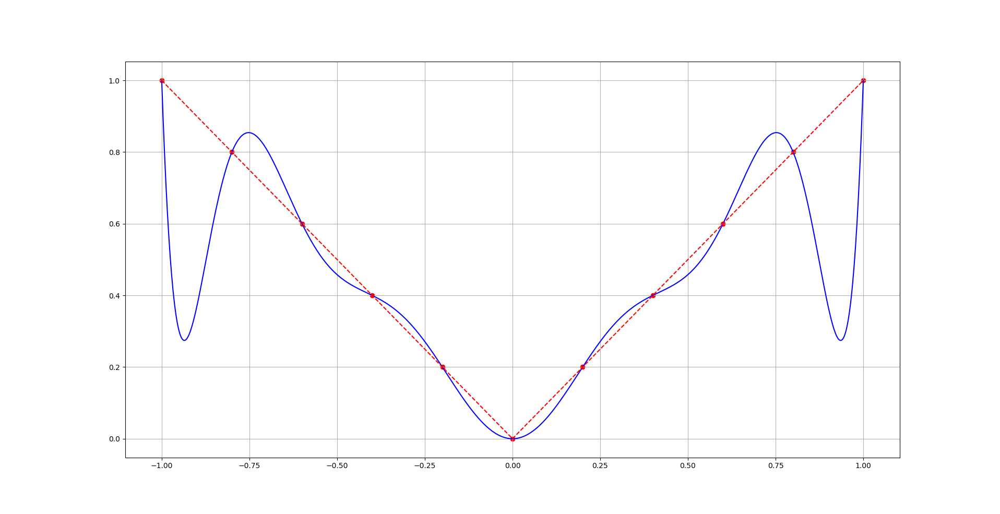
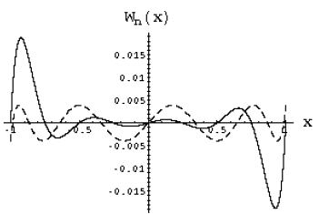



<!-- MarkdownTOC -->

- [6. Інтерполювання функцій](#6-інтерполювання-функцій)
	- [6.1. Постановка задачі інтерполювання](#61-постановка-задачі-інтерполювання)
	- [6.2. Інтерполяційна формула Лагранжа](#62-інтерполяційна-формула-лагранжа)
	- [6.3. Залишковий член інтерполяційного полінома](#63-залишковий-член-інтерполяційного-полінома)
	- [6.4. Багаточлени Чебишова. Мінімізація залишкового члена інтерполяційного полінома](#64-багаточлени-чебишова-мінімізація-залишкового-члена-інтерполяційного-полінома)
	- [6.5. Розділені різниці](#65-розділені-різниці)
	- [6.6. Інтерполяційна формула Ньютона](#66-інтерполяційна-формула-ньютона)
	- [6.7. Інтерполювання з кратними вузлами](#67-інтерполювання-з-кратними-вузлами)
	- [6.8. Збіжність процесу інтерполювання](#68-збіжність-процесу-інтерполювання)
	- [6.9. Кусково-лінійна інтерполяція](#69-кусково-лінійна-інтерполяція)
	- [6.10. Кусково-кубічна ермітова інтерполяція](#610-кусково-кубічна-ермітова-інтерполяція)
	- [6.11. Кубічні інтерполяційні сплайни](#611-кубічні-інтерполяційні-сплайни)
	- [6.12. Параметричні сплайни](#612-параметричні-сплайни)
	- [6.13. Застосування інтерполювання](#613-застосування-інтерполювання)
	- [6.14. Тригонометрична інтерполяція](#614-тригонометрична-інтерполяція)
	- [6.15. Двовимірна інтерполяція](#615-двовимірна-інтерполяція)

<!-- /MarkdownTOC -->

## 6. Інтерполювання функцій

### 6.1. Постановка задачі інтерполювання

Література:

- СГ, стор.&nbsp;151&ndash;155

Нехай функція $$f(x) \in C([a,b])$$ задана своїми значеннями $$y_i = f(x_i)$$, $$x_i \in [a,b]$$, $$i = \overline{0,n}$$, причому $$x_i \ne x_j$$ для $$i \ne j$$.

> **Означення**: Функція $$\Phi(x)$$ називається _інтерполюючою_ для $$f(x)$$ на сітці $$\{x_i\}^n_{i = 0}$$, якщо $$\Phi(x_i) = y_i$$, $$i = \overline{0,n}$$.

Задача інтерполювання функції має не єдиний розв'язок. 

> **Означення**: Виберемо систему лінійно незалежних функцій $$\{\varphi_k(x)\}^n_{k = 0}$$, $$\varphi_k(x) \in C([a,b])$$ і побудуємо лінійну комбінацію 
>
> \begin{equation} 
> \label{eq:6.1.1} 
> \Phi(x) = \Phi_n(x) = \Sum_{k = 0}^n c_k \cdot \varphi_k(x), 
> \end{equation} 
>
> яка називається _узагальненим багаточленом_. 

Умови інтерполювання дають СЛАР 

\begin{equation} 
	\label{eq:6.1.2} 
	\Sum_{k = 0}^n c_k \cdot \varphi_k(x_i) = y_i, \quad i = \overline{1, n}
\end{equation} 

розв'язком якої є $$\vec c = (c_0, \ldots, c_n)$$. 

Якщо

\begin{equation}
	D(x_0, \ldots, x_n) = \begin{vmatrix} 
		\varphi_0(x_0) & \cdots & \varphi_n(x_0) \newline
		\vdots & \ddots & \vdots \newline
		\varphi_0(x_n) & \cdots & \varphi_n(x_n)
	\end{vmatrix} \ne 0,
\end{equation}

то система \eqref{eq:6.1.2} має єдиний розв'язок.

> **Означення**: Система функцій $$\{\varphi_k (x)\}^n_{k = 0}$$ називається _системою Чебишова_, якщо $$\forall \{x_i\}^n_{i = 0}$$ таких, що $$x_i \in [a,b]$$ і $$x_i \ne x_j$$ при $$i \ne j$$ виконується $$D(x_0, \ldots, x_n)\ne 0$$.

> **Приклади** систем Чебишова:
>
> 1. $$\varphi_k(x) = x^k$$ &mdash; алгебраїчна система.
>
>    Визначник $$D(x_0, \ldots, x_n) \ne 0$$ є визначником Вандермонда: 
>
>    \begin{equation}
>    \begin{aligned}
>    D(x_0, \ldots, x_n) &= \begin{vmatrix} 
>    	1 & x_0 & \cdots & x_0^n \newline
>    	\vdots & \vdots & \ddots & \vdots \newline
>   	1 & x_n & \cdots & x_n^n 
>    \end{vmatrix} = \newline
>    &= \Prod_{0 \le k \le m \le n} (x_k - x_m) \ne 0,	
>    \end{aligned}
>    \end{equation}
>
> 2. $$\varphi_k (x) = L_k(x)$$ &mdash; ортогональні багаточлени Лежандра; 
>
> 3. $$\varphi_k(x) = T_k(x)$$ &mdash; ортогональні багаточлени Чебишова.
>
> 4. $$\varphi_k(x)$$: $$1$$, $$\cos(x)$$, $$\sin(x)$$, $$\ldots$$, $$\cos(nx)$$, $$\sin(nx)$$.
>
>    Тоді
>
>    \begin{equation}
>    \begin{aligned}
>    \Phi_n(x) &= T_n(x) = \newline
>    &= a_0 + \Sum_{k = 1}^n (a_k \cdot \cos(k x) + b_k \cdot \sin(k x))
>    \end{aligned}
>    \end{equation}
>
>    &mdash; тригонометричний багаточлен.

### 6.2. Інтерполяційна формула Лагранжа

Література:

- СГ, стор.&nbsp;127&ndash;129;

- БЖК, стор.&nbsp;38&ndash;42.

Якщо $$\varphi_k(x) = x^k$$, то

\begin{equation}
	\Phi_n(x) = P_n(x) = \Sum_{k=0}^n c_k \cdot x^k.
\end{equation}

Задача інтерполювання функції $$f(x)$$ алгебраїчним, багаточленом полягає в знаходженні коефіцієнтів $$c_k$$, $$k = \overline{0,n}$$ для яких виконується умова $$f(x_i) = \varphi(x_i)$$, $$i = \overline{0, n}$$.

Представимо інтерполяційний багаточлен у вигляді 

\begin{equation} 
	\label{eq:6.2.1} 
	P_n(x) = L_n(x) = \Sum_{k = 0}^n f(x_k) \cdot \Phi_k^{(n)}(x).
\end{equation} 
 
> **Означення**: Тут $$L_n(x)$$ &mdash; _інтерполяційний поліном_; $$\Phi_k^{(n)}(x)$$ &mdash; поліноми $$n$$-го степеня, які називають _множниками Лагранжа_. 

З умови $$L_n(x_i) = f(x_i)$$ випливає, що множник Лагранжа повинен задовольняти умови 

\begin{equation} 
	\label{eq:6.2.2}
	\Phi_k^{(n)} (x_i) = \delta_{i,k}. 
\end{equation}

Оскільки $$\Phi_k^{(n)}(x)$$ &mdash; багаточлен степеня $$n$$, то він має вигляд 

\begin{equation}
	\Phi_k^{(n)}(x) = A_k (x - x_0) \ldots (x - x_{k-1}) (x - x_{k+1}) \ldots (x - x_n), 
\end{equation}

де $$A_k$$ &mdash; число. 

Знайдемо його з умови $$\Phi_k^{(n)}(x_k) = 1$$:

\begin{equation}
	A_k = \frac{1}{(x_k - x_0) \ldots (x_k - x_{k-1}) (x_k - x_{k + 1}) \ldots (x_k - x_n)}.
\end{equation}

Таким чином багаточлен $$\Phi_k^{(n)}(x)$$ мають вигляд: 

\begin{equation} 
	\label{eq:6.2.3} 
	\Phi_k^{(n)} (x) = \frac{(x - x_0) \ldots (x - x_{k-1}) (x - x_{k+1}) \ldots (x - x_n)}{(x_k - x_0) \ldots (x_k - x_{k-1}) (x_k - x_{k+1}) \ldots (x_k - x_n)}
\end{equation} 

Позначивши

\begin{equation}
	\omega_n(x) = \Prod_{i = 0}^n(x - x_i),
\end{equation}

маємо

\begin{equation}
	\Phi_k^{(n)}(x) = \frac{\omega_n(x)}{(x - x_k) \cdot \omega_n'(x_k)}.
\end{equation}

Остаточно формула Лагранжа має вигляд 

\begin{equation} 
	\label{eq:6.2.4} 
	L_n(x) = \Sum_{k = 0}^n f(x_k) \cdot \frac{\omega_n(x)}{(x - x_k) \cdot \omega_n'(x_k)}
\end{equation}

### 6.3. Залишковий член інтерполяційного полінома

Література:

- СГ, стор.&nbsp;132&ndash;133;

- БЖК, стор.&nbsp;42.

В заданих точках (точки інтерполювання) значення функції та полінома співпадають, але в інших точках в загальному випадку не співпадають. Отже доцільно розглянути питання про похибку інтерполювання.

> **Означення**: Замінюючи функцію $$f(x)$$ на $$L_n(x)$$ ми допускаємо похибку $$r_n(x) = f(x) - L_n(x)$$. Це _залишковий член_ інтерполювання.

З означення випливає, що, $$r_n(x_i) = 0$$, $$x_i \in [a,b]$$. Оцінимо похибку у кожній точці $$x \in [a,b]$$. Введемо допоміжну функцію:

\begin{equation}
	g(t) = f(t) - L_n(t) - K \cdot \omega_n(t),
\end{equation}

де $$t \in [a,b]$$, і $$g(x_i) = 0$$ для $$i = \overline{0,n}$$.

Знайдемо таке $$K$$, щоб $$g(x) = 0$$, в деякій точці $$x \in [a,b]$$, $$x \ne x_i$$, $$i = \overline{0,n}$$. Легко бачити, що 

\begin{equation}
	K = \frac{f(x) - L_n(x)}{\omega_n(x)}.
\end{equation}

Припустимо що $$f(x) \in C^{(n+1)}([a,b])$$, тоді $$g(t) \in C^{(n+1)}([a,b])$$. Функція $$g(t) = 0$$ в $$(n + 2)$$-х точках, а саме $$t = x$$, $$t = x_i$$, $$i = \overline{0,n}$$. З теореми Ролля випливає, що існує $$(n+1)$$-а точка, де $$g'(t_i)=0$$, $$i = \overline{0,n}$$. Продовжуючи цей процес, отримаємо, що існує хоча б одна $$\xi \in [a,b]$$ така, що $$g^{(n+1)} (\xi) = 0$$. Оскільки 

\begin{equation}
	g^{(n+1)}(t) = f^{(n+1)} - 0 - K \cdot (n+1)!,
\end{equation}

то $$\exists \xi$$, що

\begin{equation}
	g^{(n+1)}(\xi) = f^{(n+1)}(\xi) - (n+1)! \cdot \frac{f(x) - L_n(x)}{\omega_n(x)} = 0.
\end{equation}

Звідси

\begin{equation}
	\label{eq:6.3.1} 
	r_n(x) = f(x) - L_n(x) = \frac{f^{(n+1)}(\xi)}{(n + 1)!} \cdot \omega_n(x). 
\end{equation} 

Оскільки $$\xi$$ невідомо, то використовують _оцінку залишкового члена_: 

\begin{equation} 
	\label{eq:6.3.2}
	|r_n(x)| = |f(x) - L_n(x)| \le \frac{M_{n + 1}}{(n + 1)!} \cdot |\omega_n(x)|, 
\end{equation}

де $$M_{n + 1} = \Sup_{x \in [a,b]} \vert f^{(n+1)}(x) \vert$$.

### 6.4. Багаточлени Чебишова. Мінімізація залишкового члена інтерполяційного полінома

Література:

- СГ, стор.&nbsp;103&ndash;108;

- БЖК стор.&nbsp;56&ndash;63.

Як вибрати вузли інтерполяції щоб похибка інтерполювання була мінімальною? Спочатку обґрунтуємо теоретичний апарат, завдяки якому будемо досліджувати це питання.

> **Означення**: _Багаточленом Чебишова ($$n$$-того степеня, 1–го роду)_ називається поліном, який задається такими рекурентними співвідношеннями 
> 
> \begin{equation} 
> \label{eq:6.4.1} 
> T_{n + 1}(x) - 2 x \cdot T_n(x) + T_{n - 1}(x) = 0,
> \end{equation} 
>
> де початкові значення
>
> \begin{equation} 
> \label{eq:6.4.2} 
> T_0(x) = 1, \quad T_1(x) = x. 
> \end{equation} 

Знайдемо явний вигляд багаточлена Чебишова. Будемо шукати розв'язок рівняння \eqref{eq:6.4.1} у вигляді $$T_n(x) = q^n$$, де $$q = q(x)$$. Підставивши в \eqref{eq:6.4.1}, отримуємо характеристичне рівняння $$q^2 - 2 x q + 1 = 0$$. Тоді при $$\vert x \vert \ge 1 \implies q_{1,2} = x \pm \sqrt{x^2 - 1}$$, а при $$\vert x \vert < 1 \implies q_{1,2} = \cos(\varphi) \pm i \sin(\varphi)$$, $$\varphi = \arccos(x)$$.

Розглянемо обидва випадки детальніше: 

1. при $$\vert x \vert \le 1$$: $$T_n(x) = A \cdot \cos(n \varphi) + B \cdot \sin (n \varphi)$$. З \eqref{eq:6.4.1} випливає $$A = 1$$, $$B = 0$$ і тому 
	
	\begin{equation} 
		\label{eq:6.4.3} 
		T_n(x) = \cos(n \arccos (x)).
	\end{equation}

2. при $$\vert x \vert > 1$$: 

	\begin{equation}
		\label{eq:6.4.4}
		T_n(x) = \frac{1}{2} \left( \left(x + \sqrt{x^2 - 1}\right)^n + \left(x - \sqrt{x^2 - 1} \right)^n \right). 
	\end{equation}

Знайдемо нулі та екстремуми багаточлена Чебишова: $$T_n(x) = 0$$, $$x \in [-1,1]$$, $$\cos(n \arccos(x)) = 0$$, $$\arccos(x) = \frac{2 k + 1}{2 n} \pi$$, $$k = \overline{0,n-1}$$.

Отже _нулі багаточлена Чебишова_:

\begin{equation}
	x_k = \cos \left( \frac{(2 k + 1) \pi}{2 n} \right) \in [-1,1], \quad k = \overline{0,n-1}.
\end{equation}

_Локальні екстремуми багаточлена Чебишова_ на $$x \in [-1,1]$$:

\begin{equation}
	 x_k' = \cos \left( \frac{k\pi}{2n} \right), \quad k = \overline{0,n}.
\end{equation}

Коефіцієнт при старшому члені багаточлена дорівнює $$2^{n-1}$$. 

> **Означення**: Введемо _нормований багаточлен Чебишова_ $$\overline T_n(x) = 2^{1-n} T_n(x) = x^n + \ldots$$.

Тоді

\begin{equation}
	\left\| \overline T_n \right\|\void_{C([-1,1])} = \Max_{x \in [-1,1]} |T_n(x)| = 2^{1-n}. 
\end{equation}

> **Означення**: Відхиленням двох функцій $$f(x)$$ та $$\Phi(x)$$ називається величина

\begin{equation}
	\Delta (f, \Phi) = \| f(x) - \Phi(x)\|\void_{C([a,b])}.
\end{equation}

> **Теорема** (_Чебишова_): Серед усіх багаточленів $$n$$-го степеня з коефіцієнтом $$1$$ при старшому степені $$\overline T_n(x)$$ найменше відхиляється від $$0$$ на $$[-1,1]$$, тобто
>
> \begin{equation}
> \left\|\overline T_n(x) - 0 \right\|\void_{C([-1,1])} = \Inf_{\overline P_n(x)} \left\|\overline P_n(x)\right\|\void_{C([-1,1])} = 2^{1-n}.
> \end{equation}

_Доведення_: Будемо доводити від супротивного: припустимо, що існує багаточлен, такий, що

\begin{equation}
	\overline Q_n(x) < 2^{1-n}.
\end{equation}

Тоді $$Q_{n-1}(x) = \overline T_n(x) - \overline Q_n(x)$$ &mdash; поліном степеня не вище $$n - 1$$ і не рівний тотожньо нулю. Дослідимо його знаки:

\begin{equation}
	\begin{aligned}
		\text{sgn} \left( Q_{n - 1}(x_k') \right) &= \text{sgn} \left( \overline T_n(x_k') - \overline Q_n(x_k') \right) = \newline
		&= \text{sgn} \left( \overline T_n(x_k') \right) = \alpha \cdot(-1)^k,
	\end{aligned}
\end{equation}

де $$\alpha = \pm 1$$.

Значить $$\exists z_k$$, $$k = \overline{0,n-1}$$ таке, що $$Q_{n-1}(z_k)=0$$. Це протиріччя, бо $$Q_{n-1}(x)$$ &mdash; поліном степеня $$\le n - 1$$. $$\square$$

Тепер узагальнимо наш багаточлен Чебишова на довільний проміжок. Нагадаємо $$T_n(t) = \cos(n \arccos t)$$, $$-1 \le t \le 1$$. Від змінної $$t \in [-1, 1]$$ перейдемо до $$x \in [a,b]$$. Запровадимо заміну

\begin{equation}
	t = \frac{2 x}{b - a} - \frac{b + a}{b - a}, \quad x = \frac{b + a}{2} + \frac{b - a}{t}.
\end{equation}

Тоді

\begin{equation}
	\begin{aligned}
		T_n^{[a,b]}(t) &= \overline T_n \left( \frac{2 x}{b - a} - \frac{b + a}{b - a} \right) = \newline
		&= 2^{1 - n} \cos \left(n \arccos \left( \frac{2 x - (b + a)}{b - a} \right) \right).
	\end{aligned}
\end{equation}

Побудований нами багаточлен Чебишова на $$[a,b]$$ не є нормованим. 

_Нормований багаточлен Чебишова_ на $$[a,b]$$: 

\begin{equation}
	\overline T_n^{[a,b]}(x) = \frac{(b - a)^n}{2^{2 n - 1}} \cos \left(n \arccos \left( \frac{2 x - (b + a)}{b - a} \right) \right).
\end{equation}

Відповідно його нулі

\begin{equation}
	x_k = \frac{a + b}{2} - \frac{b - a}{2} \cdot t_k, \quad t_k = \cos \left( \frac{(2 k + 1) \pi}{2 n} \right),
\end{equation}

де $$k = \overline{0,n-1}$$, а точки екстремуму 

\begin{equation}
	x_k' = \frac{a + b}{2} - \frac{b -a }{2} \cdot t_k', \quad t_k' = \cos \left( \frac{k \pi}{n} \right), \quad k = \overline{0,n}.
\end{equation}

Теорема Чебишова вірна і у випадку $$[a,b]$$. Тепер

\begin{equation}
	\left\|\overline T_n^{[a,b]}\right\|\void_{C([a,b])} = \frac{(b-a)^n}{2^{2n-1}}.
\end{equation}

Перейдемо до питання мінімізації залишкового члена. Нагадаємо, що 

\begin{equation} 
	\label{eq:6.4.5}
	|r_n(x)| = |f(x) - L_n(x)| \le \frac{M_{n + 1}}{(n + 1)!} \cdot |\omega_n(x)|,
\end{equation} 

де $$M_{n + 1} = \Max_{x \in [a,b]} \left\vert f^{(n+1)}(x) \right\vert$$, $$\omega_n(x) = \Prod_{i = 0}^n (x - x_i) = x^{n+1} + \ldots$$

Поставимо задачу 

\begin{equation}
	\Inf_{\overline P_n(x)} \Max_{x \in [a,b]} |\omega_n(x)|. 
\end{equation}

З теоремою Чебишова $$\omega_n(x) = \overline T_{n+1}^{[a,b]}(x)$$ поліном Чебишова. Якщо співпадають поліноми, то співпадають їх нулі. Отже: $$x_k$$ &mdash; вузли інтерполяції співпадають з нулями багаточлена Чебишова 

\begin{equation}
	x_k = \frac{a + b}{2} - \frac{b - a}{2} \cdot t_k, \quad t_k = \cos \left( \frac{(2 k + 1) \pi}{2 (n + 1)} \right),
\end{equation}

де $$k = \overline{0,n}$$.

В цьому випадку 

\begin{equation} 
	\label{eq:6.4.6}
	|r_n(x)| = |f(x) - L_n(x)| \le \frac{M_{n + 1}}{(n + 1)!} \cdot \frac{(b - a)^{n + 1}}{2^{2 n + 1}}.
\end{equation} 

Цю оцінку не можна покращити! Так для $$f(x) = \overline P_{n + 1}(x) = x^{n + 1} + \ldots$$ її $$(n + 1)$$ похідна дорівнює $$(n + 1)!$$, тому $$M_{n + 1} = (n + 1)!$$. Різниця $$f(x) - L_n(x) = \overline T_{n + 1}^{[a,b]}(x)$$, отже

\begin{equation}
	\Max_{x \in [a,b]} |f(x) - L_n(x)| = \frac{(b - a)^{n + 1}}{2^{2 n + 1}}.
\end{equation}

### 6.5. Розділені різниці

Література:

- БЖК, стор.&nbsp;42&ndash;44;

- СГ, стор.&nbsp;129&ndash;130.

Розділені різниці є аналогом похідної для функції, що задана таблицею.

> **Означення**: _Розділеною різницею 1-го порядку_ для функції $$f(x)$$ називатимемо
>
> \begin{equation}
> f(x_i; x_j) = \frac{f(x_i) - f(x_j)}{x_i - x_j}.
> \end{equation}
>
> _Розділеною різницею 2-го порядку_ для функції $$f(x)$$ називатимемо
>
> \begin{equation}
> f(x_i; x_j; x_k) = \frac{f(x_i; x_j) - f(x_j; x_k)}{x_i - x_k}.
> \end{equation}
>
> Аналогічно визначаються розділені різниці довільного порядку.

Наведемо деякі властивості розділених різниць:

1. 
	
	\begin{equation}
		f(x_0; \ldots; x_n) = \Sum_{i = 0}^n \frac{f(x_j)}{\Prod_{i \ne j}(x_i - x_j)}.
	\end{equation}

2. Розділена різниця &mdash; лінійний функційонал:

	\begin{equation}
		(\alpha_1 f_1 + \alpha_2 f_2)(x_0; x_1) = \alpha_1 f_1(x_0;x_1) + \alpha_2 f_2(x_0;x_1).
	\end{equation}

3. Розділена різниця &mdash; симетричний функціонал:

	\begin{equation}
		\begin{aligned}
			& f(x_1; \ldots; x_i; \ldots; x_j; \ldots; x_n) = \newline
			& \quad f(x_1; \ldots; x_j; \ldots; x_i; \ldots; x_n).
		\end{aligned}
	\end{equation}

4. $$\forall f(x) \in C^{(n)}([a,b])$$: $$\exists \xi \in [a,b]$$: $$f(x_0; x_1; \ldots; x_n) = \frac{f^{(n)}(\xi)}{n!}$$.

> **Задача 14**: Довести першу властивість розділених різниць.

Таблиця розділених різниць має вигляд:

$$x_i$$ | $$f_i$$ | р.р.$$1$$ | р.р.$$2$$ | $$\ldots$$ | р.р.$$n$$
------- | ------- | ----- | ----- | ---------- | ---------
$$x_0$$ | $$f(x_0)$$ | | | |
 | | $$f(x_0;x_1)$$ | | |
$$x_1$$ | $$f(x_1)$$ | | $$f(x_0;x_1;x_2)$$ | |
| | $$f(x_1;x_2)$$ | | |
$$x_2$$ | $$f(x_2)$$ | | | |
$$\vdots$$ | $$\vdots$$ | $$\vdots$$ | $$\vdots$$ | $$\vdots$$ |
$$\cdots$$ | $$\cdots$$ | $$\cdots$$ | $$\cdots$$ | $$\cdots$$ | $$f(x_0;\ldots;x_n)$$
$$\vdots$$ | $$\vdots$$ | $$\vdots$$ | $$\vdots$$ | $$\vdots$$ |
$$x_{n-2}$$ | $$f(x_{n-2})$$ | | | |
 | | $$f(x_{n-2};x_{n-1})$$ | | |
$$x_{n-1}$$ | $$f(x_{n-1})$$ | | $$f(x_{n-2};x_{n-1};x_n)$$ | |
| | $$f(x_{n-1};x_n)$$ | | |
$$x_n$$ | $$f(x_n)$$ | | | |

### 6.6. Інтерполяційна формула Ньютона

Література:

- БЖК, стор.&nbsp;44&ndash;47;

- СГ, стор.&nbsp;130&ndash;132.

Запишемо формулу Лагранжа інтерполяційного багаточлена

\begin{equation}
    \label{eq:6.6.1}
    L_n(x) = \Sum_{i = 0}^n f(x_i) \cdot \frac{\omega_n(x)}{(x - x_i) \cdot \omega_n'(x_i)},
\end{equation}

де $$\omega_n(x) = \Prod_{j=0}^n (x-x_j)$$.

Позначимо $$\Phi_j(x) = L_j(x) - L_{j-1}(x)$$. Тоді, оскільки

\begin{equation}
	\begin{aligned}
		L_n(x) &= L_0(x) + (L_1(x) - L_0(x)) + \ldots \newline
		& \quad \ldots + (L_n(x) - L_{n-1}(x)),
	\end{aligned}
\end{equation}

і

\begin{equation}
	L_j(x_i) = L_{j-1}(x_i) = f(x_i), \quad i = \overline{0,j-1},
\end{equation}

то
\begin{equation}
    \label{eq:6.6.2}
    \Phi_j(x_i) = A_j \cdot (x - x_0) \cdot \ldots \cdot (x - x_{j-1}),
\end{equation}

де $$A_j$$ визначається з умови $$\Phi_j(x_j) = L_j(x_j) - L_{j-1}(x_j) = f(x_j) - L_{j-1}(x_j)$$. Звідси

\begin{equation}
	\Phi_j(x) = \frac{f(x_j) - L_{j-1}(x_j)}{(x_j - x_0) \ldots (x_j - x_{j - 1})} \cdot (x-x_0) \ldots (x-x_j).
\end{equation}

Тоді
\begin{equation}
	\begin{aligned}
    	A_j &= \frac{f(x_j) - L_{j-1}(x_j)}{(x_j - x_0) \ldots (x_j - x_{j-1})} = \newline
    	& = \frac{f(x_j)}{(x_j - x_0) \ldots (x_j - x_{j-1})} - \newline
    	& \quad - \Sum_{i = 0}^{j - 1} \frac{f(x_i)}{(x_i - x_0) \ldots (x_i - x_{i-1}) (x_i - x_{i + 1}) \ldots (x_j-x_i)} = \newline
    	& = \frac{f(x_j)}{(x_j-x_0) \ldots (x_j - x_{j-1})} + \newline
    	& \quad + \Sum_{i = 0}^{j - 1} \frac{f(x_i)}{(x_i-x_0) \ldots (x_i - x_j)} = \newline
    	& = \Sum_{i = 0}^j \frac{f(x_i)}{(x_i - x_0) \ldots (x_i - x_{i - 1}) (x_i - x_{i + 1}) \ldots (x_i - x_j)} = \newline
    	& = f(x_0;\ldots;x_j).
    \end{aligned}
\end{equation}

Звідси маємо інтерполяційну формулу Ньютона вперед ($$x_0 \to x_n$$):

\begin{equation}
    \label{eq:6.6.3}
    \begin{aligned}
    	L_n(x) &= f(x_0) + f(x_0;x_1) (x-x_0) + \ldots \newline
    	& \quad \ldots + f(x_0;\ldots;x_n) (x-x_0) \ldots (x - x_{n-1}).
    \end{aligned}
\end{equation}

Аналогічно, інтерполяційна формула Ньютона назад ($$x_n\to x_0$$):
\begin{equation}
    \label{eq:6.18}
    \begin{aligned}
    	L_n(x) &= f(x_n) + f(x_n;x_{n-1}) (x-x_n) + \ldots \newline
    	& \quad \ldots + f(x_n;\ldots;x_0) (x-x_n) \ldots  (x-x_1).
    \end{aligned}
\end{equation}

Маємо рекурсію за степенем багаточлена 

\begin{equation}
	L_n(x) = L_{n-1}(x) + f(x_0;\ldots;x_n) (x-x_0) \ldots (x-x_1).
\end{equation}

Звідси

\begin{equation}
	\begin{aligned}
		L_n(x) &= f(x_0) + (x - x_0) (f(x_0;x_1) + (x - x_1) (\ldots \newline
		& \quad \ldots + (x - x_{n-1}) f(x_0;x_1;\ldots;x_n) \ldots ))
	\end{aligned}
\end{equation}

і цю формулу розкриваємо починаючи з середини (це аналог схеми Горнера обчислення значення багаточлена).

Введемо нову формулу для похибки інтерполювання. Для $$x \ne x_i$$, $$i = \overline{0,n}$$ розглянемо розділену різницю

\begin{equation}
	\begin{aligned}
		f(x; x_0; \ldots; x_n) &= \frac{f(x)}{(x - x_0) \ldots (x - x_n)} + \newline
		& \quad + \Sum_{k = 0}^n \frac{f(x_k)}{\Prod_{i \ne k}(x - x_i)}.
	\end{aligned}
\end{equation}

Звідси

\begin{equation}
	\begin{aligned}
		f(x) &= f(x_0) \cdot \frac{(x - x_1) \ldots (x - x_n)}{(x_0 - x_1) \ldots (x_0 - x_n)} + \ldots \newline
		& \quad \ldots + f(x_n) \cdot \frac{(x - x_1) \ldots (x - x_n)}{(x_n - x_1) \ldots (x_n - x_{n-1})} + \newline
    	& \quad + f(x; x_0; \ldots; x_n) (x - x_0) \ldots (x - x_n) = \newline
    	& = L_n(x) + f(x; x_0; \ldots; x_n) \cdot \omega_n(x).
	\end{aligned}
\end{equation}

Тоді похибка має вигляд
\begin{equation}
    \label{eq:6.19}
    r_n(x) = f(x) - L_n(x) = f(x;x_0;\ldots;x_n)\cdot\omega_n(x).
\end{equation}

Це нова форма для залишкового члена.

Порівнюючи з формулою залишкового члена в пункті [$$6.3$$](#63-залишковий-член-інтерполяційного-полінома), маємо

\begin{equation}
	f(x; x_0; \ldots; x_n) = \frac{f^{(n + 1)}(\xi)}{(n + 1)!},
\end{equation}

що доводить останню властивість розділених різниць.

Нехай маємо сітку рівновіддалених вузлів: $$x_i = a + i h$$, $$h = \frac{b-a}{n}$$, $$i = \overline{0, n}$$, $$x_0 = a$$, $$x_n = b$$. Розначимо $$\Delta f_0 = f_1 - f_0$$, $$\Delta^2f_0 = \Delta f_1 - \Delta f_0 = f_2 - 2 f_1 + f_0$$, $$\ldots$$ &mdash; скінченні різниці. 

Запишемо формули Ньютона у нових позначеннях:

\begin{equation}
	\begin{aligned}
		L_n(x) &= L_n(x_0 + t h) = \newline
		&= f_0 + t \Delta f_0 + \ldots \newline
		& \quad \ldots + \frac{t (t - 1) \ldots (t - n + 1)}{n!}\cdot \Delta^n f_0,
	\end{aligned}
\end{equation}

де $$t = \frac{x-x_0}{h}$$.

Це інтерполяційна формула Ньютона вперед по рівновіддалених вузлах.

> **Задача 15**: Побудувати інтерполяційну формулу Ньютона назад по рівновіддалених вузлах.

### 6.7. Інтерполювання з кратними вузлами

Нехай $$f(x)$$ задана таблицею значень $$f^{(j)}(x_i)$$, $$i = \overline{0, n}$$, $$j = \overline{0, k_i - 1}$$, $$k_i$$ &mdash; кратності відповідних вузлів. Побудуємо $$H_m^{(i)}(x_j) = f^{(i)}(x_j)$$ &mdash; інтерполяційний багаточлен Ерміта по кратним вузлах, де

\begin{equation}
	m = \Sum_{i = 1}^n k_i - 1.
\end{equation}

Якщо $$k_i = 1$$, то $$H_m(x) = L_n(x)$$.

Для побудови $$H_m(x)$$ в загальному випадку для кожної точки $$x_i$$ введемо $$k_i$$ точок $$x_{i, j}^\varepsilon = x_i + j \varepsilon$$, $$i = \overline{0, n}$$, $$j = \overline{0, k_i - 1}$$. З умови $$\forall i$$: $$x_{i, k_i - 1}^\varepsilon = x_i + \varepsilon (k - 1) < x_{i + 1}$$ можна вибрати $$\varepsilon$$.

Нехай $$f(x) \in C^{(m)}([a,b])$$. Запишемо інтерполяційну формулу Ньютона:

\begin{equation}
	\begin{aligned}
		L_m^\varepsilon &= f \left( x_{0, 0}^\varepsilon \right) + f \left(x_{0, 0}^\varepsilon; x_{0, 1}^\varepsilon \right) \left(x - x_{0, 0}^\varepsilon \right) + \ldots \newline
		& \quad + f \left( x_{0, 0}^\varepsilon; \ldots; x_{n, k_n - 1}^\varepsilon \right) \left( x - x_{0, 0}^\varepsilon \right) \ldots \left( x - x_{n, k_n - 1}^\varepsilon \right).
	\end{aligned}
\end{equation}
    
При $$\varepsilon \to 0$$ маємо $$x_{i,j}^\varepsilon \to x_i$$. Крім того

\begin{equation}
	f \left( x_{i,0}^\varepsilon; \ldots; x_{i, k_i - 1}^\varepsilon \right) = f (x_i; \ldots; x_i) = \frac{f^{(k_i)}(x_i)}{k_i!}.
\end{equation}

Тому $$L_m^\varepsilon(x) \to H_m(x)$$ та

\begin{equation}
	R_m(x) = f(x) - H_m(x) = \frac{f^{(m + 1)}(\xi)}{(m + 1)!} \cdot \Omega_m(x),
\end{equation}

де $$\Omega_m(x) = (x - x_0)^{k_0} \ldots (x - x_n)^{k_n}$$.

### 6.8. Збіжність процесу інтерполювання

Виникає питання, чи буде прямувати до нуля похибка інтерполювання $$f(x) - L_n(x)$$, якщо число вузлів $$n$$ збільшувати? 

Введемо норму

\begin{equation}
	\|f(x) - L_n\|\void_{C([a,b])} = \Max_{x \in [a,b]} | f(x) - L_n(x) |.
\end{equation}

Тоді для довільної $$f(x) \in C^{(n + 1)}([a,b])$$ справджується оцінка

\begin{equation}
    \label{eq:6.8.1}
    \| f(x) - L_n(x)\|\void_{C([a,b])} \le \frac{M_{n + 1}}{(n + 1)!} \|\omega_n(x)\|\void_{C([a,b])},
\end{equation}

де $$M_{n + 1} = \Max_{x \in [a,b]} \left\vert f^{(n + 1)}(x) \right\vert$$, $$\omega_n(x) = \Prod_{i = 0}^n (x - x_i)$$. 

А яка оцінка буде для довільної неперервної функції?

> **Означення**: Кажуть, що інтерполяційний процес для функції $$f(x)$$ _збігається_ в точці $$x \in [a,b]$$, якщо
>
> \begin{equation}
> \forall \\{x_i\\}^n_{i = 1}: h = \Max_{i = \overline{1,n}} \to 0: \Lim_{n\to\infty} L_n(x) = f(x), 
> \end{equation}
>
> де, як завжди, $$h_i = x_i - x_{i-1}$$.

> **Означення**: Якщо $$\|f(x) - L_n(x)\|\void_{C([a,b])} \xrightarrow[n\to\infty]{}0$$, то інтерполяційний процес збігається рівномірно.

Розглянемо приклади поведінки інтерполяційних багаточленів при $$n \to \infty$$ для деяких функцій. 

> **Приклад 1**: Послідовність інтерполяційних багаточленів (сітка рівномірна), побудованих для неперервної функції $$f(x) = \vert x \vert$$, $$-1 \le x \le 1$$ (функція неперервна, але негладка), не збігається на $$x \in [-1,1]$$, крім точок $$x = -1,0,1$$.
>
> На рисунку дано графіки самої функції (штрихова лінія) та інтерполяційного багаточлена (суцільна лінія) на рівномірній сітці $$x_i = -1 + i h$$, $$h = 2 / n$$, $$i = \overline{0,n}$$ для $$n = 10$$:
> 
> 

> **Приклад 2**: Функція Рунге $$f(x) = \frac{1}{1 + 40x^2}$$, $$-1 \le x \le 1$$ (функція аналітична!). Для рівномірної сітки $$x_i = -1 + i h$$, $$h = 2 / n$$, $$i = \overline{0,n}$$ маємо графіки: суцільна лінія &mdash; інтерполяційного багаточлена; пунктирна &mdash; самої функції для $$n = 10$$:
>
> 

Пояснити чому рівномірна сітка дає великі похибки інтерполювання біля кінців інтервалу інтерполювання допомагає наступний рисунок. На цьому рисунку суцільною лінією представлено графік функції $$\omega_n = \Prod_{i = 0}^n (x - x_i)$$ ($$n = 8$$) для рівномірної сітки. Як бачимо максимальні за модулем значення цієї функції припадають на кінці інтервалу.

Для порівняння на цьому ж рисунку (штрихова лінія) побудовано графік $$\omega_n = \Prod_{i = 0}^n (x - x_i)$$, що відповідає чебишовським вузлам, які мінімізують похибку інтерполювання. Тепер відхилення $$\omega_n(x)$$ розподілено рівномірно по всьому проміжку інтерполювання.

> **Теорема** (_Фабера_): $$\forall \{x_i\}^n_{i = 0}$$ існує $$f(x) \in C([a,b])$$, для якої інтерполяційний процес не збігається рівномірно.

> **Теорема** (_Марцинкевича_): $$\forall f(x) \in C([a,b])$$ існуюють $$\{x_i\}^n_{i = 0}$$ такі, що послідовність $$\{L_n(x)\}$$ збігається рівномірно до $$f(x)$$.

> **Теорема**: Стала Лебега
>
> \begin{equation}
> \|P_n\| = \Max_j \Sum_{j = 0}^n \left\vert \varphi_j^{(n)}(x) \right\vert,
> \end{equation}
>
> де 
> 
> \begin{equation}
> \varphi_j^{(n)}(x) = \frac{\omega_n(x)}{(x-x_j) \cdot \omega_n'(x_i)}.
> \end{equation}

> **Теорема**: Для $$f(x) \in C([a,b])$$:
>
> \begin{equation}
> \|f(x)-L_n(x)\|\void_{C([a,b])} \le (1 + \|P_n\|) \cdot E_n(f),
> \end{equation}
>
> де
>
> \begin{equation}
> E_n(f) = \Inf_{Q_n(x)} \|f(x) - Q_n(x)\|\void_{C([a,b])}
> \end{equation}
>
> &mdash; відхилення багаточлена $$n$$-го степеня найкращого рівномірного наближення від $$f(x)$$.

> **Теорема**: Нехай $$P_n^E$$ &mdash; оператор інтерполяції на рівномірній сітці, $$P_n^T$$ &mdash; оператор інтерполяції на чебишовській сітці. Тоді на $$[-1,1]$$ маємо наближені оцінки:
>
> \begin{equation}
> \|P_n^E\|\approx C_1 \cdot 2^n, \quad \|P_n^T\| \approx C_2 \cdot \ln(n).
> \end{equation}

Останні оцінки поясняють розбіжність процесу інтерполювання при великих $$n$$.

### 6.9. Кусково-лінійна інтерполяція

Інтерполяція багаточленом Лагранжа або Ньютона на відрізку $$[a,b]$$ з використанням великої кількості вузлів інтерполяції часто приводить до поганого наближення через розбіжність процесу інтерполювання. Для того щоб уникнути великої похибки, весь відрізок $$[a,b]$$ розбивають на частинні відрізки $$[x_{i-1}, x_i]$$ і на кожному з частинних відрізків замінюють функцію $$f(x)$$ багаточленом невисокого степеню. В цьому і полягає кусково-поліноміальна інтерполяція.

Розглянемо найпростішу таку інтерполяцію &mdash; лінійну. Нехай задана $$f(x)$$ значеннями $$f(x_i)$$, $$i = \overline{0, n}$$. Побудуємо функцію $$\Phi_1(x)$$ &mdash; лінійну на $$x \in [x_{i - 1}, x_i]$$, що інтерполює ці значення:

\begin{equation}
    \label{eq:6.9.2}
    \Phi_1(x) = L_1^i(x) = f(x_{i - 1}) \cdot \frac{x - x_{i - 1}}{x_i - x_{i - 1}} + f(x_i) \cdot \frac{x_i - x}{x_i - x_{i - 1}},
\end{equation}

де $$x \in [x_{i - 1}, x_i]$$.

Представимо її у вигляді

\begin{equation}
    \label{eq:6.9.3}
    \Phi_1(x) = \Sum_{i = 0}^n f(x_i) \cdot \varphi_i(x).
\end{equation}

З умов інтерполювання маємо 

\begin{equation}
	\Phi_1(x_j) = \Sum_{i = 0}^n f(x_i) \cdot \varphi_i(x_j) = f(x_j).
\end{equation}

Звідси 

\begin{equation}
	\varphi_i(x_j) = \delta_{i,j} = \begin{cases} 
		1, & i = j \newline
		0, & i \ne j
	\end{cases}.
\end{equation}

Значить

\begin{equation}
	\varphi_i(x) = \begin{cases} 
		0, & a \le x \le x_{i-1} \newline
		\frac{x-x_{i-1}}{x_i-x_{i-1}}, & x_{i-1} \le x \le x_i \newline
		\frac{x_{i+1}-x}{x_{i+1}-x_i}, & x_i \le x \le x_{i+1} \newline
		0, & x_{i+1} \le x \le b
	\end{cases}
\end{equation}

> **Теорема**: Для довільної $$f(x) \in C^{(2)}([a,b])$$ справедлива оцінка
>
> \begin{equation}
> \label{eq:6.9.4}
> \|f(x)-\Phi_1(x)\|\void_{C([a,b])} \le \frac{M_2}{8} \cdot |h|^2,
> \end{equation}
> 
> де $$\Phi_1(x)$$ &mdash; кусково-лінійна функція, побудована по значеннях $$f(x_i)$$, $$i = \overline{0, n}$$, $$\vert h \vert = \Max_i h_i$$, $$h_i = x_i - x_{i-1}$$.

_Доведення_: Маємо для $$x \in [x_{i-1}, x_i]$$:
    
\begin{equation}
	\begin{aligned}
		z(x) &= f(x) - \Phi_1(x) = \newline
		&= f(x) - L_1^i(x) = \newline
		&= \frac{f''(\xi_i)}{2!} \cdot (x-x_{i-1}) \cdot(x-x_i).
	\end{aligned}
\end{equation}

Звідси 
    
\begin{equation}
    \label{eq:6.9.5}
    \begin{aligned}
    	|f(x) - \Phi_1(x)| & \le \frac{M_2^i}{2} \cdot |(x - x_{i-1}) (x - x_i)| \le \newline
    	& = \frac{M_2^i \cdot h_i^2}{8},
    \end{aligned}
\end{equation}

де

\begin{equation}
	M_2^i = \Max_{x \in [x_{i - 1}, x_i]} | f''(x) |.
\end{equation}

Остання оцінка отримана з нерівності

\begin{equation}
	\Max_{[x_{i-1},x_i]} |(x-x_{i-1}) \cdot (x - x_i)| = \frac{h_i^2}{4}.
\end{equation}

Тоді

\begin{equation}
    \label{eq:6.9.6}
    \Max_{i = \overline{1,n}} \Max_{x \in [x_{i-1},x_i]} |z(x)| \le \frac{h^2 M_2}{8},
\end{equation}

де $$M_2 = \Max_{x\in[a,b]} \vert f''(x) \vert$$, $$h_i = \Max_i h_i$$, що доводить \eqref{eq:6.9.4}. $$\square$$

> **Задача 16**: Довести оцінку $$\vert f'(x) - \Phi_1'(x) \vert \le \vert h \vert \cdot M_2$$.

Отже маємо збіжність процесу інтерполювання за допомогою кусково-лінійної функції

\begin{equation}
	\left\| f(x) - \Phi_1^{(n)}(x) \right\|\void_{C([a,b])} \xrightarrow[h \to 0, n \to \infty]{} 0,
\end{equation}

тобто

\begin{equation}
	\left\{\Phi_1^{(n)}(x)\right\} \implies f(x).
\end{equation}

Розглянемо деякі простори:

1. $$H_0 = L_2([a,b])$$ &mdash; гільбертів простір, в якому скалярний добуток визначається так:

	\begin{equation}
		\langle u, v \rangle = \Int_a^b (u(x) \cdot v(x)) \diff x
	\end{equation}

	а норма $$\|u\|\void_0 = \sqrt{\langle u,u \rangle}$$.

2. $$H_k = W_2^k([a,b])$$. Тепер скалярний добуток

	\begin{equation}
		\langle u, v \rangle_k = \Sum_{m = 0}^k \Int_a^b \left( u^{(m)}(x) \cdot v^{(m)}(x) \right) \diff x,
	\end{equation}

	а норма $$\|u\|\void_k = \sqrt{\|u\|\void_0^2 + \ldots + \|u\|\void_k^2}$$.

> **Теорема**: Нехай $$f(x) \in H_2 = W_2^2([a,b])$$. Тоді
>
> \begin{equation}
> \left\|f^{(k)} - \Phi_1^{(k)} \right\|\void_0 \le \vert h \vert^{2-k} \cdot \|f\|\void_2,
> \end{equation}
>
> де $$k=1,2$$. 

Зауважимо, що кусково-лінійна інтерполяція негладка, тому на практиці застосовують квадратичні, а найчастіше &mdash; кубічні поліноми на кожному проміжку.

### 6.10. Кусково-кубічна ермітова інтерполяція

Нехай деяка функція $$f(x)$$ задана в точках $$x_i$$ своїми значеннями та значеннями похідної: $$y_i = f(x_i)$$, $$y_i' = f'(x_i)$$, $$i = \overline{0, n}$$. Позначимо через $$\Phi_3(x)$$ функцію, яка буде інтерполювати задану. Тоді 

\begin{equation}
    \label{eq:6.10.1}
    \Phi_3(x) = H_3^i(x), \quad x \in [x_{i-1},x_i].
\end{equation}

Неважко написати явний вигляд цього багаточлена $$H_3^i(x)$$ на проміжку:

&nbsp; | | | |
------ | | | |
$$x_i$$ | $$y_i$$ | | | 
| | $$y_i'$$ | | 
$$x_i$$ | $$y_i$$ | | $$\frac{y_{i-1,i}-y_i'}{h_i}$$ | 
| | $$y_{i-1,i}$$ | | $$\frac{y_i' - 2 y_{i-1,i}+y_{i-1}'}{h_i^2}$$ 
$$x_{i-1}$$ | $$y_{i-1}$$ | | $$\frac{y_{i-1}'-y_{i-1,i}}{h_i}$$ | 
| | $$y_{i-1}'$$ | | 
$$x_{i-1}$$ | $$y_{i-1}$$ | | | 

\begin{equation}
	\begin{aligned}
		H_3^i(x) &= y_i + y_i'(x-x_i) + \frac{y_{i-1,i}-y_i'}{h_i} \cdot (x-x_i)^2 + \newline
    	& \quad + \frac{y_i' - 2 y_{i-1,i}+y_{i-1}'}{h_i^2} \cdot (x-x_i)^2 \cdot (x-x_{i-1})
    \end{aligned}
\end{equation}    

Можна представити кусково-кубічну функцію і в такому вигляд:

\begin{equation}
    \label{eq:6.10.2}
    \Phi_3(x) = \Sum_{i = 0}^n (y_i \cdot \varphi_i^0 (x) + y_i' \cdot \varphi_i^1(x)).
\end{equation}

Умови інтерполювання: $$\Phi_3(x_i) = y_i$$, $$\Phi_3'(x_i) = y_i'$$, $$i = \overline{0,n}$$. Якщо ці умови підставити в \уйref{eq:6.10.2}, то отримаємо умови на базисні функції:

\begin{equation}
	\varphi_i^0(x_j) = \delta_{i,j}, \quad (\varphi_i^0)'(x_j) = 0, \quad i,j=\overline{0,n}.
\end{equation}

\begin{equation}
	\varphi_i^1(x_j) = 0, \quad (\varphi_i^1)'(x_j) = \delta_{i,j}.
\end{equation}

Ці функції кусково-кубічні, тобто $$\varphi_i^k(x) \in \pi_3$$, $$x \in [x_{i - 1}, x_{i + 1}]$$, $$k = 0, 1$$ ($$\pi_3$$ &mdash; множина багаточленів третього степеня), на всіх інших проміжка вони нульові. Нехай $$h_i \equiv h$$, і позначимо $$s = \frac{x - x_i}{h}$$, $$x \in [x_{i - 1}, x_i] \implies s \in [-1,0]$$.

1. введемо $$\overline \varphi_1^0(s) = \varphi_i^0(x)$$, $$x \in [x_{i - 1}, x_{i + 1}]$$, $$x \in [0,1]$$. Побудуємо цю функцію. Вона задовольняє умовам:
    
	\begin{equation}
		\overline \varphi_1^0(0) = 1, \quad \overline \varphi_1^0(1) = 0, \quad (\overline \varphi_1^0)'(0) = (\overline \varphi_1^0)'(1)=0.
	\end{equation}

    Її явний вигляд отримаємо за допомогою таблиці розділених різниць:
    
    &nbsp; | | | |
    $$0$$ | $$1$ | | |
    | | $$0$$ | |
    $$0$$ | $$1$$ | | $$-1$$ |
    | | $$-1$$ | | $$2$$
    $$1$$ | $$0$$ | | $$1$$ |
    | | $$0$$ | |
    $$1$$ | $$0$$ | | | \\

    \begin{equation}
    	H_3(s) = 1 + 0 \cdot s - 1 \cdot s^2 + 2 s^2(s-1) = 2s^3 - 3s^2 + 1 \equiv \overline \varphi_1^0(s).
    \end{equation}

    Аналогічно
    
2. $$\overline \varphi_2^0(s) = -2s^3 - 3s^2 + 1$$, $$\varphi_i^0(x) = \overline \varphi_2^0(s)$$, $$x \in [x_{i - 1}, x_i]$$, $$s \in [-1,0]$$;

3. $$\overline \varphi_1^1(s) = s(s-1)^2$$, $$\varphi_i^0(x) = h \overline \varphi_1^1(s)$$, $$x \in [x_i, x_{i+1}]$$, $$s \in [0,1]$$;

4. $$\overline \varphi_2^1(s) = s(s+1)^2$$, $$\varphi_i^0(x) = h \overline \varphi_2^1(s)$$, $$x \in [x_{i-1}, x_i]$$, $$s\in[-1,0]$$.

А тепер будуємо явний вигляд функцій $$\varphi_i^k(x)$$ для довільного проміжку $$x\in[x_{i-1},x_{i+1}]$$:

\begin{equation}
	\varphi_i^0(x) = \begin{cases} 
		0, & a \le x \le x_{i-1}, \newline
 		-2s^3 - 3s^2 + 1, & x_{i-1} \le x \le x_i, \newline
 		2s^3 - 3s^2 + 1, & x_i \le x \le x_{i+1}, \newline
		0, & x_{i+1} \le x \le b, 
	\end{cases}
\end{equation}

і

\begin{equation}
	\varphi_i^1(x) = \begin{cases} 
		0, & a \le x \le x_{i-1}, \newline
		hs(s+1)^2, & x_{i-1} \le x \le x_i, \newline
		hs(s-1)^2, & x_i \le x \le x_{i+1}, \newline
		0, & x_{i+1} \le x \le b, 
	\end{cases}
\end{equation}

де $$s = \frac{x-x_i}{h}$$ (якщо сітка нерівномірна, то в формулах замість $$h$$, буде $$h_i$$ або $$h_{i+1}$$ на відповідних інтервалах). 

Оцінимо $$\| f(x) - \Phi_3(x)\|\void_{C([a, b])}$$. Розглянемо для $$x \in [x_{i-1}, x_i]$$:

\begin{equation}
	f(x) - \Phi_3(x) = f(x) - H_3^i(x) = \frac{f^{(4)}(\xi)}{4!} \cdot (x - x_{i-1})^2 (x - x_i)^2.
\end{equation}

Зразу потрібно зробити припущення, що $$f(x) \in C^4([a,b])$$. З тих же міркувань, що і для кусково-лінійної функції, максимум знаходиться в точці $$\overline x_i = \frac{x_i + x_{i-1}}{2}$$ тому для модуля похибки маємо:

\begin{equation}
	|f(x) - \Phi_3(x)| \le \frac{M_4^i}{24} \left( \frac{h^2}{4} \right)^2 = \frac{M_4^i h^4}{384}, \quad \|f(x) - \Phi_3(x)\|\void_{C([a,b])} \le \frac{M_4 h^4}{384}.
\end{equation}

Звідси отримаємо теорему:

> **Теорема**^ Якщо функція $$f(x) \in C^4([a,b])$$ задана в точках $$x_i$$ своїми значеннями $$y_i = f(x_i)$$, $$y_i' = f'(x_i)$$, $$i = \overline{0,n}$$, то для кусково-кубічної ермітової інтерполяції 
>
> \begin{equation}
> \Phi_3(x) = \Sum_{i = 0}^n \left( y_i \varphi_i^{(0)} (x) + y_i' \varphi_i'(x) \right)
> \end{equation}
>
> має місце оцінка
>
> \begin{equation}
> \left\| f(x) - \Phi_3(x) \right\|\void_{C([a,b])} \le \frac{M_4 h^4}{384}.
> \end{equation}
>
> А для похідної
>
> \begin{equation}
> \left\| f'(x) - \Phi_3'(x) \right\|\void_{C([a,b])} \le M \cdot M_4 h^3,
> \end{equation}
>
> де $$M$$ &mdash; стала незалежна від $$h$$.

> **Задача 17**: Довести оцінку для $$\left\| f'(x) - \Phi_3'(x) \right\|\void_{C([a,b])}$$.

Порівняємо кусково-лінійну $$\Phi_1(x)$$ та кусково-кубічну інтерполяцію $$\Phi_3(x)$$: при згущенні сітки у $$2$$ рази точність лінійної підвищується в $$4$$ рази, а кубічної &mdash; у $$16$$ разів, але треба задавати більше даних.

### 6.11. Кубічні інтерполяційні сплайни

### 6.12. Параметричні сплайни

### 6.13. Застосування інтерполювання

### 6.14. Тригонометрична інтерполяція

### 6.15. Двовимірна інтерполяція

[Назад до лекцій](README.md)

[Назад на головну](../README.md)
