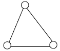
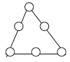
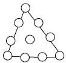
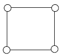
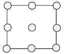
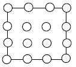
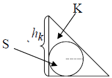
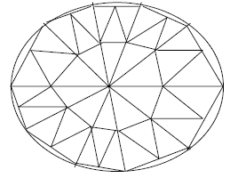



## 6. Інтерполювання функцій

### 6.1. Постановка задачі інтерполювання

Нехай функція $$f(x) \in C([a,b])$$ задана своїми значеннями $$y_i = f(x_i)$$, $$x_i \in [a,b]$$, $$i = \overline{0,n}$$, причому $$x_i \ne x_j$$ для $$i \ne j$$.

> **Означення**: Функція $$\Phi(x)$$ називається _інтерполюючою_ для $$f(x)$$ на сітці $$\{x_i\}^n_{i = 0}$$, якщо $$\Phi(x_i) = y_i$$, $$i = \overline{0,n}$$.

Задача інтерполювання функції має не єдиний розв'язок. 

> **Означення**: Виберемо систему лінійно незалежних функцій $$\{\varphi_k(x)\}^n_{k = 0}$$, $$\varphi_k(x) \in C([a,b])$$ і побудуємо лінійну комбінацію 
>
> \begin{equation} 
> \label{eq:6.1.1} 
> \Phi(x) = \Phi_n(x) = \Sum_{k = 0}^n c_k \cdot \varphi_k(x), 
> \end{equation} 
>
> яка називається _узагальненим багаточленом_. 

Умови інтерполювання дають СЛАР 

\begin{equation} 
    \label{eq:6.1.2} 
    \Sum_{k = 0}^n c_k \cdot \varphi_k(x_i) = y_i, \quad i = \overline{1, n}
\end{equation} 

розв'язком якої є $$\vec c = (c_0, \ldots, c_n)$$. 

Якщо

\begin{equation}
    D(x_0, \ldots, x_n) = \begin{vmatrix} 
        \varphi_0(x_0) & \cdots & \varphi_n(x_0) \newline
        \vdots & \ddots & \vdots \newline
        \varphi_0(x_n) & \cdots & \varphi_n(x_n)
    \end{vmatrix} \ne 0,
\end{equation}

то система \eqref{eq:6.1.2} має єдиний розв'язок.

> **Означення**: Система функцій $$\{\varphi_k (x)\}^n_{k = 0}$$ називається _системою Чебишова_, якщо $$\forall \{x_i\}^n_{i = 0}$$ таких, що $$x_i \in [a,b]$$ і $$x_i \ne x_j$$ при $$i \ne j$$ виконується $$D(x_0, \ldots, x_n)\ne 0$$.

> **Приклади** систем Чебишова:
>
> 1. $$\varphi_k(x) = x^k$$ &mdash; алгебраїчна система.
>
>    Визначник $$D(x_0, \ldots, x_n) \ne 0$$ є визначником Вандермонда: 
>
>    \begin{equation}
>    \begin{aligned}
>    D(x_0, \ldots, x_n) &= \begin{vmatrix} 
>       1 & x_0 & \cdots & x_0^n \newline
>       \vdots & \vdots & \ddots & \vdots \newline
>       1 & x_n & \cdots & x_n^n 
>    \end{vmatrix} = \newline
>    &= \Prod_{0 \le k \le m \le n} (x_k - x_m) \ne 0,  
>    \end{aligned}
>    \end{equation}
>
> 2. $$\varphi_k (x) = L_k(x)$$ &mdash; ортогональні багаточлени Лежандра; 
>
> 3. $$\varphi_k(x) = T_k(x)$$ &mdash; ортогональні багаточлени Чебишова.
>
> 4. $$\varphi_k(x)$$: $$1$$, $$\cos(x)$$, $$\sin(x)$$, $$\ldots$$, $$\cos(nx)$$, $$\sin(nx)$$.
>
>    Тоді
>
>    \begin{equation}
>    \begin{aligned}
>    \Phi_n(x) &= T_n(x) = \newline
>    &= a_0 + \Sum_{k = 1}^n (a_k \cdot \cos(k x) + b_k \cdot \sin(k x))
>    \end{aligned}
>    \end{equation}
>
>    &mdash; тригонометричний багаточлен.

### 6.2. Інтерполяційна формула Лагранжа

Якщо $$\varphi_k(x) = x^k$$, то

\begin{equation}
    \Phi_n(x) = P_n(x) = \Sum_{k=0}^n c_k \cdot x^k.
\end{equation}

Задача інтерполювання функції $$f(x)$$ алгебраїчним, багаточленом полягає в знаходженні коефіцієнтів $$c_k$$, $$k = \overline{0,n}$$ для яких виконується умова $$f(x_i) = \varphi(x_i)$$, $$i = \overline{0, n}$$.

Представимо інтерполяційний багаточлен у вигляді 

\begin{equation} 
    \label{eq:6.2.1} 
    P_n(x) = L_n(x) = \Sum_{k = 0}^n f(x_k) \cdot \Phi_k^{(n)}(x).
\end{equation} 
 
> **Означення**: Тут $$L_n(x)$$ &mdash; _інтерполяційний поліном_; $$\Phi_k^{(n)}(x)$$ &mdash; поліноми $$n$$-го степеня, які називають _множниками Лагранжа_. 

З умови $$L_n(x_i) = f(x_i)$$ випливає, що множник Лагранжа повинен задовольняти умови 

\begin{equation} 
    \label{eq:6.2.2}
    \Phi_k^{(n)} (x_i) = \delta_{i,k}. 
\end{equation}

Оскільки $$\Phi_k^{(n)}(x)$$ &mdash; багаточлен степеня $$n$$, то він має вигляд 

\begin{equation}
    \Phi_k^{(n)}(x) = A_k (x - x_0) \ldots (x - x_{k-1}) (x - x_{k+1}) \ldots (x - x_n), 
\end{equation}

де $$A_k$$ &mdash; число. 

Знайдемо його з умови $$\Phi_k^{(n)}(x_k) = 1$$:

\begin{equation}
    A_k = \frac{1}{(x_k - x_0) \ldots (x_k - x_{k-1}) (x_k - x_{k + 1}) \ldots (x_k - x_n)}.
\end{equation}

Таким чином багаточлен $$\Phi_k^{(n)}(x)$$ мають вигляд: 

\begin{equation} 
    \label{eq:6.2.3} 
    \Phi_k^{(n)} (x) = \frac{(x - x_0) \ldots (x - x_{k-1}) (x - x_{k+1}) \ldots (x - x_n)}{(x_k - x_0) \ldots (x_k - x_{k-1}) (x_k - x_{k+1}) \ldots (x_k - x_n)}
\end{equation} 

Позначивши

\begin{equation}
    \omega_n(x) = \Prod_{i = 0}^n(x - x_i),
\end{equation}

маємо

\begin{equation}
    \Phi_k^{(n)}(x) = \frac{\omega_n(x)}{(x - x_k) \cdot \omega_n'(x_k)}.
\end{equation}

Остаточно формула Лагранжа має вигляд 

\begin{equation} 
    \label{eq:6.2.4} 
    L_n(x) = \Sum_{k = 0}^n f(x_k) \cdot \frac{\omega_n(x)}{(x - x_k) \cdot \omega_n'(x_k)}
\end{equation}

### 6.3. Залишковий член інтерполяційного полінома

В заданих точках (точки інтерполювання) значення функції та полінома співпадають, але в інших точках в загальному випадку не співпадають. Отже доцільно розглянути питання про похибку інтерполювання.

> **Означення**: Замінюючи функцію $$f(x)$$ на $$L_n(x)$$ ми допускаємо похибку $$r_n(x) = f(x) - L_n(x)$$. Це _залишковий член_ інтерполювання.

З означення випливає, що, $$r_n(x_i) = 0$$, $$x_i \in [a,b]$$. Оцінимо похибку у кожній точці $$x \in [a,b]$$. Введемо допоміжну функцію:

\begin{equation}
    g(t) = f(t) - L_n(t) - K \cdot \omega_n(t),
\end{equation}

де $$t \in [a,b]$$, і $$g(x_i) = 0$$ для $$i = \overline{0,n}$$.

Знайдемо таке $$K$$, щоб $$g(x) = 0$$, в деякій точці $$x \in [a,b]$$, $$x \ne x_i$$, $$i = \overline{0,n}$$. Легко бачити, що 

\begin{equation}
    K = \frac{f(x) - L_n(x)}{\omega_n(x)}.
\end{equation}

Припустимо що $$f(x) \in C^{(n+1)}([a,b])$$, тоді $$g(t) \in C^{(n+1)}([a,b])$$. Функція $$g(t) = 0$$ в $$(n + 2)$$-х точках, а саме $$t = x$$, $$t = x_i$$, $$i = \overline{0,n}$$. З теореми Ролля випливає, що існує $$(n+1)$$-а точка, де $$g'(t_i)=0$$, $$i = \overline{0,n}$$. Продовжуючи цей процес, отримаємо, що існує хоча б одна $$\xi \in [a,b]$$ така, що $$g^{(n+1)} (\xi) = 0$$. Оскільки 

\begin{equation}
    g^{(n+1)}(t) = f^{(n+1)} - 0 - K \cdot (n+1)!,
\end{equation}

то $$\exists \xi$$, що

\begin{equation}
    g^{(n+1)}(\xi) = f^{(n+1)}(\xi) - (n+1)! \cdot \frac{f(x) - L_n(x)}{\omega_n(x)} = 0.
\end{equation}

Звідси

\begin{equation}
    \label{eq:6.3.1} 
    r_n(x) = f(x) - L_n(x) = \frac{f^{(n+1)}(\xi)}{(n + 1)!} \cdot \omega_n(x). 
\end{equation} 

Оскільки $$\xi$$ невідомо, то використовують _оцінку залишкового члена_: 

\begin{equation} 
    \label{eq:6.3.2}
    |r_n(x)| = |f(x) - L_n(x)| \le \frac{M_{n + 1}}{(n + 1)!} \cdot |\omega_n(x)|, 
\end{equation}

де $$M_{n + 1} = \Sup_{x \in [a,b]} \vert f^{(n+1)}(x) \vert$$.

### 6.4. Багаточлени Чебишова. Мінімізація залишкового члена інтерполяційного полінома

Як вибрати вузли інтерполяції щоб похибка інтерполювання була мінімальною? Спочатку обґрунтуємо теоретичний апарат, завдяки якому будемо досліджувати це питання.

> **Означення**: _Багаточленом Чебишова ($$n$$-того степеня, 1–го роду)_ називається поліном, який задається такими рекурентними співвідношеннями 
> 
> \begin{equation} 
> \label{eq:6.4.1} 
> T_{n + 1}(x) - 2 x \cdot T_n(x) + T_{n - 1}(x) = 0,
> \end{equation} 
>
> де початкові значення
>
> \begin{equation} 
> \label{eq:6.4.2} 
> T_0(x) = 1, \quad T_1(x) = x. 
> \end{equation} 

Знайдемо явний вигляд багаточлена Чебишова. Будемо шукати розв'язок рівняння \eqref{eq:6.4.1} у вигляді $$T_n(x) = q^n$$, де $$q = q(x)$$. Підставивши в \eqref{eq:6.4.1}, отримуємо характеристичне рівняння $$q^2 - 2 x q + 1 = 0$$. Тоді при $$\vert x \vert \ge 1 \implies q_{1,2} = x \pm \sqrt{x^2 - 1}$$, а при $$\vert x \vert < 1 \implies q_{1,2} = \cos(\varphi) \pm i \sin(\varphi)$$, $$\varphi = \arccos(x)$$.

Розглянемо обидва випадки детальніше: 

1. при $$\vert x \vert \le 1$$: $$T_n(x) = A \cdot \cos(n \varphi) + B \cdot \sin (n \varphi)$$. З \eqref{eq:6.4.1} випливає $$A = 1$$, $$B = 0$$ і тому 
    
    \begin{equation} 
        \label{eq:6.4.3} 
        T_n(x) = \cos(n \arccos (x)).
    \end{equation}

2. при $$\vert x \vert > 1$$: 

    \begin{equation}
        \label{eq:6.4.4}
        T_n(x) = \frac{1}{2} \left( \left(x + \sqrt{x^2 - 1}\right)^n + \left(x - \sqrt{x^2 - 1} \right)^n \right). 
    \end{equation}

Знайдемо нулі та екстремуми багаточлена Чебишова: $$T_n(x) = 0$$, $$x \in [-1,1]$$, $$\cos(n \arccos(x)) = 0$$, $$\arccos(x) = \frac{2 k + 1}{2 n} \pi$$, $$k = \overline{0,n-1}$$.

Отже _нулі багаточлена Чебишова_:

\begin{equation}
    x_k = \cos \left( \frac{(2 k + 1) \pi}{2 n} \right) \in [-1,1], \quad k = \overline{0,n-1}.
\end{equation}

_Локальні екстремуми багаточлена Чебишова_ на $$x \in [-1,1]$$:

\begin{equation}
     x_k' = \cos \left( \frac{k\pi}{2n} \right), \quad k = \overline{0,n}.
\end{equation}

Коефіцієнт при старшому члені багаточлена дорівнює $$2^{n-1}$$. 

> **Означення**: Введемо _нормований багаточлен Чебишова_ $$\overline T_n(x) = 2^{1-n} T_n(x) = x^n + \ldots$$.

Тоді

\begin{equation}
    \left\| \overline T_n \right\|\void_{C([-1,1])} = \Max_{x \in [-1,1]} |T_n(x)| = 2^{1-n}. 
\end{equation}

> **Означення**: Відхиленням двох функцій $$f(x)$$ та $$\Phi(x)$$ називається величина

\begin{equation}
    \Delta (f, \Phi) = \| f(x) - \Phi(x)\|\void_{C([a,b])}.
\end{equation}

> **Теорема** (_Чебишова_): Серед усіх багаточленів $$n$$-го степеня з коефіцієнтом $$1$$ при старшому степені $$\overline T_n(x)$$ найменше відхиляється від $$0$$ на $$[-1,1]$$, тобто
>
> \begin{equation}
> \left\|\overline T_n(x) - 0 \right\|\void_{C([-1,1])} = \Inf_{\overline P_n(x)} \left\|\overline P_n(x)\right\|\void_{C([-1,1])} = 2^{1-n}.
> \end{equation}

_Доведення_: Будемо доводити від супротивного: припустимо, що існує багаточлен, такий, що

\begin{equation}
    \overline Q_n(x) < 2^{1-n}.
\end{equation}

Тоді $$Q_{n-1}(x) = \overline T_n(x) - \overline Q_n(x)$$ &mdash; поліном степеня не вище $$n - 1$$ і не рівний тотожньо нулю. Дослідимо його знаки:

\begin{equation}
    \begin{aligned}
        \text{sgn} \left( Q_{n - 1}(x_k') \right) &= \text{sgn} \left( \overline T_n(x_k') - \overline Q_n(x_k') \right) = \newline
        &= \text{sgn} \left( \overline T_n(x_k') \right) = \alpha \cdot(-1)^k,
    \end{aligned}
\end{equation}

де $$\alpha = \pm 1$$.

Значить $$\exists z_k$$, $$k = \overline{0,n-1}$$ таке, що $$Q_{n-1}(z_k)=0$$. Це протиріччя, бо $$Q_{n-1}(x)$$ &mdash; поліном степеня $$\le n - 1$$. $$\square$$

Тепер узагальнимо наш багаточлен Чебишова на довільний проміжок. Нагадаємо $$T_n(t) = \cos(n \arccos t)$$, $$-1 \le t \le 1$$. Від змінної $$t \in [-1, 1]$$ перейдемо до $$x \in [a,b]$$. Запровадимо заміну

\begin{equation}
    t = \frac{2 x}{b - a} - \frac{b + a}{b - a}, \quad x = \frac{b + a}{2} + \frac{b - a}{t}.
\end{equation}

Тоді

\begin{equation}
    \begin{aligned}
        T_n^{[a,b]}(t) &= \overline T_n \left( \frac{2 x}{b - a} - \frac{b + a}{b - a} \right) = \newline
        &= 2^{1 - n} \cos \left(n \arccos \left( \frac{2 x - (b + a)}{b - a} \right) \right).
    \end{aligned}
\end{equation}

Побудований нами багаточлен Чебишова на $$[a,b]$$ не є нормованим. 

_Нормований багаточлен Чебишова_ на $$[a,b]$$: 

\begin{equation}
    \overline T_n^{[a,b]}(x) = \frac{(b - a)^n}{2^{2 n - 1}} \cos \left(n \arccos \left( \frac{2 x - (b + a)}{b - a} \right) \right).
\end{equation}

Відповідно його нулі

\begin{equation}
    x_k = \frac{a + b}{2} - \frac{b - a}{2} \cdot t_k, \quad t_k = \cos \left( \frac{(2 k + 1) \pi}{2 n} \right),
\end{equation}

де $$k = \overline{0,n-1}$$, а точки екстремуму 

\begin{equation}
    x_k' = \frac{a + b}{2} - \frac{b -a }{2} \cdot t_k', \quad t_k' = \cos \left( \frac{k \pi}{n} \right), \quad k = \overline{0,n}.
\end{equation}

Теорема Чебишова вірна і у випадку $$[a,b]$$. Тепер

\begin{equation}
    \left\|\overline T_n^{[a,b]}\right\|\void_{C([a,b])} = \frac{(b-a)^n}{2^{2n-1}}.
\end{equation}

Перейдемо до питання мінімізації залишкового члена. Нагадаємо, що 

\begin{equation} 
    \label{eq:6.4.5}
    |r_n(x)| = |f(x) - L_n(x)| \le \frac{M_{n + 1}}{(n + 1)!} \cdot |\omega_n(x)|,
\end{equation} 

де $$M_{n + 1} = \Max_{x \in [a,b]} \left\vert f^{(n+1)}(x) \right\vert$$, $$\omega_n(x) = \Prod_{i = 0}^n (x - x_i) = x^{n+1} + \ldots$$

Поставимо задачу 

\begin{equation}
    \Inf_{\overline P_n(x)} \Max_{x \in [a,b]} |\omega_n(x)|. 
\end{equation}

З теоремою Чебишова $$\omega_n(x) = \overline T_{n+1}^{[a,b]}(x)$$ поліном Чебишова. Якщо співпадають поліноми, то співпадають їх нулі. Отже: $$x_k$$ &mdash; вузли інтерполяції співпадають з нулями багаточлена Чебишова 

\begin{equation}
    x_k = \frac{a + b}{2} - \frac{b - a}{2} \cdot t_k, \quad t_k = \cos \left( \frac{(2 k + 1) \pi}{2 (n + 1)} \right),
\end{equation}

де $$k = \overline{0,n}$$.

В цьому випадку 

\begin{equation} 
    \label{eq:6.4.6}
    |r_n(x)| = |f(x) - L_n(x)| \le \frac{M_{n + 1}}{(n + 1)!} \cdot \frac{(b - a)^{n + 1}}{2^{2 n + 1}}.
\end{equation} 

Цю оцінку не можна покращити! Так для $$f(x) = \overline P_{n + 1}(x) = x^{n + 1} + \ldots$$ її $$(n + 1)$$ похідна дорівнює $$(n + 1)!$$, тому $$M_{n + 1} = (n + 1)!$$. Різниця $$f(x) - L_n(x) = \overline T_{n + 1}^{[a,b]}(x)$$, отже

\begin{equation}
    \Max_{x \in [a,b]} |f(x) - L_n(x)| = \frac{(b - a)^{n + 1}}{2^{2 n + 1}}.
\end{equation}

### 6.5. Розділені різниці

Розділені різниці є аналогом похідної для функції, що задана таблицею.

> **Означення**: _Розділеною різницею 1-го порядку_ для функції $$f(x)$$ називатимемо
>
> \begin{equation}
> f(x_i; x_j) = \frac{f(x_i) - f(x_j)}{x_i - x_j}.
> \end{equation}
>
> _Розділеною різницею 2-го порядку_ для функції $$f(x)$$ називатимемо
>
> \begin{equation}
> f(x_i; x_j; x_k) = \frac{f(x_i; x_j) - f(x_j; x_k)}{x_i - x_k}.
> \end{equation}
>
> Аналогічно визначаються розділені різниці довільного порядку.

Наведемо деякі властивості розділених різниць:

1. 
    
    \begin{equation}
        f(x_0; \ldots; x_n) = \Sum_{i = 0}^n \frac{f(x_j)}{\Prod_{i \ne j}(x_i - x_j)}.
    \end{equation}

2. Розділена різниця &mdash; лінійний функційонал:

    \begin{equation}
        (\alpha_1 f_1 + \alpha_2 f_2)(x_0; x_1) = \alpha_1 f_1(x_0;x_1) + \alpha_2 f_2(x_0;x_1).
    \end{equation}

3. Розділена різниця &mdash; симетричний функціонал:

    \begin{equation}
        \begin{aligned}
            & f(x_1; \ldots; x_i; \ldots; x_j; \ldots; x_n) = \newline
            & \quad f(x_1; \ldots; x_j; \ldots; x_i; \ldots; x_n).
        \end{aligned}
    \end{equation}

4. $$\forall f(x) \in C^{(n)}([a,b])$$: $$\exists \xi \in [a,b]$$: $$f(x_0; x_1; \ldots; x_n) = \frac{f^{(n)}(\xi)}{n!}$$.

> **Задача 14**: Довести першу властивість розділених різниць.

Таблиця розділених різниць має вигляд:

$$x_i$$ | $$f_i$$ | р.р.$$1$$ | р.р.$$2$$ | $$\ldots$$ | р.р.$$n$$
------- | ------- | ----- | ----- | ---------- | ---------
$$x_0$$ | $$f(x_0)$$ | | | |
 | | $$f(x_0;x_1)$$ | | |
$$x_1$$ | $$f(x_1)$$ | | $$f(x_0;x_1;x_2)$$ | |
| | $$f(x_1;x_2)$$ | | |
$$x_2$$ | $$f(x_2)$$ | | | |
$$\vdots$$ | $$\vdots$$ | $$\vdots$$ | $$\vdots$$ | $$\vdots$$ |
$$\cdots$$ | $$\cdots$$ | $$\cdots$$ | $$\cdots$$ | $$\cdots$$ | $$f(x_0;\ldots;x_n)$$
$$\vdots$$ | $$\vdots$$ | $$\vdots$$ | $$\vdots$$ | $$\vdots$$ |
$$x_{n-2}$$ | $$f(x_{n-2})$$ | | | |
 | | $$f(x_{n-2};x_{n-1})$$ | | |
$$x_{n-1}$$ | $$f(x_{n-1})$$ | | $$f(x_{n-2};x_{n-1};x_n)$$ | |
| | $$f(x_{n-1};x_n)$$ | | |
$$x_n$$ | $$f(x_n)$$ | | | |

### 6.6. Інтерполяційна формула Ньютона

Запишемо формулу Лагранжа інтерполяційного багаточлена

\begin{equation}
    \label{eq:6.6.1}
    L_n(x) = \Sum_{i = 0}^n f(x_i) \cdot \frac{\omega_n(x)}{(x - x_i) \cdot \omega_n'(x_i)},
\end{equation}

де $$\omega_n(x) = \Prod_{j=0}^n (x-x_j)$$.

Позначимо $$\Phi_j(x) = L_j(x) - L_{j-1}(x)$$. Тоді, оскільки

\begin{equation}
    \begin{aligned}
        L_n(x) &= L_0(x) + (L_1(x) - L_0(x)) + \ldots \newline
        & \quad \ldots + (L_n(x) - L_{n-1}(x)),
    \end{aligned}
\end{equation}

і

\begin{equation}
    L_j(x_i) = L_{j-1}(x_i) = f(x_i), \quad i = \overline{0,j-1},
\end{equation}

то
\begin{equation}
    \label{eq:6.6.2}
    \Phi_j(x_i) = A_j \cdot (x - x_0) \cdot \ldots \cdot (x - x_{j-1}),
\end{equation}

де $$A_j$$ визначається з умови $$\Phi_j(x_j) = L_j(x_j) - L_{j-1}(x_j) = f(x_j) - L_{j-1}(x_j)$$. Звідси

\begin{equation}
    \Phi_j(x) = \frac{f(x_j) - L_{j-1}(x_j)}{(x_j - x_0) \ldots (x_j - x_{j - 1})} \cdot (x-x_0) \ldots (x-x_j).
\end{equation}

Тоді
\begin{equation}
    \begin{aligned}
        A_j &= \frac{f(x_j) - L_{j-1}(x_j)}{(x_j - x_0) \ldots (x_j - x_{j-1})} = \newline
        & = \frac{f(x_j)}{(x_j - x_0) \ldots (x_j - x_{j-1})} - \newline
        & \quad - \Sum_{i = 0}^{j - 1} \frac{f(x_i)}{(x_i - x_0) \ldots (x_i - x_{i-1}) (x_i - x_{i + 1}) \ldots (x_j-x_i)} = \newline
        & = \frac{f(x_j)}{(x_j-x_0) \ldots (x_j - x_{j-1})} + \newline
        & \quad + \Sum_{i = 0}^{j - 1} \frac{f(x_i)}{(x_i-x_0) \ldots (x_i - x_j)} = \newline
        & = \Sum_{i = 0}^j \frac{f(x_i)}{(x_i - x_0) \ldots (x_i - x_{i - 1}) (x_i - x_{i + 1}) \ldots (x_i - x_j)} = \newline
        & = f(x_0;\ldots;x_j).
    \end{aligned}
\end{equation}

Звідси маємо інтерполяційну формулу Ньютона вперед ($$x_0 \to x_n$$):

\begin{equation}
    \label{eq:6.6.3}
    \begin{aligned}
        L_n(x) &= f(x_0) + f(x_0;x_1) (x-x_0) + \ldots \newline
        & \quad \ldots + f(x_0;\ldots;x_n) (x-x_0) \ldots (x - x_{n-1}).
    \end{aligned}
\end{equation}

Аналогічно, інтерполяційна формула Ньютона назад ($$x_n\to x_0$$):
\begin{equation}
    \label{eq:6.18}
    \begin{aligned}
        L_n(x) &= f(x_n) + f(x_n;x_{n-1}) (x-x_n) + \ldots \newline
        & \quad \ldots + f(x_n;\ldots;x_0) (x-x_n) \ldots  (x-x_1).
    \end{aligned}
\end{equation}

Маємо рекурсію за степенем багаточлена 

\begin{equation}
    L_n(x) = L_{n-1}(x) + f(x_0;\ldots;x_n) (x-x_0) \ldots (x-x_1).
\end{equation}

Звідси

\begin{equation}
    \begin{aligned}
        L_n(x) &= f(x_0) + (x - x_0) (f(x_0;x_1) + (x - x_1) (\ldots \newline
        & \quad \ldots + (x - x_{n-1}) f(x_0;x_1;\ldots;x_n) \ldots ))
    \end{aligned}
\end{equation}

і цю формулу розкриваємо починаючи з середини (це аналог схеми Горнера обчислення значення багаточлена).

Введемо нову формулу для похибки інтерполювання. Для $$x \ne x_i$$, $$i = \overline{0,n}$$ розглянемо розділену різницю

\begin{equation}
    \begin{aligned}
        f(x; x_0; \ldots; x_n) &= \frac{f(x)}{(x - x_0) \ldots (x - x_n)} + \newline
        & \quad + \Sum_{k = 0}^n \frac{f(x_k)}{\Prod_{i \ne k}(x - x_i)}.
    \end{aligned}
\end{equation}

Звідси

\begin{equation}
    \begin{aligned}
        f(x) &= f(x_0) \cdot \frac{(x - x_1) \ldots (x - x_n)}{(x_0 - x_1) \ldots (x_0 - x_n)} + \ldots \newline
        & \quad \ldots + f(x_n) \cdot \frac{(x - x_1) \ldots (x - x_n)}{(x_n - x_1) \ldots (x_n - x_{n-1})} + \newline
        & \quad + f(x; x_0; \ldots; x_n) (x - x_0) \ldots (x - x_n) = \newline
        & = L_n(x) + f(x; x_0; \ldots; x_n) \cdot \omega_n(x).
    \end{aligned}
\end{equation}

Тоді похибка має вигляд
\begin{equation}
    \label{eq:6.19}
    r_n(x) = f(x) - L_n(x) = f(x;x_0;\ldots;x_n)\cdot\omega_n(x).
\end{equation}

Це нова форма для залишкового члена.

Порівнюючи з формулою залишкового члена в пункті [$$6.3$$](#63-залишковий-член-інтерполяційного-полінома), маємо

\begin{equation}
    f(x; x_0; \ldots; x_n) = \frac{f^{(n + 1)}(\xi)}{(n + 1)!},
\end{equation}

що доводить останню властивість розділених різниць.

Нехай маємо сітку рівновіддалених вузлів: $$x_i = a + i h$$, $$h = \frac{b-a}{n}$$, $$i = \overline{0, n}$$, $$x_0 = a$$, $$x_n = b$$. Розначимо $$\Delta f_0 = f_1 - f_0$$, $$\Delta^2f_0 = \Delta f_1 - \Delta f_0 = f_2 - 2 f_1 + f_0$$, $$\ldots$$ &mdash; скінченні різниці. 

Запишемо формули Ньютона у нових позначеннях:

\begin{equation}
    \begin{aligned}
        L_n(x) &= L_n(x_0 + t h) = \newline
        &= f_0 + t \Delta f_0 + \ldots \newline
        & \quad \ldots + \frac{t (t - 1) \ldots (t - n + 1)}{n!}\cdot \Delta^n f_0,
    \end{aligned}
\end{equation}

де $$t = \frac{x-x_0}{h}$$.

Це інтерполяційна формула Ньютона вперед по рівновіддалених вузлах.

> **Задача 15**: Побудувати інтерполяційну формулу Ньютона назад по рівновіддалених вузлах.

### 6.7. Інтерполювання з кратними вузлами

Нехай $$f(x)$$ задана таблицею значень $$f^{(j)}(x_i)$$, $$i = \overline{0, n}$$, $$j = \overline{0, k_i - 1}$$, $$k_i$$ &mdash; кратності відповідних вузлів. Побудуємо $$H_m^{(i)}(x_j) = f^{(i)}(x_j)$$ &mdash; інтерполяційний багаточлен Ерміта по кратним вузлах, де

\begin{equation}
    m = \Sum_{i = 1}^n k_i - 1.
\end{equation}

Якщо $$k_i = 1$$, то $$H_m(x) = L_n(x)$$.

Для побудови $$H_m(x)$$ в загальному випадку для кожної точки $$x_i$$ введемо $$k_i$$ точок $$x_{i, j}^\varepsilon = x_i + j \varepsilon$$, $$i = \overline{0, n}$$, $$j = \overline{0, k_i - 1}$$. З умови $$\forall i$$: $$x_{i, k_i - 1}^\varepsilon = x_i + \varepsilon (k - 1) < x_{i + 1}$$ можна вибрати $$\varepsilon$$.

Нехай $$f(x) \in C^{(m)}([a,b])$$. Запишемо інтерполяційну формулу Ньютона:

\begin{equation}
    \begin{aligned}
        L_m^\varepsilon &= f \left( x_{0, 0}^\varepsilon \right) + f \left(x_{0, 0}^\varepsilon; x_{0, 1}^\varepsilon \right) \left(x - x_{0, 0}^\varepsilon \right) + \ldots \newline
        & \quad + f \left( x_{0, 0}^\varepsilon; \ldots; x_{n, k_n - 1}^\varepsilon \right) \left( x - x_{0, 0}^\varepsilon \right) \ldots \left( x - x_{n, k_n - 1}^\varepsilon \right).
    \end{aligned}
\end{equation}
    
При $$\varepsilon \to 0$$ маємо $$x_{i,j}^\varepsilon \to x_i$$. Крім того

\begin{equation}
    f \left( x_{i,0}^\varepsilon; \ldots; x_{i, k_i - 1}^\varepsilon \right) = f (x_i; \ldots; x_i) = \frac{f^{(k_i)}(x_i)}{k_i!}.
\end{equation}

Тому $$L_m^\varepsilon(x) \to H_m(x)$$ та

\begin{equation}
    R_m(x) = f(x) - H_m(x) = \frac{f^{(m + 1)}(\xi)}{(m + 1)!} \cdot \Omega_m(x),
\end{equation}

де $$\Omega_m(x) = (x - x_0)^{k_0} \ldots (x - x_n)^{k_n}$$.

### 6.8. Збіжність процесу інтерполювання

Виникає питання, чи буде прямувати до нуля похибка інтерполювання $$f(x) - L_n(x)$$, якщо число вузлів $$n$$ збільшувати? 

Введемо норму

\begin{equation}
    \|f(x) - L_n\|\void_{C([a,b])} = \Max_{x \in [a,b]} | f(x) - L_n(x) |.
\end{equation}

Тоді для довільної $$f(x) \in C^{(n + 1)}([a,b])$$ справджується оцінка

\begin{equation}
    \label{eq:6.8.1}
    \| f(x) - L_n(x)\|\void_{C([a,b])} \le \frac{M_{n + 1}}{(n + 1)!} \|\omega_n(x)\|\void_{C([a,b])},
\end{equation}

де $$M_{n + 1} = \Max_{x \in [a,b]} \left\vert f^{(n + 1)}(x) \right\vert$$, $$\omega_n(x) = \Prod_{i = 0}^n (x - x_i)$$. 

А яка оцінка буде для довільної неперервної функції?

> **Означення**: Кажуть, що інтерполяційний процес для функції $$f(x)$$ _збігається_ в точці $$x \in [a,b]$$, якщо
>
> \begin{equation}
> \forall \\{x_i\\}^n_{i = 1}: h = \Max_{i = \overline{1,n}} \to 0: \Lim_{n\to\infty} L_n(x) = f(x), 
> \end{equation}
>
> де, як завжди, $$h_i = x_i - x_{i-1}$$.

> **Означення**: Якщо $$\|f(x) - L_n(x)\|\void_{C([a,b])} \xrightarrow[n\to\infty]{}0$$, то інтерполяційний процес збігається рівномірно.

Розглянемо приклади поведінки інтерполяційних багаточленів при $$n \to \infty$$ для деяких функцій. 

> **Приклад 1**: Послідовність інтерполяційних багаточленів (сітка рівномірна), побудованих для неперервної функції $$f(x) = \vert x \vert$$, $$-1 \le x \le 1$$ (функція неперервна, але негладка), не збігається на $$x \in [-1,1]$$, крім точок $$x = -1,0,1$$.
>
> На рисунку дано графіки самої функції (штрихова лінія) та інтерполяційного багаточлена (суцільна лінія) на рівномірній сітці $$x_i = -1 + i h$$, $$h = 2 / n$$, $$i = \overline{0,n}$$ для $$n = 10$$:
> 
> 

> **Приклад 2**: Функція Рунге $$f(x) = \frac{1}{1 + 40x^2}$$, $$-1 \le x \le 1$$ (функція аналітична!). Для рівномірної сітки $$x_i = -1 + i h$$, $$h = 2 / n$$, $$i = \overline{0,n}$$ маємо графіки: суцільна лінія &mdash; інтерполяційного багаточлена; пунктирна &mdash; самої функції для $$n = 10$$:
>
> 

Пояснити чому рівномірна сітка дає великі похибки інтерполювання біля кінців інтервалу інтерполювання допомагає наступний рисунок. На цьому рисунку суцільною лінією представлено графік функції $$\omega_n = \Prod_{i = 0}^n (x - x_i)$$ ($$n = 8$$) для рівномірної сітки. Як бачимо максимальні за модулем значення цієї функції припадають на кінці інтервалу.

Для порівняння на цьому ж рисунку (штрихова лінія) побудовано графік $$\omega_n = \Prod_{i = 0}^n (x - x_i)$$, що відповідає чебишовським вузлам, які мінімізують похибку інтерполювання. Тепер відхилення $$\omega_n(x)$$ розподілено рівномірно по всьому проміжку інтерполювання.

> **Теорема** (_Фабера_): $$\forall \{x_i\}^n_{i = 0}$$ існує $$f(x) \in C([a,b])$$, для якої інтерполяційний процес не збігається рівномірно.

> **Теорема** (_Марцинкевича_): $$\forall f(x) \in C([a,b])$$ існуюють $$\{x_i\}^n_{i = 0}$$ такі, що послідовність $$\{L_n(x)\}$$ збігається рівномірно до $$f(x)$$.

> **Теорема**: Стала Лебега
>
> \begin{equation}
> \|P_n\| = \Max_j \Sum_{j = 0}^n \left\vert \varphi_j^{(n)}(x) \right\vert,
> \end{equation}
>
> де 
> 
> \begin{equation}
> \varphi_j^{(n)}(x) = \frac{\omega_n(x)}{(x-x_j) \cdot \omega_n'(x_i)}.
> \end{equation}

> **Теорема**: Для $$f(x) \in C([a,b])$$:
>
> \begin{equation}
> \|f(x)-L_n(x)\|\void_{C([a,b])} \le (1 + \|P_n\|) \cdot E_n(f),
> \end{equation}
>
> де
>
> \begin{equation}
> E_n(f) = \Inf_{Q_n(x)} \|f(x) - Q_n(x)\|\void_{C([a,b])}
> \end{equation}
>
> &mdash; відхилення багаточлена $$n$$-го степеня найкращого рівномірного наближення від $$f(x)$$.

> **Теорема**: Нехай $$P_n^E$$ &mdash; оператор інтерполяції на рівномірній сітці, $$P_n^T$$ &mdash; оператор інтерполяції на чебишовській сітці. Тоді на $$[-1,1]$$ маємо наближені оцінки:
>
> \begin{equation}
> \|P_n^E\|\approx C_1 \cdot 2^n, \quad \|P_n^T\| \approx C_2 \cdot \ln(n).
> \end{equation}

Останні оцінки поясняють розбіжність процесу інтерполювання при великих $$n$$.

### 6.9. Кусково-лінійна інтерполяція

Інтерполяція багаточленом Лагранжа або Ньютона на відрізку $$[a,b]$$ з використанням великої кількості вузлів інтерполяції часто приводить до поганого наближення через розбіжність процесу інтерполювання. Для того щоб уникнути великої похибки, весь відрізок $$[a,b]$$ розбивають на частинні відрізки $$[x_{i-1}, x_i]$$ і на кожному з частинних відрізків замінюють функцію $$f(x)$$ багаточленом невисокого степеню. В цьому і полягає кусково-поліноміальна інтерполяція.

Розглянемо найпростішу таку інтерполяцію &mdash; лінійну. Нехай задана $$f(x)$$ значеннями $$f(x_i)$$, $$i = \overline{0, n}$$. Побудуємо функцію $$\Phi_1(x)$$ &mdash; лінійну на $$x \in [x_{i - 1}, x_i]$$, що інтерполює ці значення:

\begin{equation}
    \label{eq:6.9.2}
    \begin{aligned}
        \Phi_1(x) &= L_1^i(x) = \newline
        &= f(x_{i - 1}) \cdot \frac{x - x_{i - 1}}{x_i - x_{i - 1}} + f(x_i) \cdot \frac{x_i - x}{x_i - x_{i - 1}},
    \end{aligned}
\end{equation}

де $$x \in [x_{i - 1}, x_i]$$.

Представимо її у вигляді

\begin{equation}
    \label{eq:6.9.3}
    \Phi_1(x) = \Sum_{i = 0}^n f(x_i) \cdot \varphi_i(x).
\end{equation}

З умов інтерполювання маємо 

\begin{equation}
    \Phi_1(x_j) = \Sum_{i = 0}^n f(x_i) \cdot \varphi_i(x_j) = f(x_j).
\end{equation}

Звідси 

\begin{equation}
    \varphi_i(x_j) = \delta_{i,j} = \begin{cases} 
        1, & i = j \newline
        0, & i \ne j
    \end{cases}.
\end{equation}

Значить

\begin{equation}
    \varphi_i(x) = \begin{cases} 
        0, & a \le x \le x_{i-1} \newline
        \frac{x-x_{i-1}}{x_i-x_{i-1}}, & x_{i-1} \le x \le x_i \newline
        \frac{x_{i+1}-x}{x_{i+1}-x_i}, & x_i \le x \le x_{i+1} \newline
        0, & x_{i+1} \le x \le b
    \end{cases}
\end{equation}

> **Теорема**: Для довільної $$f(x) \in C^{(2)}([a,b])$$ справедлива оцінка
>
> \begin{equation}
> \label{eq:6.9.4}
> \|f(x)-\Phi_1(x)\|\void_{C([a,b])} \le \frac{M_2}{8} \cdot |h|^2,
> \end{equation}
> 
> де $$\Phi_1(x)$$ &mdash; кусково-лінійна функція, побудована по значеннях $$f(x_i)$$, $$i = \overline{0, n}$$, $$\vert h \vert = \Max_i h_i$$, $$h_i = x_i - x_{i-1}$$.

_Доведення_: Маємо для $$x \in [x_{i-1}, x_i]$$:
    
\begin{equation}
    \begin{aligned}
        z(x) &= f(x) - \Phi_1(x) = \newline
        &= f(x) - L_1^i(x) = \newline
        &= \frac{f^{\prime\prime}(\xi_i)}{2!} \cdot (x-x_{i-1}) \cdot(x-x_i).
    \end{aligned}
\end{equation}

Звідси 
    
\begin{equation}
    \label{eq:6.9.5}
    \begin{aligned}
        |f(x) - \Phi_1(x)| & \le \frac{M_2^i}{2} \cdot |(x - x_{i-1}) (x - x_i)| \le \newline
        & \le \frac{M_2^i \cdot h_i^2}{8},
    \end{aligned}
\end{equation}

де

\begin{equation}
    M_2^i = \Max_{x \in [x_{i - 1}, x_i]} | f^{\prime\prim  (x) |.
\end{equation}

Остання оцінка отримана з нерівності

\begin{equation}
    \Max_{[x_{i-1},x_i]} |(x-x_{i-1}) \cdot (x - x_i)| = \frac{h_i^2}{4}.
\end{equation}

Тоді

\begin{equation}
    \label{eq:6.9.6}
    \Max_{i = \overline{1,n}} \Max_{x \in [x_{i-1},x_i]} |z(x)| \le \frac{h^2 M_2}{8},
\end{equation}

де $$M_2 = \Max_{x\in[a,b]} \vert f^{\prime\prime}(x) \vert$$, $$h_i = \Max_i h_i$$, що доводить \eqref{eq:6.9.4}. $$\square$$

> **Задача 16**: Довести оцінку $$\vert f'(x) - \Phi_1'(x) \vert \le \vert h \vert \cdot M_2$$.

Отже маємо збіжність процесу інтерполювання за допомогою кусково-лінійної функції

\begin{equation}
    \left\| f(x) - \Phi_1^{(n)}(x) \right\|\void_{C([a,b])} \xrightarrow[h \to 0, n \to \infty]{} 0,
\end{equation}

тобто

\begin{equation}
    \left\\{\Phi_1^{(n)}(x)\right\\} \implies f(x).
\end{equation}

Розглянемо деякі простори:

1. $$H_0 = L_2([a,b])$$ &mdash; гільбертів простір, в якому скалярний добуток визначається так:

    \begin{equation}
        \langle u, v \rangle = \Int_a^b (u(x) \cdot v(x)) \diff x
    \end{equation}

    а норма $$\|u\|\void_0 = \sqrt{\langle u,u \rangle}$$.

2. $$H_k = W_2^k([a,b])$$. Тепер скалярний добуток

    \begin{equation}
        \langle u, v \rangle_k = \Sum_{m = 0}^k \Int_a^b \left( u^{(m)}(x) \cdot v^{(m)}(x) \right) \diff x,
    \end{equation}

    а норма $$\|u\|\void_k = \sqrt{\|u^{(0)}\|^2 + \ldots + \|u^{(k)}\|^2}$$.

> **Теорема**: Нехай $$f(x) \in H_2 = W_2^2([a,b])$$. Тоді
>
> \begin{equation}
> \left\|f^{(k)} - \Phi_1^{(k)} \right\|\void_0 \le \vert h \vert^{2-k} \cdot \|f\|\void_2,
> \end{equation}
>
> де $$k=1,2$$. 

Зауважимо, що кусково-лінійна інтерполяція негладка, тому на практиці застосовують квадратичні, а найчастіше &mdash; кубічні поліноми на кожному проміжку.

### 6.10. Кусково-кубічна ермітова інтерполяція

Нехай деяка функція $$f(x)$$ задана в точках $$x_i$$ своїми значеннями та значеннями похідної: $$y_i = f(x_i)$$, $$y_i' = f'(x_i)$$, $$i = \overline{0, n}$$. Позначимо через $$\Phi_3(x)$$ функцію, яка буде інтерполювати задану. Тоді 

\begin{equation}
    \label{eq:6.10.1}
    \Phi_3(x) = H_3^i(x), \quad x \in [x_{i-1},x_i].
\end{equation}

Неважко написати явний вигляд цього багаточлена $$H_3^i(x)$$ на проміжку:

$$x_i$$ | $$y_i$$ | | | 
| | $$y_i'$$ | | 
$$x_i$$ | $$y_i$$ | | $$\frac{y_{i-1,i}-y_i'}{h_i}$$ | 
| | $$y_{i-1,i}$$ | | $$\frac{y_i' - 2 y_{i-1,i}+y_{i-1}'}{h_i^2}$$ 
$$x_{i-1}$$ | $$y_{i-1}$$ | | $$\frac{y_{i-1}'-y_{i-1,i}}{h_i}$$ | 
| | $$y_{i-1}'$$ | | 
$$x_{i-1}$$ | $$y_{i-1}$$ | | | 

\begin{equation}
    \begin{aligned}
        H_3^i(x) &= y_i + y_i'(x-x_i) + \frac{y_{i-1,i}-y_i'}{h_i} \cdot (x-x_i)^2 + \newline
        & \quad + \frac{y_i' - 2 y_{i-1,i}+y_{i-1}'}{h_i^2} \cdot (x-x_i)^2 \cdot (x-x_{i-1})
    \end{aligned}
\end{equation}    

Можна представити кусково-кубічну функцію і в такому вигляд:

\begin{equation}
    \label{eq:6.10.2}
    \Phi_3(x) = \Sum_{i = 0}^n (y_i \cdot \varphi_i^0 (x) + y_i' \cdot \varphi_i^1(x)).
\end{equation}

Умови інтерполювання: $$\Phi_3(x_i) = y_i$$, $$\Phi_3'(x_i) = y_i'$$, $$i = \overline{0,n}$$. Якщо ці умови підставити в \уйref{eq:6.10.2}, то отримаємо умови на базисні функції:

\begin{align}
    \varphi_i^0(x_j) &= \delta_{i,j}, \newline
    \left(\varphi_i^0\right)^\prime(x_j) &= 0, \newline
    \varphi_i^1(x_j) &= 0, \newline
    \left(\varphi_i^1\right)^\prime(x_j) &= \delta_{i,j}.
\end{align}

для $$i,j=\overline{0,n}$$.

Ці функції кусково-кубічні, тобто $$\varphi_i^k(x) \in \pi_3$$, $$x \in [x_{i - 1}, x_{i + 1}]$$, $$k = 0, 1$$ ($$\pi_3$$ &mdash; множина багаточленів третього степеня), на всіх інших проміжка вони нульові. Нехай $$h_i \equiv h$$, і позначимо $$s = \frac{x - x_i}{h}$$, $$x \in [x_{i - 1}, x_i] \implies s \in [-1,0]$$.

1. введемо $$\overline \varphi_1^0(s) = \varphi_i^0(x)$$, $$x \in [x_{i - 1}, x_{i + 1}]$$, $$x \in [0,1]$$. Побудуємо цю функцію. Вона задовольняє умовам:
    
    \begin{align}
        \overline \varphi_1^0(0) &= 1, \newline
        \overline \varphi_1^0(1) &= 0, \newline
        \left(\overline \varphi_1^0\right)^\prime(0) &= 0, \newline
        \left(\overline \varphi_1^0\right)^\prime(1) &= 0.
    \end{align}

    Її явний вигляд отримаємо за допомогою таблиці розділених різниць:
    
    $$0$$ | $$1$$ | | |
    | | $$0$$ | |
    $$0$$ | $$1$$ | | $$-1$$ |
    | | $$-1$$ | | $$2$$
    $$1$$ | $$0$$ | | $$1$$ |
    | | $$0$$ | |
    $$1$$ | $$0$$ | | |

    \begin{equation}
        \begin{aligned}
            H_3(s) &= 1 + 0 \cdot s - 1 \cdot s^2 + 2 s^2(s-1) = \newline
            &= 2s^3 - 3s^2 + 1 \equiv \overline \varphi_1^0(s).
        \end{aligned}
    \end{equation}

    Аналогічно
    
2. $$\overline \varphi_2^0(s) = -2s^3 - 3s^2 + 1$$, $$\varphi_i^0(x) = \overline \varphi_2^0(s)$$, $$x \in [x_{i - 1}, x_i]$$, $$s \in [-1,0]$$;

3. $$\overline \varphi_1^1(s) = s(s-1)^2$$, $$\varphi_i^0(x) = h \overline \varphi_1^1(s)$$, $$x \in [x_i, x_{i+1}]$$, $$s \in [0,1]$$;

4. $$\overline \varphi_2^1(s) = s(s+1)^2$$, $$\varphi_i^0(x) = h \overline \varphi_2^1(s)$$, $$x \in [x_{i-1}, x_i]$$, $$s\in[-1,0]$$.

А тепер будуємо явний вигляд функцій $$\varphi_i^k(x)$$ для довільного проміжку $$x\in[x_{i-1},x_{i+1}]$$:

\begin{equation}
    \varphi_i^0(x) = \begin{cases} 
        0, & a \le x \le x_{i-1}, \newline
        -2s^3 - 3s^2 + 1, & x_{i-1} \le x \le x_i, \newline
        2s^3 - 3s^2 + 1, & x_i \le x \le x_{i+1}, \newline
        0, & x_{i+1} \le x \le b, 
    \end{cases}
\end{equation}

і

\begin{equation}
    \varphi_i^1(x) = \begin{cases} 
        0, & a \le x \le x_{i-1}, \newline
        hs(s+1)^2, & x_{i-1} \le x \le x_i, \newline
        hs(s-1)^2, & x_i \le x \le x_{i+1}, \newline
        0, & x_{i+1} \le x \le b, 
    \end{cases}
\end{equation}

де $$s = \frac{x-x_i}{h}$$ (якщо сітка нерівномірна, то в формулах замість $$h$$, буде $$h_i$$ або $$h_{i+1}$$ на відповідних інтервалах). 

Оцінимо $$\| f(x) - \Phi_3(x)\|\void_{C([a, b])}$$. Розглянемо для $$x \in [x_{i-1}, x_i]$$:

\begin{equation}
    \begin{aligned}
        f(x) - \Phi_3(x) &= f(x) - H_3^i(x) = \newline
        &= \frac{f^{(4)}(\xi)}{4!} \cdot (x - x_{i-1})^2 (x - x_i)^2.
    \end{aligned}
\end{equation}

Зразу потрібно зробити припущення, що $$f(x) \in C^4([a,b])$$. З тих же міркувань, що і для кусково-лінійної функції, максимум знаходиться в точці $$\overline x_i = \frac{x_i + x_{i-1}}{2}$$ тому для модуля похибки маємо:

\begin{align}
    |f(x) - \Phi_3(x)| &\le \frac{M_4^i}{24} \left( \frac{h^2}{4} \right)^2 = \frac{M_4^i h^4}{384}, \newline 
    \|f(x) - \Phi_3(x)\|\void_{C([a,b])} &\le \frac{M_4 h^4}{384}.
\end{align}

Звідси отримаємо теорему:

> **Теорема**: Якщо функція $$f(x) \in C^4([a,b])$$ задана в точках $$x_i$$ своїми значеннями $$y_i = f(x_i)$$, $$y_i' = f'(x_i)$$, $$i = \overline{0,n}$$, то для кусково-кубічної ермітової інтерполяції 
>
> \begin{equation}
> \Phi_3(x) = \Sum_{i = 0}^n \left( y_i \varphi_i^{(0)} (x) + y_i' \varphi_i'(x) \right)
> \end{equation}
>
> має місце оцінка
>
> \begin{equation}
> \left\| f(x) - \Phi_3(x) \right\|\void_{C([a,b])} \le \frac{M_4 h^4}{384}.
> \end{equation}
>
> А для похідної
>
> \begin{equation}
> \left\| f'(x) - \Phi_3'(x) \right\|\void_{C([a,b])} \le M \cdot M_4 h^3,
> \end{equation}
>
> де $$M$$ &mdash; стала незалежна від $$h$$.

> **Задача 17**: Довести оцінку для $$\left\| f'(x) - \Phi_3'(x) \right\|\void_{C([a,b])}$$.

Порівняємо кусково-лінійну $$\Phi_1(x)$$ та кусково-кубічну інтерполяцію $$\Phi_3(x)$$: при згущенні сітки у $$2$$ рази точність лінійної підвищується в $$4$$ рази, а кубічної &mdash; у $$16$$ разів, але треба задавати більше даних.

### 6.11. Кубічні інтерполяційні сплайни

Сплайн (spline) в перекладі означає рейка, якою користувалися креслярі при проведені гладкої кривої, що з'єднувала задані точки на площині.

> **Означення**: Функція $$s(x)$$ називається _сплайном степеня $$m$$ і дефекту $$k$$_, якщо
>
> 1. $$s(x) \in \pi_m$$ (множина поліномів степеня $$m$$) для $$x \in [x_{i-1}, x_i]$$, $$i = \overline{1,n}$$.
>
> 2. $$s(x) \in C^{(m - k)}([a, b])$$.

> **Приклади**:
>
> 1. $$\Phi_1(x)$$: $$m = 1$$, $$k = 1$$;
>
> 2. $$\Phi_3(x)$$: $$m = 3$$, $$k = 2$$;

Зараз ми побудуємо сплайн, для якого $$m = 3$$, $$k = 1$$.

> **Означення**: Функція $$s_3(x) = s(x)$$ називається _кубічним інтерполяційним природнім сплайном_, якщо
>
> 1. Кубічність:
>
>    \begin{equation}
>    \label{eq:6.11.1}
>    s(x) \in \pi_3, \quad x \in [x_{i-1}, x_i], \quad i = \overline{1,n}
>    \end{equation}
>
> 2. Дефект 1:
>
>    \begin{equation}
>    \label{eq:6.11.2}
>    s(x) \in C^{(2)}([a,b])
>    \end{equation}
>
> 3. Інтерполює $$f(x)$$:
>
>    \begin{equation}
>    \label{eq:6.11.3}
>    s(x_i) = f(x_i), \quad i = \overline{0, n}
>    \end{equation}
>
> 4. Природній:
>
>    \begin{equation}
>    \label{eq:6.11.4}
>    s^{\prime\prime}(a) = s^{\prime\prime}(b) = 0.
>    \end{equation}

Умови \eqref{eq:6.11.4}, так звані _умови природності_, необхідні, щоб разом було $$4 n$$
умов для знаходження $$4 n$$ коефіцієнтів сплайну. Замість них можуть бути такі умови:

\begin{align}
    & s^{\prime\prime}(a) = A, \quad s^{\prime\prime}(b) = B \tag{4.a} \newline
    & s'(a) = A, \quad s'(b) = B \tag{4.b} \newline
    & s(a) = s(b), \quad s'(a) = s'(b), \quad s^{\prime\prime}(a) = s^{\prime\prime}(b) \tag{4.c}
\end{align}

Умови $$(4.c)$$ &mdash; це так звані умови періодичності.

Побудуємо природній сплайн. З \eqref{eq:6.11.1} та \eqref{eq:6.11.2} маємо

\begin{equation}
    \label{eq:6.11.5}
    s^{\prime\prime}(x) = m_{i-1} \cdot \frac{x_i - x}{h_i} + m_i \cdot \frac{x - x_{i - 1}}{h_i},
\end{equation}

де $$m_i = s^{\prime\prime}(x_i)$$ і вони є невідомими коефіцієнтами: $$h_i = x_i - x_{i-1}$$.

Двічі інтегруючи \eqref{eq:6.11.5}, маємо

\begin{equation}
    \label{eq:6.11.6}
    \begin{aligned}
        s(x) &= m_{i-1} \cdot \frac{(x_i - x)^3}{6 h_i} + m_i \cdot \frac{(x - x_{i-1})^3}{6 h_i} + \newline
        & \quad + \left(f_{i-1} - \frac{m_{i-1}h_i^2}{6}\right) \cdot \frac{x_i - x}{h_i} + \newline
        & \quad + \left(f_i -\frac{m_i h_i^2}{6}\right) \cdot \frac{x - x_{i-1}}{h_i},
    \end{aligned}
\end{equation}

для $$x \in [x_{i-1}, x_i]$$.

З \eqref{eq:6.11.4} маємо $$m_0 = m_n = 0$$.

Враховуючи, що $$s'(x_i - 0) = s'(x_i + 0)$$ отримаємо СЛАР для знаходження всіх $$m_i = s^{\prime\prime}(x_i)$$:

\begin{equation}
    \label{eq:6.11.7}
    \left\\{
        \begin{aligned}
            & \frac{h_i m_{i-1}}{6} + \frac{(h_i + h_{i+1}) m_i}{3} + \frac{h_{i+1} m_{i+1}}{6} = \newline
            & \quad = \frac{f_{i+1} - f_i}{h_i} - \frac{f_i - f_{i-1}}{h_i}, \quad i = \overline{1,n-1}, \newline
            & m_0 = m_n = 0.
        \end{aligned}
    \right.
\end{equation}

Це тридіагональна СЛАР; її можна розв'язати методом прогонки за $$Q = O(N)$$ арифметичних операцій.

> **Задача 18**: Написати СЛАР для кубічного інтерполяційного сплайну, якщо $$s'(a) = A$$, $$s'(b) = B$$ та розробити алгоритм її розв'язання (тобто написати формули методу прогонки).

> **Теорема**: Нехай $$f(x) \in C^{(4)}([a,b])$$, тоді має місце оцінка
>
> \begin{equation}
> \left\| f^{(k)}(x) - s^{(k)}(x) \right\|\void_{C([a,b])} \le M_4 |h|^{4 - k},
> \end{equation}
>
> де $$k = 0, 1, 2$$ і $$M_4 = \Max_{[a, b]} \left\vert f^{(4)}(x) \right\vert$$, $$\vert h \vert = \Max_i h_i$$.

Введемо клас функцій 

\begin{equation}
    U = \left\\{  u(x): u(x) \in W_2^2([a,b]) , u(x_i) = f_i, i = \overline{0,n} \right\\}    
\end{equation}

&mdash; це функції досить гладкі і приймають задані значення. Якщо ввести такий функціонал 

\begin{equation}
    \Phi(u) = \Int_a^b (u^{\prime\prime}(x))^2 \diff x,
\end{equation}

то

\begin{equation}
    \Phi(s) = \Inf_{u \in U} \Phi(u),
\end{equation}

де $$s(x)$$ &mdash; кубічний природній інтерполяційний сплайн. 

Оскільки кривизна графіка кривої $$u(x)$$ пропорційна $$u^{\prime\prime}(x)$$, то це фактично означає, що сплайн має в середньоквадратичному розумінні найменшу кривизну серед всіх функцій $$u(x) \in W_2^2([a,b])$$, що інтерполюють значення $$f(x_i)$$.

Для того, щоб не розв'язувати СЛАР [$$(116)$$](#eq:6.11.7) інколи будують наближення до сплайну $$\tilde s(x)$$, яке отримується заміною $$m_i = s^{\prime\prime}(x_i)$$ на

\begin{equation}
    \begin{aligned}
        f_{\bar x, \hat x, i} &\equiv \frac{1}{\bar h_i} \left( \frac{f_{i+1}-f_i}{h_{i+1}} - \frac{f_i - f_{i-1}}{h_i} \right) \approx \newline
        & \approx f^{\prime\prime}(x_i) \approx s^{\prime\prime}(x_i),
    \end{aligned}
\end{equation}

де $$\bar h_i = \frac{h_i + h_{i+1}}{2}$$, причому $$f^{\prime\prime}(x_i) - f_{\bar x \hat x, i} = O(\vert h\vert^2)$$; При цьому і $$\tilde s(x) - s(x) = O(h^4)$$. Відмітимо, що $$\tilde s(x)$$ не є сплайном дефекту 1.

> **Зауваження 1**: Складемо матрицю $$A$$ розмірності $$(n - 1) \times (n - 1)$$:
> 
> \begin{equation}
> A = \begin{pmatrix}
> \frac{h_1 + h_2}{3} & \frac{h_2}{6} & 0 & \ldots & 0 \newline
> \frac{h_2}{6} & \frac{h_2 + h_3}{3} & \frac{h_3}{6} & \ddots & \vdots \newline
> 0 & \frac{h_3}{6} & \frac{h_3 + h_4}{3} & \ddots & 0 \newline
> \vdots & \ddots & \ddots & \ddots & \ddots \newline
> 0 & \ldots & 0 & \frac{h_{n - 1}}{6} & \frac{h_{n-1} + h_n}{3}
> \end{pmatrix}
> \end{equation}
>
> і матрицю $$H$$ розмірності $$(n + 1) \times (n - 1)$$:
>
> \begin{equation}
> H = \begin{pmatrix}
> \frac{1}{h_1} & - \left(\frac{1}{h_1} + \frac{1}{h_2}\right) & \frac{1}{h_2} & 0 & \ldots & 0 \newline
> 0 & \frac{1}{h_2} & - \left(\frac{1}{h_2} + \frac{1}{h_3}\right) & \frac{1}{h_3} & \ddots & \vdots \newline
> \vdots & \ddots & \ddots & \ddots & \ddots & 0 \newline
> 0 & \ldots & 0 & \frac{1}{h_{n - 1}} & - \left(\frac{1}{h_{n-1}}+\frac{1}{h_n}\right) & \frac{1}{h_n}
> \end{pmatrix}
> \end{equation}
>
> Тоді можна записати СЛАР [$$(116)$$](#eq:6.11.7) відносно моментів $$\vec m = (m_1, m_2, \ldots, m_{n-1})$$ вигляді: 
>
> \begin{equation}
> A \vec m = F \vec f,
> \end{equation}
>
> де 
>
> \begin{equation}
> \vec f = (f_0, f_1, \ldots, f_n)^\intercal
> \end{equation}

> **Зауваження 2**: Нагадаємо формулу для інтерполяційного багаточлена Лагранжа
>
> \begin{equation}
> L_n(x) = \Sum_{i = 0}^n f(x_i) \Phi_i^{(n)}(x),
> \end{equation}
>
> де $$\Phi_i^{(n)}$$ &mdash; множники Лагранжа. Це представлення інтерполяційного багаточлена Лагранжа по системі функцій $$\left\{\Phi_i^{(n)}\right\}$$. Для
>
> \begin{equation}
> \Phi_1 = \Sum_{i = 1}^n f(x_i) \varphi_i(x)
> \end{equation}
>
> маємо представлення по системі кусково-лінійних функцій $$\{\varphi_i(x)\}$$. Для
>
> \begin{equation}
> \Phi_3(x) = \Sum_{i = 1}^n \left( f(x_i) \varphi_i^0(x) + f'(x_i) \left( \varphi_i^1 \right) '(x) \right)
> \end{equation}
>
> &mdash; представлення по системі $$\left\{\varphi_i^0, \left( \varphi_i^1 \right)' \right\}$$.

Аналогічно, якщо представити кубічний сплайн у вигляді

\begin{equation}
    s_3(x) = \Sum_{i = 0}^n c_i B_3^i(x),
\end{equation}

то відповідна система для кубічного сплайну буде $$\left\{ B_3^i(x) \right\}^n_{i = 1}$$. Тут $$B_3^i(x)$$ &mdash; так званий кубічний $$B_3$$-сплайн. Формула дається, а графік представлено на рис.:

\begin{equation}
    B_3^i(z) = \frac{1}{6h} \begin{cases}
        \left(\frac{z - x_{i-2}}{h}\right)^3, & z \in [x_{i - 2}, x_{i - 1}]; \newline
        - 3 \left(\frac{z - x_{i - 1}}{h}\right)^3 + 3 \left(\frac{z - x_{i-1}}{h}\right)^2 + 3 \left(\frac{z - x_{i-1}}{h}\right) + 1, & z \in [x_{i - 1}, x_i]; \newline
        - 3 \left(\frac{x_{i + 1} - z}{h}\right)^3 + 3 \left(\frac{x_{i-1} - z}{h}\right)^2 + 3 \left(\frac{x_{i-1} - z}{h}\right) + 1, & z \in [x_i, x_{i + 1}]; \newline
        \left(\frac{x_{i+2} - z}{h}\right)^3, & z \in [x_{i + 1}, x_{i + 2}]; \newline
        0, & z < x_{i - 2} \lor x_{i + 2} < z.
    \end{cases}
\end{equation}

> **Задача 19**: Показати, що $$B_3^i$$ є кубічним сплайном дефекту $$1$$.

Для знаходження коефіцієнтів $$c_i$$записується СЛАР з умов інтерполювання.

### 6.12. Параметричні сплайни

На практиці часто виникає задача побудови кривої по заданим точкам $$(x_i, y_i)^n_{i = 1}$$. В цьому випадку використовують сплайни. Якщо відповідна функція $$y = f(x)$$ однозначна, то сплайн будується за алгоритмом з попереднього пункту.

Окремо розглянемо випадок, коли точки $$(x_i, y_i)^n_{i = 1}$$ в площині $$(x, y)$$ розташовані у довільний спосіб: 

В цьому випадку відповідна функція задається параметрично

\begin{equation}
    \label{eq:6.12.1}
    x = x(t), \quad y = y(t), \quad t \in [A, B].
\end{equation}

Для значень $$x_i$$, $$i = \overline{1,n}$$ побудуємо кубічний сплайн $$s_x(t)$$ такий, що $$s_x(t_i) = x_i$$, $$i = \overline{1,n}$$, а для $$y_i$$, $$i = \overline{1, n}$$ будуємо сплайн $$s_y(t)$$, для якого $$s_y(t_i) = y_i$$, $$i = \overline{1,n}$$. 

> **Означення**: Тоді параметрична функція
>
> \begin{equation}
> \label{eq:6.12.2}
> (s_x(t), s_y(t), \quad t \in [A, B].
> \end{equation}
>
> називається _параметричним сплайном_ для функції \eqref{eq:6.12.2}.

Стає питання про вибір параметру $$t$$. Нехай $$t_i = i$$, $$i = \overline{1,n}$$, тобто для табличних даних $$(x_i, y_i)^n_{i = 1}$$ параметром виступає номер точки в площині $$(x, y)$$. Тоді для параметричного сплайну неперервний параметр $$t$$ змінюється на інтервалі $$t \in [1,n]$$.

Побудова сплайнів $$s_x(t)$$ та $$s_y(t)$$ здійснюється за алгоритмом наведеним в попередньому пункті по значенням $$f_i = x_i$$, $$i = \overline{1,n}$$ та $$f_i = y_i$$, $$i = \overline{1,n}$$.

Розглянемо тепер побудову замкненої гладкої кривої:

Параметризуємо її як в попередньому випадку. Відмінність полягає в тому, що тепер функції $$x = x(t)$$ та $$y = y(t)$$ періодичні з періодом $$T = n$$, тобто

\begin{equation}
    \forall t: \quad x(t) = x(t + n), \quad y(t) = y(t + n).
\end{equation}

Наприклад, для значень в точках маємо:

\begin{equation}
    \label{eq:6.12.3}
    x_1 = x_{n + 1}, \quad y_1 = y_{n + 1}; \qquad x_0 = x_n, \quad y_0 = y_n.
\end{equation}

Побудуємо алгоритм реалізації періодичного параметричного кубічного сплайну. Як і для звичайного сплайну на інтервалі $$t \in [t_i , t_{i+1}]$$ маємо:

\begin{equation}
    \begin{aligned}
        s(t) &= \frac{m_{i - 1} (t_i - t)^3}{6 h_i} + \frac{m_i (t - t_{i - 1})^3}{6 h_i} + \newline
        & \quad + \left(f_{i - 1} - \frac{m_{i - 1} h_i^2}{6}\right) \frac{t_i - t}{h_i} + \newline
        & \quad + \left(f_i - \frac{m_i h_i^2}{6}\right) \frac{t - t_{i - 1}}{h_i},
    \end{aligned}
\end{equation}

де $$s(t)$$ &mdash; одна з функцій $$s_x(t)$$ або $$s_y(t)$$; $$f_i = x_i$$, $$i = \overline{1,n}$$ або $$f_i = y_i$$, $$i = \overline{1,n}$$; $$h_i = t_{i+1} - t_i = 1$$. Для знаходження коефіцієнтів сплайну $$m_i = s''(t_i)$$ з умови неперервності першої похідної сплайна маємо СЛАР:

\begin{equation}
    \label{eq:6.12.4}
    \left\\{
        \begin{aligned}
            & \frac{h_i m_{i - 1}}{6} + \frac{(h_i + h_{i + 1}) m_i}{3} + \frac{h_{i + 1} m_{i + 1}}{6} = \newline
            & \quad = \frac{f_{i + 1} - f_i}{h_i} -\frac{f_i - f_{i - 1}}{h_i}, \quad i = \overline{1,n}, \newline
            & m_0 = m_n, \quad m_1 = m_{n + 1},
        \end{aligned}
    \right.
\end{equation}

Додаткові умови на коефіцієнти $$m_i$$ випливають з періодичності сплайну та його других похідних.

Системі [$$(74)$$](#eq:6.12.4) відповідає матриця розмірності $$(n \times n)$$:

\begin{equation}
    A = \begin{pmatrix}
        \frac{h_1 + h_2}{3} & \frac{h_2}{6} & 0 & \cdots & 0 & \left\langle\frac{h_1}{6}\right\rangle \newline
        \frac{h_2}{6} & \frac{h_2 + h_3}{3} & \frac{h_3}{6} & \ddots &  & 0 \newline
        0 & \frac{h_3}{6} & \frac{h_3 + h_4}{3} & \ddots & \ddots & \vdots \newline
        \vdots & \ddots & \ddots & \ddots & \ddots & 0 \newline
        0 & & \ddots & \ddots & \ddots & \frac{h_n}{6} \newline
        \left\langle \frac{h_1}{6} \right\rangle & 0 & \cdots & 0 & \frac{h_n}{6} & \frac{h_n + h_1}{3}
    \end{pmatrix}
\end{equation}

яка є майже тридіагональною: &laquo;заважають&raquo; два елементи матриці, що
виділені кутовими дужками. 

Для розв'язання таких систем застосовують метод циклічної прогонки.

Розглянемо алгоритм цього методу для більш загальної системи:

\begin{equation}
    \label{eq:6.12.5}
    \left\\{
        \begin{aligned}
            & a_i y_{i - 1} - c_i y_i + b_i y_{i + 1} = - f_i, \quad i = \overline{1, n}, \newline
            & y_0 = y_n, \quad y_{n + 1} = y_1, \quad a_1 = a_n, \quad b_{n + 1} = b_1,
        \end{aligned}
    \right.
\end{equation}

Формули методу [ЛМС, стор.&nbsp;391&ndash;392]:

1. $$\alpha_2 = b_1 / c_1$$, $$\beta_2 = f_1 / c_1$$, $$\gamma_2 = a_1 / c_1$$;

2. $$z_i = c_i - a_i \alpha_i$$; $$\alpha_{i + 1} = b_i / z_i$$; $$\beta_{i + 1} = (f_i + a_i \beta_i)/z_i$$; $$\gamma_{i + 1} = a_i \gamma_i / z_i$$, $$i = \overline{2, n}$$;

3. $$p_{n - 1} = \beta_n$$; $$q_{n - 1} = \alpha_n + \gamma_n$$;

4. $$p_i = \alpha_{i + 1} p_{i + 1} + \beta_{i + 1}$$; $$q_i = \alpha_{i + 1} q_{i + 1} + \gamma_{i + 1}$$, $$i = \overline{n - 2, 1}$$;

5. $$y_n = (\beta_{n + 1} + a_{n + 1} p_1) / (1 - \alpha_{n + 1} q_1 - \gamma_{n + 1})$$;

6. $$y_i = p_i + y_n q_i$$, $$i = \overline{1, n - 1}$$

Метод стійкий ($$\vert \alpha_i \vert < 1$$, $$1 - \alpha_{n + 1} \alpha_1 - \gamma_{n + 1} \ne 0$$), якщо $$a_i, b_i > 0$$, $$c_i > b_i + a_i$$. Для системи [$$(74)$$](#eq:6.12.4) ці умови виконані.

Метод економний, оскільки кількість арифметичних операцій, що витрачається на його реалізацію, $$Q = O(n)$$.

Розглянуті в цьому пункті параметричні сплайни мають хороші апроксимативні та екстремальні властивості, тому побудовані по ним криві добре відновлюють задані як при малій, так досить великій кількості точок інтерполювання

### 6.13. Застосування інтерполювання

1. Складання таблиць. Нехай $$r_1^i(x)$$ залишковий член лінійної інтерполяції по двох сусідніх точках $$x_{i-1}$$, $$x_i$$:

    \begin{equation}
        r_1^i(x) = f(x) - L_1^i(x) = \frac{f''(\xi)}{2!} \cdot (x - x_{i - 1}) (x - x_i).
    \end{equation}
    
    Тоді

    \begin{equation}
        \left|r_1^i(x)\right| \le \frac{M_2^i}{2} \cdot |(x - x_{i - 1}) (x - x_i)| \le \frac{M_2^i h^2}{8}, \quad x \in [x_{i - 1}, x_i].
    \end{equation}
    
    Таким чином 

    \begin{equation}
        \left\| f(x) - L_1^i(x) \right\|\void_{C([a,b])} \le \frac{M_2 h^2}{8}.
    \end{equation}
    
    Ця оцінка може бути використана при складані таблиць функцій, які при відновлення проміжних значень лінійною інтерполяцією сусідніх значень забезпечують точність $$\varepsilon$$.

    Для того, щоб похибка була меншою за $$\varepsilon$$ потрібно вибрати

    \begin{equation}
        h \le \sqrt{\frac{8 \varepsilon}{M_2}}.
    \end{equation}
    
    Аналогічно, для квадратичного інтерполювання маємо

    \begin{equation}
        \left\|f(x) - L_2^i(x)\right\|\void_{C([a,b])} \le \frac{M_3 h^3}{9 \sqrt{3}} < \varepsilon.
    \end{equation}
    
    Звідси

    \begin{equation}
        h \le \sqrt[3]{\frac{9 \sqrt{3} \varepsilon}{M_3}}.
    \end{equation}

2. Розв'язування рівнянь. Нехай необхідно розв'язати рівняння

    \begin{equation}
        \label{eq:6.13.1}
        f(x) = \bar y.
    \end{equation}
    
    При $$\bar y = 0$$ маємо рівняння $$f(x) = 0$$. Нехай $$\bar x$$ корінь рівняння \eqref{eq:6.13.1}.

    1. Обернене інтерполювання. Якщо відома обернена функція $$x = x(y)$$, то $$\bar x = x(\bar y)$$. Нехай функція $$f(x)$$ задана значеннями $$y_i = f(x_i)$$, $$x_i \in [a,b]$$. Побудуємо інтерполяційний багаточлен $$L_n(y)$$ по значеннях $$\{y_i, x_i\}^n_{i = 0}$$ де $$y_i$$ вважаються значеннями аргументу, а $$x_i$$ &mdash; значеннями оберненої функції. Тоді наближення до кореня є $$x^\star = L_n(y)$$.

       Оцінимо похибку:

       \begin{equation}
           \label{eq:6.13.2}
           \left| \bar x - x^\star \right| = \left| x(\bar y) - L_n(\bar y) \right| \le \frac{M_{n+1}}{(n + 1)!} |\omega_n(\bar y)|,
       \end{equation}
       
       де $$M_{n + 1} = \Max_{y_\min \le y \le y_\max} \left\vert \frac{\diff^{n + 1}}{\diff y^{n + 1}} x(y) \right\vert$$, $$\vert\omega_n(y)\vert = (y - y_0) \ldots (y - y_n)$$.

       **Недоліком** методу є складність обчислення похідних старших порядків оберненої функції.

    2. Пряме інтерполювання. Нехай знову відомі $$y_i = f(x_i)$$, $$x_i \in [a,b]$$. Тоді замість рівняння \eqref{eq:6.13.1} розв'язуємо рівняння

       \begin{equation}
       L_n(x^\star) = y,     
       \end{equation}
    
       де $$L_n(x)$$ інтерполяційний багаточлен по значенням $$\{x_i, y_i\}^n_{i = 0}$$. 

       **Недоліками** методу є необхідність розв'язування алгебраїчних рівнянь $$n$$-го степеня та необхідність вибирати шуканий розв'язок серед $$n$$ коренів багаточлена степеня $$n$$. 

       Але **позитивним** є те, що функція є все таки алгебраїчною (а саме багаточленом).

       Оцінимо похибку такого способу обчислення кореня. Маємо:

       \begin{equation}
           f(x^\star) - L_n(x) = \frac{f^{(n + 1)}(\xi)}{(n + 1)!} \cdot \omega_n(x).
       \end{equation}
       
       Далі $$f(x^\star) - y = f(x^\star) - f(\bar x)$$, звідки

       \begin{equation}
           |f(x^\star) - f(\bar x)| \le \frac{M_{n + 1}}{(n + 1)!} \cdot |\omega_n(x)|.
       \end{equation}
       
       Тут тепер $$M_{n + 1} = \Max_{x \in [a, b]} \left\vert f^{(n + 1)}(x) \right\vert$$.

       За теоремою Лагранжа $$f(x^\star) -f(\bar x) = f'(\eta) (x^\star - \bar x)$$.

       Припустимо, що $$f'(x) \ne 0$$. Це означає, що на проміжку $$[a,b]$$ функція $$f(x)$$ монотонна. Звідси

       \begin{equation}
           |x^\star - \bar x| \le \frac{|f(x^\star) - f(\bar x)}{\Min_{x \in [a,b]} |f'(x)|} \le \frac{M_{n + 1}}{\Min_{x \in [a, b]} |f'(x)|} \cdot \frac{|\omega_n(x)|}{(n + 1)!}.
       \end{equation}
       
3. Метод інтерполювання побудови характеристичного багаточлена.

    Одним з найпростіших методів побудови характеристичного багаточлена є наступний. Відомо, що багаточлен $$n$$-го степеня однозначно визначається своїми значеннями в $$(n + 1)$$-й точці. Тому для побудови $$P_n(\lambda) = \det(A - \lambda E)$$ виберемо на проміжку де знаходяться власні значення (наприклад, $$\lambda \in [- \|A\|\void_k, \|A\|\void_k]$$, де $$k = 1$$ або $$k = \infty$$) деякі точки $$\lambda_i$$, $$i = \overline{0,n}$$. За допомогою методу Гауса для несиметричних матриць або методу квадратних коренів для симетричних матриць обчислимо $$P_n(\lambda_i) = \det(A - \lambda_i E)$$ і по цих значення за формулою, наприклад, Ньютона побудуємо інтерполяційний багаточлен, який співпадатиме з характеристичним.

    Далі розв'язується рівняння $$P_n(\lambda) = 0$$ одним з відомих методів для нелінійного рівняння. Характерно, що часто для цього використовують метод парабол (обернене інтерполювання по трьох точках, або заміна рівняння $$n$$-го степеня в околі кореня на квадратне рівняння за допомогою інтерполяційного багаточлена другого степеня).

    Зауважимо, що знаходження власних значень за допомогою характеристичного багаточлена пов'язана з проблемою нестійкості коренів характеристичного багаточлена відносно похибок обчислення коефіцієнтів цього багаточлена. Тому застосовують цей метод для невеликих розмірностях $$n \le 10$$ матриці $$A$$.

### 6.14. Тригонометрична інтерполяція

Інтерполяція відбувається за системою функцій

\begin{equation}
    \label{eq:6.14.1}
    1, \sin (x), \cos(x), \sin(2x), \cos(2x), \ldots, \sin(kx), \cos(kx), \ldots
\end{equation}

що є відрізком тригонометричного ряду Фур'є. Щоб знайти $$T_n(x)$$ потрібно визначити $$2 n + 1$$ коефіцієнт, а значить задати $$(2 n + 1)$$ значень періодичної з періодом $$2 \pi$$ функції $$y_i = f_i(x)$$, $$i = \overline{0, 2 n}$$.

Покажемо, що

\begin{equation}
    \label{eq:6.14.2}
    T_n(x) = \Sum_{i = 0}^{2n} f(x_i) \Phi_i(x),
\end{equation}

де 

\begin{equation}
    \Phi_i(x) = \Prod_{\substack{j = 0 \\\\ j \ne i}}^{2 n} \frac{\sin \left(\frac{x - x_j}{2}\right)}{\sin \left(\frac{x_i - x_j}{2}\right)},
\end{equation}

тобто $$T_n(x_k) = f(x_k)$$, та $$\Phi_i(x_k) = \delta_{ik}$$. Дійсно

\begin{equation}
    \Phi_i(x_k) = \Prod_{\substack{j = 0 \\\\ j \ne i}}^{2 n} \frac{\sin \left(\frac{x_k - x_j}{2}\right)}{\sin \left(\frac{x_i - x_j}{2}\right)},
\end{equation}

для $$i \ne k$$, а

\begin{equation}
    \Phi_i(x_i) = \Prod_{\substack{j = 0 \\\\ j \ne i}}^{2 n} \frac{\sin \left(\frac{x_i - x_j}{2}\right)}{\sin \left(\frac{x_i - x_j}{2}\right)} = 1.
\end{equation}

Таким чином за допомогою формули \eqref{eq:6.14.2} ми уникли необхідності підраховувати коефіцієнти Фур'є $$a_k$$, $$b_k$$.

Нехай функція $$f(x)$$ є парною та неперервною на проміжку $$[-\pi, \pi]$$. Тоді по значенням в $$(n + 1)$$-й точці, $$y_i = f_i(x)$$, $$i = \overline{0,n}$$, $$x_i \in [0, \pi]$$ можна побудувати парний тригонометричний багаточлен:

\begin{equation}
    \label{eq:6.14.3}
    T_n(x) = \Sum_{i = 0}^{n} f(x_i) \Prod_{\substack{j = 0 \\\\ j \ne i}}^n \frac{\cos(x) - \cos(x_i)}{\cos(x_i) - \cos(x_j)}.
\end{equation}

Якщо ж функція є непарною на проміжку $$[-\pi, \pi]$$, то по значенням в $$n$$ точках $$y_i = f_i(x)$$, $$i = \overline{1,n}$$. $$x_i \in [0, \pi]$$ можна побудувати непарний
інтерполяційний багаточлен:

\begin{equation}
    \label{eq:6.14.4}
    T_n(x) = \Sum_{i = 1}^{n} f(x_i) \frac{\sin(x)}{\sin(x_i)}  \Prod_{\substack{j = 1 \\\\ j \ne i}} \frac{\cos(x) - \cos(x_i)}{\cos(x_i) - \cos(x_j)}.
\end{equation}

> **Задача 20**: Показати, що тригонометричні багаточлени \eqref{eq:6.14.3}, \eqref{eq:6.14.4} є інтерполюючими для функції $$f(x)$$. Яке значення функції інтерполює \eqref{eq:6.14.4} при $$x = 0$$? Чому?

### 6.15. Двовимірна інтерполяція

Побудова багаточлена для функції від двох змінних $$z = f(x, y)$$, що інтерполює значення $$z_i = f(x_i, y_i)$$ в точках $$A_i(x_i, y_i)$$, пов'язана з такими труднощами

1. Якщо в одновимірному випадку кількість вузлів та степінь багаточлена пов'язані простою залежністю: $$n + 1$$ точка $$x_i$$ дозволяють побудувати багаточлен $$n$$-го степеня $$L_n(x)$$, то в двовимірному випадку багаточлен $$n$$-го степеня від двох змінних

    \begin{equation}
        P_n(x, y) = \Sum_{0 \le k + m \le n} a_{k,m} x^k y^m,
    \end{equation}

    має $$N = \frac{(n + 1) (n + 2)}{2}$$ коефіцієнтів $$a_{k,m}$$. Тому необхідно задати значення в точках $$A_i(x_i, y_i)^N_{i = 1}$$.

2. Не всяке розташування вузлів допустиме. Якщо розглянути умови інтерполювання

\begin{equation}
    P_n(x_i, y_i) = \Sum_{0 \le k + m \le n} a_{k,m} x_i^k y_i^m = z_i,
\end{equation}

то для розв'язності цієї СЛАР необхідно виконання умови $$\det B \ne 0$$, де
матриця $$B$$ має коефіцієнти:

\begin{equation}
    
\end{equation}

Ця умова, наприклад, для лінійної інтерполяції $$n = 1$$ та $$N = 3$$ вимагає, щоб вузли $$A_i(x_i, y_i)$$ не лежали на одній прямій. Якщо $$n = 2$$, то $$N = 6$$ і необхідно розглядати точки, які не лежать на деякій кривій другого порядку і т.&nbsp;д.

Розглянемо випадки, коли можна записати багаточлен для двовимірної інтерполяції в явному вигляді.

Нехай область, в якій інтерполюється функція є прямокутником:

\begin{equation}
    \overline \Omega = \{ (x, y): 0 \le x \le L_1, 0 \le y \le L_2 \}.
\end{equation}

Введемо сітку 

\begin{equation}
    x_i = i h_x, \quad, h_x = L_1 / N, \quad i = \overline{0, N}; \qquad y_j = j h_y, \quad, h_y = L_2 / M, \quad j = \overline{0, M}
\end{equation}

Тоді інтерполяційний багаточлен має вигляд

\begin{equation}
    \label{eq:6.15.1}
    P(x, y) = \Sum_{i = 0}^{N} \Sum_{j = 0}^{M} f(x_i, y_j) \Prod_{\substack{p = 0 \\\\ p \ne i}}^{N} \Prod_{\substack{q = 0 \\\\ q \ne j}}^{M} \left(\frac{x - x_i}{x_p - x_i} \cdot \frac{y - y_j}{y_q - y_j}\right)
\end{equation}

Розглянемо випадок, коли $$N = M = 1$$. Тоді

\begin{equation}
    \label{eq:6.15.2}
    \begin{aligned}
        P_{1,1}(x, y) &= f(x_0, y_0) \cdot \frac{x - x_1}{x_0 - x_1} \cdot \frac{y - y_1}{y_0 - y_1} + \newline
        & \quad + f(x_0, y_1) \cdot \frac{x - x_1}{x_0 - x_1} \cdot \frac{y - y_0}{y_1 - y_0} + \newline
        & \quad + f(x_1, y_0) \cdot \frac{x - x_0}{x_1 - x_0} \cdot \frac{y - y_1}{y_0 - y_1} + \newline
        & \quad + f(x_1, y_1) \cdot \frac{x - x_0}{x_1 - x_0} \cdot \frac{y - y_0}{y_1 - y_0} = \newline
        &= a_0 + a_1 x + a_2 y + a_{1,2} x y.
    \end{aligned}
\end{equation}

Це так звана білінійна інтерполяція, тобто лінійна по кожній окремій змінній.

Формула \eqref{eq:6.15.1} являє собою приклад інтерполювання на всій області. В одновимірному випадку при великих степенях багаточлена отримують погане наближення через розбіжність процесу інтерполювання. Так ж картина має місце і в двовимірному випадку. Тому найчастіше застосовують кусково-поліноміальну апроксимацію.

Коротко наведемо деякі відомості про кусково-поліноміальне інтерполювання з теорії методу скінчених елементів розв'язання крайових задач для диференціальних рівнянь в частинних похідних.

Нехай область $$\Omega \subset \RR^2$$ &mdash; багатокутник в площині. Представимо її у вигляді

\begin{equation}
    \Omega = \bigsqcup_{i = 1}^n K_i,
\end{equation}

де $$K_i \in T_h$$. 

> **Означення**: $$T_h$$ називається &laquo;тріангуляцією&raquo; області $$Omega$$,

а $$K_i$$ &mdash; багатокутники з непорожньою внутрішністю що не мають спільних внутрішніх точок, причому $$\diam K_i \le h$$, де $$h$$ &mdash; характеристика щільності розбиття.

Найчастіше $$K_i$$ це трикутники або прямокутники.

Нехай $$v \in X$$ &mdash; функція, яку ми будемо інтерполювати. Позначимо $$X_h$$ простір, що апроксимує $$X$$, а його елементи $$c_h \in X_h$$. Причому звуження цієї функції на область $$K_i$$, тобто $$v_h \vert_{K_i}$$ є поліномом.

Позначимо $$\Pi_k$$, $$k \ge 0$$ &mdash; простір багаточленів степеня $$k$$ по сукупності змінних $$x$$, $$y$$; його розмірність $$\dim \Pi_k = \frac{(k + 1) (k + 2)}{2}$$. Нехай $$\Theta_k$$, $$k \ge 0$$ &mdash; простір багаточленів степеня по кожній окремій змінний $$x$$, $$y$$; його розмірність $$\dim \Theta_k = (k + 1)^2$$. 

> **Наприклад**, $$P_1(x, y) = a_0 + a_1 x + a_2 y \in \Pi_1$$ &mdash; поліном степеня $$1$$ по $$x$$, $$y$$, а $$Q_1(x, y) = a_0 + a_1 x + a_2 y + a_{1,2} x y \in \Theta_1$$ лінійна по кожній окремій змінній.

Позначимо через $$X_h^k = \{ v_h \in C^0(\Omega): v_h \vert_{k, \forall k \in T_k\}$$ &mdash; простір інтерполянтів при розбитті області на трикутники, а $$Y_h^k = \{v_h \in C^0(\Omega): v_h \vert_k \in \Theta_k, \forall k \in T_h\}$$ &mdash; при розбитті на прямокутники.

> **Приклад 1**: Утворимо $$X_h^1$$, $$k = 1$$. 

Будуємо багаточлен $$1$$-го степеня по двох змінних. Оскільки $$\dim \Pi_1 = 3$$, то для цього треба задати значення функції в трьох точках. Точки, які задано &mdash; $$A_i$$, i = \overline{1,3}$$ вибираємо вершинами трикутника, як на малюнку:

Тоді поліном першого степеня $$z = P_1(x, y)$$ є розв'язком такого рівняння відносно $$z$$:

\begin{equation}
    \begin{vmatrix}
        1 & x & y & z \newline
        1 & x_1 & y_1 & z_1 \newline
        1 & x_2 & y_2 & z_2 \newline
        1 & x_3 & y_3 & z_3
    \end{vmatrix} = 0.
\end{equation}

Тут $$f_i = f(x_i, y_i)$$, $$i = \overline{1, 3}$$.

> **Задача 21**: Знайти явний вигляд $$z = P_1(x, y)$$ &mdash; інтерполяційного багаточлена по значенням в точках $$A_i = (x_i, y_i)$$, $$i = 1, 2, 3$$.

> **Приклад 2**: Для $$X_h^2$$, $$k = 2$$, $$\dim \Pi_2 = 6$$.

Треба задати $$6$$ значень, щоб забезпечити однозначність наближення. Тому вибираємо точки інтерполювання так:

> **Приклад 3**: $$X_h^2$$, $$k = 3$$, $$\dim \Pi_3 = 10$$. 

Потрібно задати 10 точок, як на наступному малюнку:

> **Приклад 4**: $$Y_h^1$$, $$k = 1$$, $$\dim \Theta_1 = 4$$.

Формула для $$Q_1(x,y)$$ наведена в \eqref{eq:6.15.2}. Точки:

> **Приклад 5**: $$Y_h^2$$, $$k = 2$$, $$\dim \Theta_2 = 9$$.

> **Приклад 6**: $$Y_h^3$$, $$k = 3$$, $$\dim \Theta_4 = 16$$.

Нехай $$X = W_2^m(\Omega) = H^m(\Omega)$$ &mdash; це простір з нормою

\begin{equation}
    \|v\|^2_m = \Sum_{k = 0}^{m} |v_k|^2:
\end{equation}

\begin{equation}
    |v_k|^2 = \Int_\Omega (D^m v)^2 \diff \Omega = \Int_\Omega \left( \left(D_{x^k}^k x\right)^2 + \left(D_{x^{k - 1} y}^k x\right)^2 + \ldots + \left(D_{y^k}^k x\right)^2 \right) \diff \Omega
\end{equation}

\begin{equation}
    D_{x^k}^k v = \frac{\partial^k v}{\partial x^k}; \quad D_{x^{k - 1} y}^k v = \frac{\partial^k v}{\partial x^{k - 1} \partial y}; \quad \ldots
\end{equation}

Якщо $$\|v\|\void_m \le M < \infty$$, то $$v \in W_2^m(\Omega)$$, класу функцій інтегрованих з квадратом до $$m$$-ї похідної.

Розглянемо розбиття на трикутники. Накладемо обмеження на них.

> **Означення**: Розбиття $$T_h$$ називається _регулярним_, якщо $$\exists \sigma \ge 1$$ таке, що
>
> \begin{equation}
> \Max_{k \in T_h} \frac{h_k}{\rho_k} \le \sigma, \quad h_k = \diam K, \quad S \subset K, \quad \rho_k = \mu(S):
> \end{equation}
>
> 
    
Якщо $$h_k / \rho_k \gg 1$$, то $$K$$ вироджується в пряму і це погано.

> **Теорема**: Нехай $$v \in W_2^{l + 1} (\Omega)$$, $$1 \le l \le k$$, $$T_h$$ &mdash; регулярна тріангуляція $$v_h \in X_h = \{v_h: v_h \vert_k = P_k\}$$. Тоді
>
> \begin{equation}
> |v - v_h|\void_m \le C h^{l + 1 - m} |v|\void_{l + 1}, \quad m = 0, 1, \quad k \ge 1.
> \end{equation}

> **Наприклад**: для $$k = 1$$, $$m = 0$$: $$l = 1$$, $$\|v - v_h\|\void_{L_2(\Omega)} = \|v - v_h\|\void_0 \le C h^2 \vert v \vert_2$$. Якщо ж $$k = 3$$, $$l = 3$$, то $$\| v- v_j\|\void_0 \le h^4 \vert v\vert_4$$.

Ця теорема дозволяє стверджувати збіжність процесу інтерполювання. І чим більше степінь полінома на кожному елементі тим вища швидкість збіжності.

Узагальнимо результат теореми на область з гладкою границею:

Для цього вибираємо точки на границі і будуємо вписаний багатогранник. Його тріангулюємо. Далі на кожному трикутнику будуємо інтерполянт. В результаті отримуємо $$v_h \in X_h^k$$.

Тоді для $$k = 1$$, $$l = 1$$: $$\|v - v_h\|\void_0 \le c h^{3/2} \vert v \vert\void_2$$.
