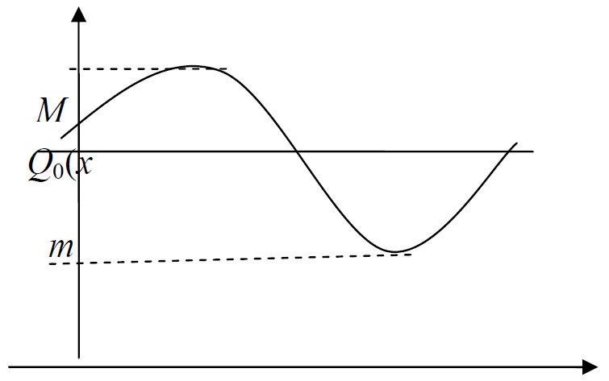
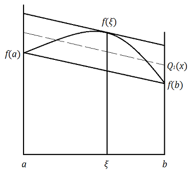



<!-- MarkdownTOC -->

- [8. Апроксимування функцій](#8-апроксимування-функцій)
	- [8.1. Постановка задачі апроксимації](#81-постановка-задачі-апроксимації)
	- [8.2. Найкраще рівномірне наближення](#82-найкраще-рівномірне-наближення)
	- [8.3. Приклади побудови БНРН](#83-приклади-побудови-бнрн)

<!-- /MarkdownTOC -->

## 8. Апроксимування функцій

### 8.1. Постановка задачі апроксимації 

Література:

<!-- - ЛМС, стор.&nbsp;8&ndash;13; -->

- Бахвалов, Жидков, Кобельков, стор.&nbsp;164&ndash;166: [pdf](../books/bahvalov-zhidkov-kobelkov-2015/164-166.pdf)

Наближення функцій застосовують у випадках, якщо

- функція складна (трансцендентна або є розв'язком складної задачі) і її замінюють функцією, яка легко обчислюється (найчастіше, поліномом);

- необхідно побудувати функцію неперервного аргументу для функції, яка задана своїми значеннями (таблична);

- таблична функція наближається табличною ж функцією (згладжування).

Інтерполювання не кращий спосіб наближення функцій через розбіжність цього процесу для поліномів. Тим більше доцільність застосування інтерполювання сумнівна, якщо функція таблична, а її значення неточні. Потрібно будувати апроксимуючу функцію з інших міркувань.

Найбільш загальний принцип: наблизити $$f(x)$$ функцією $$\Phi(x)$$ так, щоб досягалася деяка задана точність $$\varepsilon$$:

\begin{equation}
	\left\| f(x) - \Phi(x) \right\| < \varepsilon
\end{equation}

Але розв'язок в такій постановці може не існувати або бути не єдиним.

Загальна постановка задачі наближення така. Нехай маємо елемент $$f$$ лінійного нормованого простору $$R$$. Побудуємо підпростір $$M_n$$, в якому елементи є лінійною комбінацією:

\begin{equation}
	\label{eq:8.1.1}
	\Phi = \Sum_{i = 0}^n c_i \varphi_i \in M_n \subset R
\end{equation}

по елементах лінійно незалежної системи

$$
\begin{equation}
	\left\{ \varphi_i \right\\}_{i = 0}^\infty, \quad \varphi_i \in R \label{eq:8.1.2}.
\end{equation}
$$

Відхилення $$\Phi \in M_n$$ від $$f \in R$$ є число 

\begin{equation}
	\Delta(f, \Phi) = \| f - \Phi \|.
\end{equation}

Позначимо

\begin{equation}
	\Inf_{\Phi \in M_n} \|f - \Phi\| = \Delta (f).
\end{equation}

> **Означення**. Елемент $$\Phi_0$$ такий, що
>
> \begin{equation}
> \Delta(d, \Phi_0) = \|f - \Phi_0\| = \Inf_{\Phi \in M_n} \|f - \Phi\| = \Delta(f),
> \end{equation}
>
> називається _елементом найкращого наближення_ (ЕНН).

Ясно, що умову точності треба перевіряти на цьому елементі. У випадку її невиконання треба збільшувати кількість елементів $$n$$ в \eqref{eq:8.1.1}.

> **Теорема 1**: Для будь-якого лінійного нормованого простору $$R$$ існує елемент найкращого наближення $$\Phi_0 \in M_n$$.

_Доведення_: Введемо 

\begin{equation}
	F \left( \vec c \right) = F(c_0, c_1, \ldots, c_n) = \|f - \Phi\| = \left\| f - \Sum_{i = 0}^n c_i \varphi_i \right\|.
\end{equation}

Це неперервна функція аргументів $$\vec c = (c_0, c_1, \ldots, c_n)$$. Для елементів, які задовольняють умові 

\begin{equation}
	\label{eq:8.1.4}
	\|\Phi\| > 2 \|f\|, \quad f \in R_1, \quad \Phi \in M_n,
\end{equation}

маємо

\begin{equation}
	F \left( \vec c \right) = \|f - \Phi\| \ge \|\Phi\| - \|f\| > 2 \|f\| - \|f\| = \|f\| > \Delta(f).
\end{equation}

Значить ЕНН $$\Phi_0 \in \{\Phi: \|\Phi\| \le 2 \|f\|\} = \overline{U} \subset M_n$$. За теоремою Кантора $$\exists \Phi_0$$, де $$F \left( \vec c \right)$$ досягає мінімуму. Причому $$\|f - \Phi_0\| \le \|f - \Phi\|$$. $$\square$$

Елементів найкращого наближення в лінійному нормованому просторі може бути і декілька.

> **Означення**: Простір $$R$$ називається _строго нормованим_, якщо з умови
>
> \begin{equation}
> \|f + g\| = \|f\| + \|g\|, \quad \|f\| \ne 0, \quad \|g\| \ne 0
> \end{equation}
>
> випливає, що $$\exists \lambda \ne 0$$ таке, що
>
> \begin{equation}
> g = \lambda f.
> \end{equation}

> **Теорема 2**: Якщо простір $$R$$ строго нормований, то елемент найкращого наближення $$\Phi_0$$ єдиний.

_Доведення_: від супротивного. Нехай існують $$\Phi_0^{(1)} \ne \Phi_0^{(2)}$$ &mdash; два елементи найкращого наближення. Візьмемо $$\alpha \in [0, 1]$$, тоді

$$
\begin{equation}
	\begin{aligned}
		\Delta(f) & \le \left\| f - \alpha \Phi_0^{(1)} - (1 - \alpha) \Phi_0^{(2)} \right\| = \newline
		& = \left\| \alpha \left( f - \Phi_0^{(1)} \right) + (1 - \alpha) \left( f - \Phi_0^{(2)} \right) \right\| \le \newline
		& \le \alpha \left\| f - \Phi_0^{(1)} \right\| + (1 - \alpha) \left\| f - \Phi_0^{(2)} \right\| = \newline
		&= \alpha \Delta (f) + (1 - \alpha) \Delta (f) = \Delta(f).
	\end{aligned}
\end{equation}
$$

Тобто всі &laquo;$$\le$$&raquo; можна замінити на &laquo;$$=$$&raquo; Отримаємо

\begin{equation}
	\begin{aligned}
		& \left\| \alpha \left( f - \Phi_0^{(1)} \right) + (1 - \alpha) \left( f - \Phi_0^{(2)} \right) \right\| = \newline
		& \quad \alpha \left\| f - \Phi_0^{(1)} \right\| + (1 - \alpha) \left\| f - \Phi_0^{(2)} \right\|.
	\end{aligned}
\end{equation}

За припущенням $$\exists \lambda$$ таке, що 

\begin{equation}
	\alpha \left( f - \Phi_0^{(1)} \right) + \lambda (1 - \alpha) \left( f - \Phi_0^{(2)} \right).
\end{equation}

Виберемо $$\alpha = 1 / 2$$. Тоді

\begin{equation}
	f - \Phi_0^{(1)} = \lambda \left( f - \Phi_0^{(2)} \right).
\end{equation}

Оскільки

\begin{equation}
	\left\| f - \Phi_0^{(1)} \right\| = \left\| f - \Phi_0^{(2)} \right\| = \Delta(f),
\end{equation}

то остання рівність має місце тільки для $$\lambda = 1$$. Звідси

\begin{equation}
	f - \Phi_0^{(1)} = f - \Phi_0^{(2)} \implies \Phi_0^{(1)} = \Phi_0^{(2)}.
\end{equation}

Отже, ми отримали протиріччя з припущенням, що і доводить існування єдиного елемента найкращого наближення. $$\square$$

> **Теорема 3**: Гільбертів простір $$H$$ &mdash; строго нормований.

_Доведення_: Нехай

\begin{align}
	\| f + g \| &= \|f\| + \|g\|, \label{eq:8.1.6} \newline
	\| f + g \|^2 &= \|f\|^2 + 2 \|f\| \cdot \|g\| + \|g\|^2.
\end{align}

З іншого боку

\begin{equation}
	\| f + g \|^2 = \langle f + g, f + g\rangle = \|f\|^2 + 2 \langle f, g \rangle + \|g\|^2.
\end{equation}

Звідси $$\|f\| \cdot \|g\| = \langle f, g \rangle$$. Для довільного гільбертового простору $$\langle f, g\rangle \le \|f\| \cdot \|g\|$$.

Таким чином на елементах \eqref{eq:8.1.6} нерівність Коші-Буняковського перетворюється в рівність. Розглянемо

\begin{equation}
	\begin{aligned}
		\|f - \lambda g\|^2 & = \|f\| - 2 \lambda \langle f, g \rangle + \lambda^2 \|g\|^2 = \newline
		& = \|f\|^2 - \lambda \|f\| \cdot \|g\| + \lambda^2 \|g\|^2 = \newline
		&= \left( \|f\| - \lambda \|g\| \right)^2.
	\end{aligned}
\end{equation}

Тоді для $$\lambda = \|f\| / \|g\|$$ маємо $$\|f - λ g\| = 0$$. Звідси $$\exists λ$$: $$f = \lambda g$$, тобто $$Н$$ &mdash; строго нормований. $$\square$$

> **Наслідок**: $$R = H \implies \exists! \Phi_0 \in M_n$$.

> **Приклади** (_строго нормованих просторів_):
> 
> 1. $$L_2([a, b])$$ з нормою $$\|u\| = \sqrt{\Int_a^b u^2 \diff x}$$.
> 
> 2. $$L_p([a, b])$$ з нормою $$\|u\| = \left( \Int_a^b u^p \diff x \right)^{1 / p}$$, $$p > 1$$.

Простір $$C([a,b])$$ не є строго нормованим, але в ньому існує єдиний елемент найкращого наближення (про цей факт в наступному пункті).

### 8.2. Найкраще рівномірне наближення

Література:

<!-- - ЛМС, стор.&nbsp;66&ndash;82; -->

- Бахвалов, Жидков, Кобельков, стор.&nbsp;178&ndash;187: [pdf](../books/bahvalov-zhidkov-kobelkov-2015/178-187.pdf)

> **Означення**: _Найкраще рівномірне наближення_ &mdash; це наближення в просторі $$R = C([a,b])$$, де $$\|f\|_{C([a,b])} = \Max_{x \in [a, b]} \vert f \vert$$ &mdash; рівномірна метрика.

> **Теорема 1** (_Хаара_): Для того, щоб $$\forall f \in C([a,b])$$ існував єдиний елемент
найкращого рівномірного наближення необхідно і достатньо, щоб система $$\{\varphi_i\}_{i = 0}^\infty$$ була _системою Чебишова_.

> **Означення**: Система $$\{\varphi\}_{i = 1}^\infty$$ називається _системою Чебишова_, якщо елемент $$\Phi_n(x) = \Sum_{i = 0}^n c_i \varphi_i(x)$$ має не більше $$n$$ нулів, причому $$\Sum_{i = 1}^n c_i^2 \ne 0$$. 

> **Наприклад**, системою Чебишова є поліноміальна система $$\{x^i\}_{i = 0}^\infty$$.

> **Означення**: Позначимо $$Q_n^0(x)$$ &mdash; _багаточлен найкращого рівномірного наближення_ (далі &mdash; БНРН.). 

Його відхилення від $$f$$:

$$
\begin{equation}
	\Delta(f) = \left\| Q_n^0 (x) - f(x) \right\|_C = \Inf_{Q_n(x)} \left\| Q_n(x) - f(x) \right\|.
\end{equation}
$$

> **Теорема 2** (_Чебишова_): $$Q_n^0(x)$$ &mdash; БНРН неперервної функції $$f(x)$$ тоді та тільки тоді, якщо на відрізку $$[a,b]$$ існує хоча б $$(n + 2)$$-а точки $$a \le x_0 \le \ldots \le x_m \le b$$, $$m \ge n + 1$$ такі, що

\begin{equation}
	\label{eq:8.2.1}
	f(x_i) - Q_n^0(x_i) = \alpha (-1)^i \Delta(f),
\end{equation}

де $$i = \overline{0,m}$$, $$\alpha = \pm 1$$.

> **Означення**: Точки $$\{x_i\}_{i=0}^m$$, які задовольняють умовам теореми Чебишова, називаються _точками чебишовського альтернансу_.

> **Теорема 3**: $$Q_n^0(x)$$ &mdash; БНРН для неперервної функції єдиний.

_Доведення_: Припустимо, існують два БНРН степеня $$n$$: $$Q_n^{(1)}(x) \ne Q_n^{(2)}(x)$$:

\begin{equation}
	\Delta(f) = \left\| f - Q_n^{(1)} \right\|_C = \left\| f - Q_n^{(2)} \right\|_C.
\end{equation}

Звідси випливає, що

\begin{equation}
	\left\| f - \frac{Q_n^{(1)}(x) + Q_n^{(2)}(x)}{2} \right\| \le \left\| \frac{f - Q_n^{(2)}(x)}{2} \right\| = \Delta(x),
\end{equation}

тобто багаточлен

\begin{equation}
	\frac{Q_n^{(1)}(x) + Q_n^{(2)}(x)}{2}
\end{equation}

також є БНРН. Нехай $$x_0, x_1, \ldots, x_m$$ &mdash; відповідні йому точки чебишовського альтернансу.

Це означає, що

\begin{equation}
	\left| \frac{Q_n^{(1)}(x_i) + Q_n^{(2)}(x_i)}{2} - f(x_i) \right| = \Delta(f),
\end{equation}

або

\begin{equation}
	\label{eq:8.2.2}
	\left( Q_n^{(1)} (x_i) - f(x_i) \right)+ \left( Q_n^{(2)} (x_i) - f (x_i) \right) = 2 \Delta (f).
\end{equation}

Оскільки $$\left\vert Q_n^{(k)} (x_i) - f(x_i) \right\vert \le \Delta(f)$$, $$k = 1,2$$, то \eqref{eq:8.2.2} можливе лише у тому випадку, коли

\begin{equation}
	Q_n^{(1)} (x_i) - f(x_i) = Q_n^{(2)} (x_i) - f(x_i),
\end{equation}

для усіх $$i = \overline{0, n + 1}$$.

Звідки випливає, що $$Q_n^{(1)}(x) = Q_n^{(2)}(x)$$, а це суперечить початковому
припущенню. $$\square$$

### 8.3. Приклади побудови БНРН 

Література

- Бахвалов, Жидков, Кобельков, стор.&nbsp;181&ndash;187: [pdf](../books/bahvalov-zhidkov-kobelkov-2015/181-187.pdf)

- Волков, стор.&nbsp;81&ndash;90: [pdf](../books/volkov-1987/81-90.pdf)

Скінченого алгоритму побудови БНРН для довільної функції не існує. Є ітераційний [ЛМС, 73&ndash;79]. Але в деяких випадках можна побудувати БНРН за теоремою Чебишова.

1. Потрібно наблизити багаточленом нульового степеня.

	
	
	
	Нехай $$M = \Max_{[a, b]} f(x) = f(x_0)$$, $$m = \Min_{[a,b]} f(x) = f(x_1)$$, тоді $$Q_0(x)$$ &mdash; БНРН має вигляд (див.&nbsp;рис.&nbsp;[11](#img-8-3-1)):

	\begin{equation}
		Q_0(x) = \frac{M + m}{2},
	\end{equation}

	де $$\Delta(x_0) = \frac{M + m}{2}$$, а $$x_0$$, $$x_1$$ &mdash; точки чебишовського альтернансу.

2. Опукла функція $$f(x) \in C([a,b])$$ наближається багаточленом першого степеня

	\begin{equation}
		Q_1(x) = c_0 + c_1 x.
	\end{equation}

	Оскільки $$f(x)$$ опукла, то різниця $$f(x) - (c_0 + c_1 x)$$ може мати лише одну внутрішню точку екстремуму. Тому точки $$a$$, $$b$$ є точками чебишовського альтернансу. Нехай $$\xi$$ третя &mdash; точка чебишовського альтернансу. Згідно з теоремою Чебишова, маємо систему:

	$$
	\begin{equation}
		\left\{
			\begin{aligned}
				f(a) - c_0 - c_1 a &= \alpha \Delta(f), \newline
				f(\xi) - c_0 - c_1 \xi &= - \alpha \Delta(f), \newline
				f(b) - c_0 - c_1 b &= \alpha \Delta(f).
			\end{aligned}
		\right.
	\end{equation}
	$$

	Звідси $$f(b) - f (a) = c_1 (b - a)$$ та $$c_1 = \frac{f(b) - f(a)}{b - a}$$.

	Цю систему треба замкнути, використавши ще одне рівняння з умови: точка $$\xi$$ є точкою екстремуму різниці $$f(x) - (c_0 + c_1 x)$$. Тому для диференційованої функції $$f(x)$$ для визначення $$\xi$$ маємо рівняння (дотична і січна паралельні):

	\begin{equation}
		f'(\xi) = c_1 = \frac{f(b) - f(a)}{b - a}
	\end{equation}

	
	

	Геометрично ця процедура виглядає наступним чином (див.&nbsp;[рис.&nbsp;12](#img-8-3-2)). Проводимо січну через точки $$(a, f (a))$$, $$(b, f (b))$$. Для неї тангенс кута дорівнює $$c_1$$. Проводимо паралельну їй дотичну до кривої $$y = f(x)$$, а потім пряму, рівновіддалену від січної та дотичної, яка і буде графіком $$Q_1(x)$$. При цьому $$x_0 = a$$, $$x_1 = \xi$$, $$x_2 = b$$.
	
3. Потрібно наблизити $$f(x) = x^{n + 1}$$, $$x \in [-1,1]$$ багаточленом степеня $$n$$: $$Q_n^0(x)$$. Введемо

	\begin{equation}
		\overline{P}_{n + 1}(x) = x^{n + 1} - Q_n(x) = x^{n + 1} - a_1 x^n - \ldots
	\end{equation}

	Далі

	$$
	\begin{equation}
		\begin{aligned}
			\Delta(f) &= \Inf_{Q_n(x)} \left\| x^{n + 1} - Q_n^0(x) \right\|_C = \newline
			&= \Inf_{\overline{P}_{n + 1}} \left\| \overline{P}_{n + 1} - 0 \right\|_C = \newline
			&= \left\| \overline{T}_{n + 1}(x) \right\|.
		\end{aligned}
	\end{equation}
	$$

	Звідси

	$$
	\begin{equation}
		x^{n + 1} - Q_n^0(x) = \overline{T}_{n + 1}(x),
	\end{equation}
	$$

	або

	$$
	\begin{equation}
		Q_n^0(x) = x^{n + 1} - \overline{T}_{n + 1}(x).
	\end{equation}
	$$

	> **Задача 25**: Для прикладу&nbsp;3 вказати точки чебишовського альтернансу $$\{x_i\}$$, $$i = \overline{0, n + 1}$$.

4. Потрібно наблизити $$f(x) = P_{n + 1}(x) = a_0 + \ldots + a_{n + 1} x^{n + 1}$$, $$a_{n + 1} \ne 0$$, $$x \in [a, b]$$ БНРН степеня $$n$$. Запишімо його у вигляді:

	\begin{equation}
		Q_n^0(x) = P_{n + 1}(x) - a_{n + 1}(x) \overline{T}_{n + 1}^{[a, b]}
	\end{equation}

	де $$\overline{T}_{n + 1}^{[a, b]}(x)$$ &mdash; нормований багаточлен Чебишова на проміжку $$x \in [a,b]$$.

	Дійсно це БНРН: вираз у правій частині є багаточленом степеня $$n$$, оскільки коефіцієнт при $$x^{n + 1}$$ дорівнює нулю, а його нулі

	\begin{equation}
		x_k = \frac{b + a}{2} + \frac{b - a}{2} \cdot t_k,
	\end{equation}

	де 

	\begin{equation}
		t_k = \cos \left( \frac{(2 k + 1) \pi}{2 (n + 1)} \right),
	\end{equation}

	для $$k = \overline{0,n}$$ є точками чебишевського альтернасу для $$Q_n^0(x)$$.

	> **Задача 26**: Показати, що для $$f(x)$$ парної (непарної) функції БНРН це багаточлен по парних (непарних) степенях $$x$$.

5. Телескопічний метод. Дуже часто БНРН точно знайти не вдається. В таких випадках шукається багаточлен, близький до нього. Бажано щоб цей багаточлен був невисокого степеня (менше арифметичних операцій на його обчислення) Спочатку будують такий багаточлен 

	\begin{equation}
		P_n(x) = \Sum_{j = 0}^n a_j x^j,
	\end{equation}

	щоб відхилення від $$f(x)$$ була достатньо малою. (наприклад меншою за $$\varepsilon / 2$$).

	Можна це зробити, наприклад, за формулою Тейлора. Потім наближають багаточлен $$P_n(x)$$ багаточленом найкращого рівномірного наближення $$P_{n-1}(x)$$ (за алгоритмом п.&nbsp;4; для простоти $$x \in [-1,1]$$):

	\begin{equation}
		P_{n - 1}(x) = P_n(x) - a_n T_n(x) 2^{1 - n}.
	\end{equation}

	Оскільки $$\vert T_n(x) \vert \le 1$$ на відрізку $$[-1, 1]$$, то

	\begin{equation}
		| P_{n - 1}(x) - P_n(x) | \le |a_n| \cdot 2^{1 - n}.
	\end{equation}

	Далі наближають багаточлен $$P_{n-1}(x)$$ багаточленом найкращого рівномірного наближення $$P_{n - 2}(x)$$ і т.&nbsp;д. Пониження степеня продовжується до тих пір, поки сумарна похибка від таких послідовних апроксимацій залишається меншою за задане мале число $$\varepsilon$$.

[Назад до лекцій](README.md)

[Назад на головну](../README.md)
